<div align="center">

<h1>kimi-k3-in-c</h1>

<h3>A 2.78-trillion-parameter model. One CPU. 8 GB of RAM.</h3>

<p>Kimi K3 inference in portable C99.<br>No BLAS. No framework. No GPU.</p>

<p>
<a href="https://github.com/FareedKhan-dev/kimi-k3-in-c/actions/workflows/ci.yml"></a>
<a href="LICENSE"></a>
<a href="Makefile"></a>
<a href="#requirements"></a>
<a href="CHANGELOG.md"></a>
</p>

<table>
<tr>
<td align="center"><b>2.78T</b><br><sub>parameters</sub></td>
<td align="center"><b>1.56 TB</b><br><sub>checkpoint on disk</sub></td>
<td align="center"><b>8.24 GB</b><br><sub>peak RSS, measured</sub></td>
<td align="center"><b>176 KB</b><br><sub>the whole engine</sub></td>
<td align="center"><b>0</b><br><sub>GPUs</sub></td>
</tr>
</table>

<p><b>The same 2.78-trillion-parameter model, the same answer, on whatever machine you own.</b><br>More memory only buys speed:</p>

<table>
<tr>
<th align="left">the machine you have</th>
<th align="right">RAM</th>
<th align="right">time per token</th>
<th align="left">what is going on</th>
</tr>
<tr>
<td align="left">an ordinary laptop</td>
<td align="right">8 GB</td>
<td align="right"><b>26.5 s</b></td>
<td>the whole model streams off the disk on every step</td>
</tr>
<tr>
<td align="left">a high-end laptop</td>
<td align="right">32 GB</td>
<td align="right"><b>24.2 s</b></td>
<td>some of the model now sits in memory</td>
</tr>
<tr>
<td align="left">a desktop</td>
<td align="right">64 GB</td>
<td align="right"><b>19.8 s</b></td>
<td>more of it sits in memory</td>
</tr>
<tr>
<td align="left">a heavy workstation</td>
<td align="right">128 GB+</td>
<td align="right"><b>5.6 s</b></td>
<td>the model fits entirely in memory, the disk wait is gone</td>
</tr>
</table>

<sub>Same short prompt at every size, and the output is <b>byte-identical</b> from the smallest machine to the largest; only the clock changes. One machine, 124 cores, fast NVMe drive: the first three rows still read the model from disk each step, so a slower drive is slower there, while the 128 GB+ row keeps everything in memory and no longer waits on the disk. On that same machine v1.0.0 made the math per token about <b>8&times;</b> lighter, a follow-up question in a chat <b>3.9&times;</b> faster, and long prompts about <b>half</b> as costly. (A token is roughly a short word-piece; the two runnable demos below are the original captures on a slower drive, so their clock reads a little higher.) Full data in <a href="docs/data/">docs/data/</a>.</sub>

<hr>

<p>
  
  <i>I am open to AI research roles and PhD positions. <a href="https://drive.google.com/file/d/1yW5xHDS6Mr9ByrkCgVve85OqF4UOPv9K/view?usp=sharing">CV</a>.</i>
</p>

<hr>

</div>

<br>

```console
$ ./bin/k3 ~/k3model --trunk ~/k3trunk --preset laptop \
           --tok ~/k3model --prompt "The capital of France is" --gen 8 --incremental

--- generated text ---
 Paris.",
+            "The Eiffel
----------------------
8 tokens in 261.5 s, 32.69 s/token average
PEAK RSS for the whole run: 8.24 GB
```

Slow, and answering correctly, in 8.24 GB, from a checkpoint of 1.56 TB. This is a base
model, so what follows " Paris." is a continuation rather than a reply; there is no chat
template. Give it more memory and the answer does not change, only the clock:

```console
$ ./bin/k3 ~/k3model --trunk ~/k3trunk --preset server \
           --tok ~/k3model --prompt "def fibonacci(n):" --gen 28 --incremental

--- generated text ---
    if n <= 1:
        return n
    else:
        return fibonacci(n-1) + fibonacci
----------------------
28 tokens in 299.3 s, 10.69 s/token average
PEAK RSS for the whole run: 127.92 GB
```

Every figure in this document comes from the measurement output in
[`docs/data/`](docs/data/).


The dense trunk stays in memory to whatever depth you choose and streams the rest; the
1.45 TB of routed experts are never resident, and are multiplied straight out of their
packed 4-bit form. The consequence is that **the same model runs in 8 GB and in 224 GB and
produces byte-identical output at every budget between.**

Four decisions about where bytes live take it from a cluster to a laptop, and the answer
at the bottom is the same as the answer at the top:


[Part II](#part-ii-how-it-works) builds every box in both diagrams from scratch, one
component at a time.

---

## Contents

**[Part I: Getting started](#part-i-getting-started)**

- [Requirements](#requirements)
- [Quick start](#quick-start): clone, build and verify in about a minute, with no model
- [Full setup](#full-setup): the whole path to generated text
- [Usage](#usage)
  - [Synopsis](#synopsis)
  - [Prompt options](#prompt-options)
  - [Memory options](#memory-options)
  - [Generation options](#generation-options)
  - [Diagnostic options](#diagnostic-options)
  - [Exit codes](#exit-codes)
  - [Environment variables](#environment-variables)
  - [Worked examples](#worked-examples)
- [Choosing a preset](#choosing-a-preset)
- [Reading the run report](#reading-the-run-report)
- [Common questions](#common-questions)

**[Part II: How it works](#part-ii-how-it-works)**

- [The problem: a model that does not fit](#the-problem-a-model-that-does-not-fit)
- [The four reductions](#the-four-reductions)
- [The machine, and what it assumes](#the-machine-and-what-it-assumes)
- [The codebase](#the-codebase)
- [Three invariants](#three-invariants)
- [1. Reading a 1.56 TB checkpoint from its headers](#1-reading-a-156-tb-checkpoint-from-its-headers)
- [2. The config reader that refuses to guess](#2-the-config-reader-that-refuses-to-guess)
- [3. The tokenizer, byte for byte](#3-the-tokenizer-byte-for-byte)
- [4. Reduction one: the experts already ship at half a byte](#4-reduction-one-the-experts-already-ship-at-half-a-byte)
- [5. Kernels with a floating point contract](#5-kernels-with-a-floating-point-contract)
- [6. Reduction two: KDA, attention with a memory that never grows](#6-reduction-two-kda-attention-with-a-memory-that-never-grows)
- [7. Reduction three: MLA, one latent instead of ninety-six heads](#7-reduction-three-mla-one-latent-instead-of-ninety-six-heads)
- [8. Attention residuals: layers that look back](#8-attention-residuals-layers-that-look-back)
- [9. Picking 16 experts of 896](#9-picking-16-experts-of-896)
- [10. Packing the trunk: 93 layers, one read each](#10-packing-the-trunk-93-layers-one-read-each)
- [11. Reduction four: streaming the trunk turns a floor into a dial](#11-reduction-four-streaming-the-trunk-turns-a-floor-into-a-dial)
- [12. An LRU cache for the experts](#12-an-lru-cache-for-the-experts)
- [13. How big should that cache be? Ask the trace](#13-how-big-should-that-cache-be-ask-the-trace)

**[Part III: Validation](#part-iii-validation)**

- [The gate ladder](#the-gate-ladder)
- [A tiny oracle first](#a-tiny-oracle-first)
- [Proving it on the full checkpoint](#proving-it-on-the-full-checkpoint)
- [The first tokens](#the-first-tokens)
- [Sustained generation: text in, text out](#sustained-generation-text-in-text-out)

**[Part IV: Measurements](#part-iv-measurements)**

- [The memory ladder: 8 GB to 224 GB](#the-memory-ladder-8-gb-to-224-gb)
- [The cache that was not participating](#the-cache-that-was-not-participating)
- [Allocation beats capacity](#allocation-beats-capacity)
- [Measuring the measurement](#measuring-the-measurement)
- [Storage is the whole game](#storage-is-the-whole-game)
- [Why the trunk is not quantised](#why-the-trunk-is-not-quantised)

**[Part V: Reference](#part-v-reference)**

- [Scope](#scope)
- [Closing the ledger](#closing-the-ledger)
- [Documentation](#documentation)
- [Development](#development)
- [License](#license)

---

# Part I: Getting started

## Requirements

The gate is storage: **the checkpoint is 1.56 TB.** Everything else is ordinary.

| | | |
|---|---|---|
| **OS** | Linux, x86-64 | uses `O_DIRECT`, `posix_memalign`, `getrusage` |
| **CPU** | AVX2 + FMA | AVX-512 unnecessary. `make portable` targets generic AVX2 |
| **RAM** | 8 GB and up | every preset works; more memory is faster, never different |
| **Storage** | ~1.7 TB free | 1.56 TB checkpoint + 109 GB packed trunk, ideally on fast local disk |
| **Toolchain** | GCC ≥ 9 or Clang ≥ 10 | GNU make, or CMake |
| **Python** | 3.9+ | for the download, pack and analysis tools; not for `make test` |

The tokenizer and config reader are portable C99 and build anywhere. Without a checkpoint
you can still do everything in [Quick start](#quick-start).

## Quick start

Clone, build and run the entire test suite. **No checkpoint, no network, no Python**. The
whole thing takes about a minute.

```bash
git clone https://github.com/FareedKhan-dev/kimi-k3-in-c.git
cd kimi-k3-in-c

make -j            # seconds. Seven C files, a compiler and OpenMP
make test          # under a minute
```

It ends like this, or it failed:

```
GATE 1  teacher forcing : 32/32 positions match tf_pred
        generated span  : 20/20  <- must be exact
GATE 2  greedy decode   : 20/20 generated tokens match full_ids
GATE 3  incremental    : 20/20 generated tokens match full_ids  <- KV cache + carried KDA state

VERDICT: ENGINE MATCHES THE REFERENCE EXACTLY

ALL WEIGHTLESS TESTS PASSED
```

That is the whole engine: every kernel, the streaming cache, the safetensors reader, the
config reader, the tokenizer, and an end-to-end oracle over a 13-layer model built with the
same tensor graph as the released one, checked against a PyTorch reference from fixtures
committed to the repository.

One published measurement also replays on the spot, from a trace recorded during a full
93-layer run (this one needs Python 3.9+ and numpy):

```bash
python3 tools/sim_cache.py tests/fixtures/expert_trace.bin
```

100,096 expert requests, reprinting the capacity table in
[`expert-cache-capacity.txt`](docs/data/expert-cache-capacity.txt).

## Full setup

Six steps from an empty directory to generated text. Only step 4 is slow.

`./scripts/k3-doctor.sh` can be run at any point. It checks the toolchain, sizes your RAM
to a preset, measures your storage, and prints the exact command to run next.

### Step 0. clone

```bash
git clone https://github.com/FareedKhan-dev/kimi-k3-in-c.git
cd kimi-k3-in-c
```

About 45 MB, most of it the diagrams and the test fixtures.

### Step 1. check the machine

```bash
./scripts/k3-doctor.sh
```

Takes about a minute, because it measures your disk the way the engine reads it. It exits
non-zero if the machine cannot run the model at all.

### Step 2. build

```bash
make -j
```

Seconds. The only dependencies are a C99 compiler, libm and OpenMP. CMake works too:

```bash
cmake -B build && cmake --build build -j && ctest --test-dir build
```

### Step 3. verify before downloading anything

```bash
make test
```

This is worth doing before committing to a 1.56 TB download: it proves the engine matches
its reference on a model with the same tensor graph, and it needs nothing but the
repository.

### Step 4. fetch the checkpoint

**1.56 TB, so hours rather than minutes.** Get a token from
[huggingface.co/settings/tokens](https://huggingface.co/settings/tokens):

```bash
export HF_TOKEN=hf_your_token_here          # read from the environment, never echoed
./scripts/download-model.sh ~/k3model       # resumable, re-run to continue
```

The script finishes by verifying the shard count, the exact byte total, and then every
individual per-shard size against the published figures:

```text
verifying…
  shards : 96 (expect 96)
  bytes  : 1560936091448 (expect 1560936091448)
  shards : all 96 match their published sizes individually
  RESULT : byte-exact match
```

A partial download does not fail loudly; it produces wrong tokens. Treat a `FAIL` here as
a stop. Checking per shard also turns "re-download 1.56 terabytes" into "re-download this
one 17 gigabyte file", and it catches the one case a total cannot: two shards wrong in
opposite directions by the same amount.

### Step 5. pack the trunk

```bash
./scripts/pack-trunk.sh ~/k3model ~/k3trunk
```

About four minutes, once. It rewrites the 93 dense layers into one 109 GB file where layer
*L* lives at a known offset and can be read in a single call. **This is what turns the
memory requirement into a dial.** Put the output on the fastest disk you have.

### Step 6. run

```bash
./bin/k3 ~/k3model --trunk ~/k3trunk --preset workstation \
         --tok ~/k3model --prompt "The capital of France is" --gen 8 --incremental
```

The tokenizer ships with the checkpoint, which is why `--tok` points at the model
directory.

### Where everything ends up

```
kimi-k3-in-c/    ~45 MB   source, docs, images, and bin/k3
~/k3model/      1.56 TB   96 shards · config.json · tiktoken.model · tokenizer_config.json
~/k3trunk/       109 GB   trunk.bin · trunk.json, on the fastest disk you have
```

The first token of any run loads every pinned layer from disk, about 108 GB at the
`server` preset, so it takes far longer than the steady rate. That cost is paid once per
run, not once per token.

## Usage

### Synopsis

```
k3 <model_dir> [prompt] [memory] [generation] [diagnostics]
```

`<model_dir>` is the directory holding the `.safetensors` shards. It is required for any
run, but `--help`, `--version` and `--list-presets` work without it:

```bash
./bin/k3 --help
./bin/k3 --version
./bin/k3 --list-presets
```

### Prompt options

Exactly one of these is required. Passing none, or more than one, is a usage error
(exit 2).

| flag | argument | |
|---|---|---|
| `--prompt` | `TEXT` | tokenize TEXT and run it. **Requires `--tok`.** |
| `--prompt-file` | `PATH` | tokenize the file's bytes. **Requires `--tok`.** Preferred for anything non-ASCII: the shell re-encodes `argv`, whereas a file is read verbatim |
| `--ids` | `1,2,3` | token ids directly. No tokenizer is loaded at all, so this works on a machine with no tokenizer files. The reproducible channel the tests use |

```bash
# text in
./bin/k3 ~/k3model --tok ~/k3model --prompt "The capital of France is" ...

# text in, from a file. Use this for CJK, emoji, accents
printf 'La capitale de la France est' > /tmp/p.txt
./bin/k3 ~/k3model --tok ~/k3model --prompt-file /tmp/p.txt ...

# ids in, ids out, no tokenizer needed
./bin/k3 ~/k3model --ids 1008,10484,318,15383,387 ...
```

### Memory options

| flag | argument | default | |
|---|---|---|---|
| `--preset` | `NAME` | none | `laptop` · `desktop` · `workstation` · `server` · `max`. Sets both budgets below |
| `--trunk` | `DIR` | off | the packed trunk directory from step 5. **This is what enables streaming.** Without it the trunk loads fully resident, around 113.5 GB |
| `--trunk-gb` | `X` | 16 | budget for pinned layers plus the streaming ring |
| `--cache-gb` | `X` | 64 | budget for the routed-expert LRU cache |

`--preset` and the two `-gb` flags set the same two numbers, so a preset is just a
shorthand. Order matters if you mix them: a later flag wins, so
`--preset server --cache-gb 40` gives you the server trunk budget with a 40 GB cache.

> **`--preset` without `--trunk` does nothing useful.** Every preset assumes the trunk is
> streamed. Omit `--trunk` and the engine loads all 113.5 GB resident regardless of the
> budget you asked for.

### Generation options

| flag | argument | default | |
|---|---|---|---|
| `--gen` | `N` | 8 | tokens to generate. Ceiling 4096; prompts may be up to 32768 tokens |
| `--incremental` | none | off | carry the KV cache and the recurrent state between tokens instead of re-running the whole prefix |
| `--tok` | `DIR` | none | directory holding `tiktoken.model` and `tokenizer_config.json` |

**Pass `--incremental` for any generation of length.** Without it every step re-runs the
entire prefix, which is *O(T²)*; with it, step 0 pays for the prompt and every later step
costs the same fixed amount. Both paths are gated on producing identical tokens, so this
is a pure speed choice.

### Diagnostic options

| flag | argument | |
|---|---|---|
| `--config` | `PATH` | model config; defaults to `<model_dir>/config.json` |
| `--layers` | `N` | bind only the first N layers, for partial shard sets |
| `--out` | `FILE` | JSON results (default `k3_run.json`) |
| `--dump-logits` | `PATH` | float32 logits for the first step, for elementwise comparison |
| `--dump-cache-trace` | `DIR` | writes `expert_hist.json` and `expert_trace.bin`, which `tools/sim_cache.py` replays |

### Exit codes

Scripts can rely on these.

| | |
|---:|---|
| `0` | success |
| `1` | a tensor failed to bind, or a forward pass failed |
| `2` | usage error, or a config that could not be read with confidence; the engine declines to guess |
| `4` | the run finished, but at least one routed expert failed to load, so the emitted ids are unsound. Distinct from `1` because the process otherwise succeeded, and it is the code that catches silent numerical corruption |

### Environment variables

| variable | used by | |
|---|---|---|
| `HF_TOKEN` | `download-model.sh` | HuggingFace token, read from the environment and never echoed |
| `OMP_NUM_THREADS` | the engine | thread count, defaulting to all cores |
| `K3_TOK_FILES` | tokenizer tools and CI | directory holding `tiktoken.model`, when it is not in a default location |
| `K3_MODEL_DIR` | `tools/budget.py` | checkpoint directory, when not given as an argument |

### Worked examples

```bash
# Smallest possible run, the 8 GB floor.
./bin/k3 ~/k3model --trunk ~/k3trunk --preset laptop \
         --tok ~/k3model --prompt "Hello! My name is" --gen 16 --incremental

# Fastest per gigabyte. Pins 90 of 93 trunk layers.
./bin/k3 ~/k3model --trunk ~/k3trunk --preset server \
         --tok ~/k3model --prompt "def fibonacci(n):" --gen 28 --incremental

# Hand-tuned split instead of a preset: everything to the trunk.
./bin/k3 ~/k3model --trunk ~/k3trunk --trunk-gb 110 --cache-gb 13 \
         --tok ~/k3model --prompt-file prompt.txt --gen 32 --incremental

# Reproducible: ids in, ids out, no tokenizer, JSON results.
./bin/k3 ~/k3model --trunk ~/k3trunk --preset desktop \
         --ids 1008,10484,318,15383,387 --gen 8 --incremental --out run.json

# Capture a cache trace, then replay it offline at any capacity.
./bin/k3 ~/k3model --trunk ~/k3trunk --preset workstation \
         --ids 1008,10484,318,15383,387 --gen 8 --incremental \
         --dump-cache-trace /tmp/trace
python3 tools/sim_cache.py /tmp/trace/expert_trace.bin

# Elementwise logit comparison against the PyTorch reference.
./bin/k3 ~/k3model --trunk ~/k3trunk --preset server \
         --ids 3,4,5,6,7 --gen 1 --dump-logits /tmp/c_logits.bin
python3 tools/cmp_logits.py /tmp/c_logits.bin ref_logits.json

# Partial shard set: bind only the first 8 layers.
./bin/k3 ~/k3model --trunk ~/k3trunk --layers 8 \
         --ids 1,2,3 --gen 1

# Under a hard memory ceiling, which is how the ladder was measured.
systemd-run --scope --user -q -p MemoryMax=8G -p MemorySwapMax=0 \
  ./bin/k3 ~/k3model --trunk ~/k3trunk --trunk-gb 2.5 --cache-gb 0.5 \
           --ids 1008,10484,318,15383,387 --gen 8 --incremental
```

## Choosing a preset

```console
$ ./bin/k3 --list-presets
presets (trunk / expert-cache, in GB):
  laptop          3.0 / 1.0     8.2 GB peak RSS. The floor. Runs, slowly.
  desktop        16.0 / 10.0    31.9 GB peak RSS.
  workstation    60.0 / 30.0    95.5 GB peak RSS; the expert cache starts to matter here.
  server        110.0 / 13.0    ~128 GB peak RSS; 90 of 93 trunk layers pinned. Fastest.
  max           110.0 / 109.0   ~224 GB peak RSS; trunk pinned and a large expert cache.

All presets stream the trunk, so they need --trunk <packed_dir>.
Run scripts/k3-doctor.sh to see which one this machine fits.
```


The boundaries come from the measured ladder, and the doctor keys on `MemAvailable` rather
than `MemTotal`:

```bash
if   [ "$AVAIL_GB" -ge 192 ]; then PRESET=server;      EXPECT="~6 s/token"
elif [ "$AVAIL_GB" -ge  96 ]; then PRESET=workstation; EXPECT="~6-20 s/token"
elif [ "$AVAIL_GB" -ge  32 ]; then PRESET=desktop;     EXPECT="~24 s/token"
elif [ "$AVAIL_GB" -ge  10 ]; then PRESET=laptop;      EXPECT="~27 s/token"
else PRESET=""; fi
```

Two things worth knowing before you pick:

- **`max` is not faster than `server`** in these measurements. The extra 96 GB buys nothing
  outside the noise floor.
- **Give the trunk memory before the expert cache.** At a fixed 128 GB budget that was
  worth 1.69×. [Allocation beats capacity](#allocation-beats-capacity) has the data.

## Reading the run report

The engine prints a memory plan, then a line per generated token, then a summary. Abridged
from a `workstation` run:

```
cache [final step]
  requests     : 1472  hits 1472 (100.00%)  misses 0  evictions 729
                 TRUE resident hit rate 50.48%
I/O share of wall clock: 71.1%  (trunk 62.4 s + experts 34.2 s of 135.8 s)
trunk [final]
  pinned 48/93 layers, ring 1 slots
  read 368.65 GB in 62.40 s (5908 MB/s)
PEAK RSS for the whole run: 94.74 GB   <- quote this, not the plan
```

Three numbers carry the meaning:

- **`TRUE resident hit rate`**: experts served from RAM. The raw `hits` counter also
  counts experts the prefetcher pulled off disk moments earlier, so it reads 100% at every
  cache size; the resident figure is printed beneath it.
- **`I/O share of wall clock`**: whole-run disk time against total, measured between 41%
  and 61% across the ladder.
- **`PEAK RSS`**: from `getrusage`, after the run. This is the memory figure; the up-front
  plan runs slightly above it.

## Common questions

**Memory sits near 113 GB even at a small preset.** `--trunk` was omitted. Without a packed
trunk directory the whole trunk is loaded resident; every preset assumes streaming.

**A non-ASCII prompt tokenizes oddly.** The shell re-encodes `argv`, so the engine receives
different bytes than you typed. Put the prompt in a file and use `--prompt-file`, which is
read verbatim.

**`--prompt/--prompt-file need --tok DIR`.** The tokenizer ships with the checkpoint, so
add `--tok ~/k3model`. The engine exits rather than guessing where the vocabulary lives. To
skip the tokenizer entirely, pass token ids with `--ids`.

**Throughput is well below the table.** Almost always storage. `python3 tools/devbw.py
<file-on-that-disk>` measures the disk the way the engine reads it, using large random
`O_DIRECT` reads at queue depth 1 and 16, which `dd` does not. Network volumes run several
times slower than local NVMe; keep `~/k3trunk` local.

**The run refused to start over the KV cache.** Context costs about 2.37 MB per position
regardless of budget, and the engine computes that up front rather than discovering it an
hour in. Shorten the request, or drop `--incremental`, which carries no KV cache at all.

**Is the whole 1.56 TB needed?** For generation, yes. For development, no: `make test`
needs nothing at all, and `--layers N` runs against partial shard sets.

**macOS, Windows, WSL?** The engine targets Linux. The tokenizer and config reader are
portable C99 and are built portably in CI.

---

# Part II: How it works

## The problem: a model that does not fit

[Kimi K3](https://huggingface.co/moonshotai/Kimi-K3) has **2.78 trillion parameters** and
is **1.56 terabytes** as shipped. No consumer machine can hold it, and waiting for better
hardware does not help, because the wall is not speed, it is capacity.

But it is a [mixture of experts](https://huggingface.co/blog/moe), so only 16 of its 896
experts per layer fire for any given token and the rest sit asleep on disk. Keep the
always-on part in memory, stream the sleeping experts, and it fits in **8.24 gigabytes**
on one CPU with no GPU.

The naive requirement is the one every parameter count implies.


So 5.56 terabytes is the number to beat.


Kimi K3 has 93 layers. Layer 0 is a plain dense feed-forward layer, so the other 92
layers route, and each of those picks the top 16 experts out of 896.


About 104 billion parameters are active for any given token, out of 2.78 trillion, which is 3.7
percent. The other 96.3 percent still has to exist somewhere reachable, but it does not
have to be in RAM.

Counting the actual bytes on disk rather than guessing:

```text
=== shard census: what the 1.56 TB actually is ===
shards            : 96
total bytes       : 1560936091448  (1.56 TB)

--- routed experts (the part that is streamed, never resident) ---
  experts total     : 82,432   (896 routed x 92 MoE layers)
  bytes per expert  : 17,547,264  exactly
                      = 33,030,144 params x 0.53125 bytes
                      = 0.5 bytes/nibble + 1/32 byte for the shared E8M0 scale
  routed expert set : 82,432 x 17,547,264 = 1.447 TB
```

There are **82,432 routed experts**, each occupying exactly **17,547,264 bytes**. Together
they are **1.447 terabytes**, which is 93 percent of the entire checkpoint. Everything
else (attention projections, routers, norms, embeddings) is the remaining 7 percent.

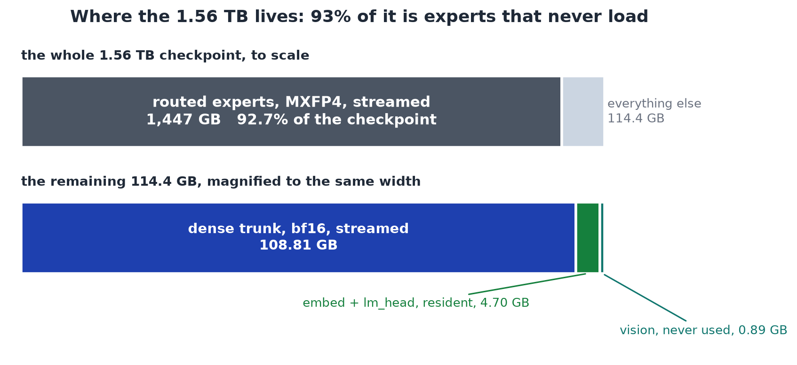

That census is the whole strategy in one picture. If those 1.447 terabytes can be
reachable but never resident, the memory problem shrinks by more than an order of
magnitude before a single kernel is written.


What is left is **56,743,648,000 parameters**, or 113.49 gigabytes at bfloat16. Of that,
108.81 GB is the per-layer dense trunk and 4.70 GB is the embedding table plus the output
head.

## The four reductions

- **5,560 GB**: every parameter at bfloat16, where we start.
- **1,560 GB**: the checkpoint as shipped, because the experts already arrive at half a
  byte per weight.
- **113.49 GB**: what has to be resident once routing means the experts never load.
- **8.24 GB**: what is measured, once the trunk is streamed instead of held.

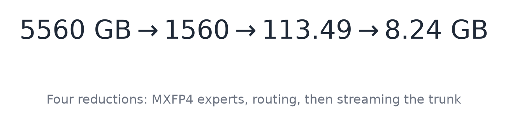

End to end that is a **675× reduction** from the bfloat16 model and **189×** from the
shipped checkpoint. Nothing is approximated and no weight is dropped: the output at the
bottom of that ladder is byte for byte the output at the top. The chart at the top of
this document is that ledger drawn to scale.

## The machine, and what it assumes

Every measurement here comes from one workstation: a two-socket AMD EPYC 7763 with 124
cores and no SMT, 228 GB of RAM, and 3.2 TB of NVMe. It also has four NVIDIA L40 GPUs,
which sat completely idle for the entire campaign, because this engine has no GPU path.

```text
--- ISA (note: AVX2 present, AVX-512 ABSENT) ---
avx avx2 fma sse4_2

--- memory ---
Mem:           228Gi       5.1Gi       207Gi       3.1Mi        18Gi       223Gi
MemTotal:       239308464 kB
MemAvailable:   233961008 kB
Hugepagesize:       2048 kB
```

There is **no AVX-512**. The engine needs AVX2 and FMA and nothing more, the instruction
set on any desktop CPU from the last decade.

The storage numbers matter more than the CPU numbers, and one runs against expectation.

```text
--- storage bandwidth, measured ---
O_DIRECT cold : 3.2 GB/s     (dd bs=4M iflag=direct after drop_caches)
buffered warm : 2.3 GB/s
engine, trunk : 5373-6064 MB/s sustained during runs
NOTE O_DIRECT is FASTER than buffered here. That is the opposite of the usual
expectation, and it is why the engine opens the trunk O_DIRECT.
```

Reading with `O_DIRECT`, bypassing the page cache entirely, is **faster** here than
reading through it. That single measurement decided the whole I/O design.


One piece of hygiene, because a loaded machine is easy to measure badly:

```text
--- measurement hygiene ---
unattended-upgrades: STOPPED and DISABLED before measurement (was using ~63% of a
  core during the smoke run).
apt-daily.timer and apt-daily-upgrade.timer: DISABLED
```

A background package updater eating most of a core moves a timing by more than most
optimisations do, so it goes off before anything is measured.

How much memory does the engine actually need? Multiplying config values by hand gives the
wrong answer in an instructive way, which is why `tools/budget.py` exists:

```python
# Streamable only if ROUTED. The 2 SHARED experts sit in the same namespace and
# are NOT streamable, which is where hand arithmetic goes wrong.
def classify(name: str) -> str:
    if ".block_sparse_moe.experts." in name:
        return "routed_expert"          # streamable: only 16 of 896 per token
    if ".block_sparse_moe.shared_expert" in name:
        return "shared_expert"          # RESIDENT: runs on every token
    if ".self_attn." in name:
        return "attention"              # resident
    if "embed_tokens" in name or "lm_head" in name:
        return "embedding"              # resident
    return "other"                      # norms, router gates, biases: resident
```

The two shared experts run on every token, so they belong in the resident set even though
their tensor names sit next to the routed experts. Getting that wrong makes the floor look
smaller than it is, which is the worst direction to be wrong in.

---

## The codebase

Six C files compiled into one binary. No BLAS, no PyTorch, no ONNX runtime, no GPU
library. The only dependencies are libm and OpenMP.

```
include/k3/
  k3.h              # the public header: config, weights, every kernel prototype
  k3_cfg.h          # config reader, header-only, refuses to substitute defaults
src/
  core/k3_ops.c     # every numeric kernel: RMSNorm, KDA, MLA, MoE, MXFP4 matmul
  io/k3_st.c        # safetensors reader, hand-written JSON scan, O_DIRECT reads
  io/k3_load.c      # locating one expert's bytes inside a shard
  io/k3_trunk.c     # streaming the dense trunk, pinned prefix plus a ring slot
  cache/k3_cache.c  # the routed-expert LRU cache and its batch prefetch
  model/k3_bind.c   # binding checkpoint tensor names to kernel arguments
  tokenizer/k3_tok.h# byte-level BPE loaded from tiktoken.model
  cli/k3_run.c      # the k3 binary: memory plan, decode loop, reporting
tools/              # python: pack the trunk, replay the cache, verify against torch
benchmarks/         # the cgroup memory ladder and the split sweep
tests/              # fixtures, the tiny oracle, the 93-layer conformance run
```

```bash
CFLAGS = -O3 -std=gnu99 -Wall -Wextra -Wpointer-arith -Wshadow -Wvla \
         -march=native -fopenmp -ffp-contract=off
LDFLAGS = -lm -fopenmp
```

The flag that looks unusual is `-ffp-contract=off`. By default a compiler may fuse a
multiply and an add into a single FMA, which changes the rounding. That is normally good.
Here it is a problem, because the scalar path, the OpenMP path and the AVX2 path must
produce **bit-identical** results, so that a performance change can never quietly become
an accuracy change.

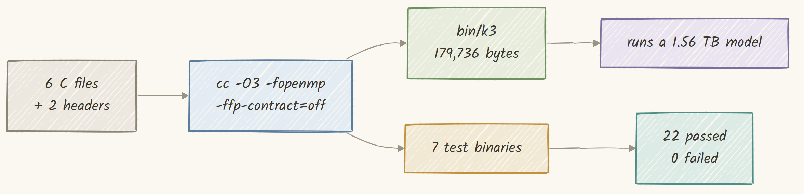

```text
1. build, warnings are failures
  -> clean build, no diagnostics
  test_ops          97784 bytes
  k3_model          89392 bytes
  k3_run           179736 bytes
```

The whole inference engine is **179,736 bytes**, a 176 kilobyte binary whose job is to
run a 1.56 terabyte model.

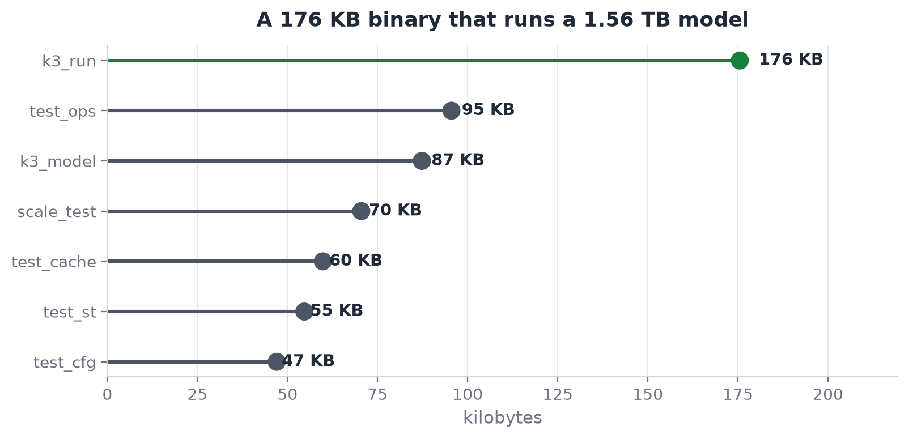

One check crosses machines. The tokenizer was run on the same input file under Windows and
under Linux:

```text
=== cross-platform tokenizer determinism ===
  Linux   gcc 13.3.0  x86_64
  Windows gcc 16.1.0  x86_64
  input   src/k3.h (24,499 bytes) -> 6,862 ids
  result  IDENTICAL id streams

  (a naive md5 of stdout DIFFERS by one byte: Windows text-mode stdout writes the
   trailing newline as CRLF. That is the pipe, not the tokenizer.)
```

Two compilers on two operating systems produce the same 6,862 token ids from the same
24,499 bytes. The md5 sums differ by exactly one byte, and the reason is the line ending
the shell added, not anything the tokenizer did.

## Three invariants

The public header opens with three invariants that must hold. Each one is a place where a
plausible-looking implementation produces a model that runs, emits fluent text, and is
wrong, with no crash and no NaN to warn you.

1. **`A_log` is indexed per head, not per channel.** The checkpoint ships `head_dim`
   floats but only the first `num_heads` are meaningful; the rest are padding.
2. **MLA uses NoPE, yet the 64 rope dimensions still exist and are still cached.** Only
   the rotation is absent; dropping the slots changes the head width.
3. **The MoE routing bias steers selection only.** The combining weights come from the
   unbiased sigmoid scores.

Each is ticked off below as its component arrives, and each is gated by a fixture chosen
so that getting it wrong changes the output: `A_log` by a linspace that a per-channel
misindex scrambles, NoPE by asserting the softmax scale is over the full head width, and
the routing bias by a fixture whose bias reorders the top-k on five of its six rows.

This list used to have five entries. The other two, that the UT-transform inverse is
`(I + Akk)^-1` and that `Aqk` keeps its diagonal while `Akk` does not, describe the
chunked parallel form of the delta rule. This engine does not use it. `k3_kda_step` runs
the naive sequential recurrence one position at a time, and so does the PyTorch reference
it is checked against, so neither matrix is ever formed. They were claims about an
algorithm rather than about this code, nothing implemented them, and no test could have
caught getting them wrong. They now live in [`docs/ARCHITECTURE.md`](docs/ARCHITECTURE.md)
with the rest of the algorithm description. Restoring a chunked KDA path means restoring
them, with the fixtures that gate them.

## 1. Reading a 1.56 TB checkpoint from its headers

The checkpoint is 96 safetensors files. The format is deliberately simple, which is what
makes it possible to treat 1.56 terabytes as an index rather than as data.


Every file starts with an 8-byte little-endian length, then that many bytes of JSON
describing every tensor, then the raw tensor bytes back to back. Nothing is compressed and
nothing is interleaved.


No JSON library is used. The header can be tens of megabytes and only four fields per
tensor are wanted, so the reader scans it directly.

```c
/* Walk the header once, copy nothing we do not need. `p` sits just past the
 * opening quote of the tensor name. */
static const char *st_scan_entry(const char *p, const char *end, K3Tensor *t)
{
    const char *q = memchr(p, '"', (size_t)(end - p));
    if (!q || (size_t)(q - p) >= sizeof t->name) return NULL;
    memcpy(t->name, p, (size_t)(q - p));
    t->name[q - p] = '\0';

    const char *d = st_find_key(q, end, "dtype");
    if (!d) return NULL;
    t->dtype = st_dtype_code(d);

    const char *s = st_find_key(q, end, "shape");
    if (!s) return NULL;
    t->rank = 0;
    t->nelem = 1;
    for (const char *c = s; c < end && *c != ']'; c++) {
        if (*c >= '0' && *c <= '9') {
            long v = strtol(c, (char **)&c, 10);
            if (t->rank >= K3_ST_MAXRANK) return NULL;
            t->shape[t->rank++] = v;
            t->nelem *= (size_t)v;
        }
    }

    /* offsets are RELATIVE to the start of the data section */
    const char *o = st_find_key(q, end, "data_offsets");
    if (!o) return NULL;
    t->off  = (size_t)strtoull(o, (char **)&o, 10);
    while (o < end && (*o < '0' || *o > '9')) o++;
    t->nbytes = (size_t)strtoull(o, (char **)&o, 10) - t->off;
    return o;
}
```

Every tensor goes into a hash table keyed by a hash of its name. The choice of hash is not
arbitrary.

```c
/* Names are long and share deep prefixes
 * ("language_model.model.layers.N.block_sparse_moe.experts.M...."), so the hash must
 * mix every byte; a prefix-only or length-only hash would pile every expert of a
 * layer into one bucket. */
static uint64_t fnv1a(const char *s)
{
    uint64_t h = 1469598103934665603ull;
    while (*s) { h ^= (unsigned char)*s++; h *= 1099511628211ull; }
    return h;
}
```

Half a million tensor names that all begin with the same forty characters is a genuinely
hostile input for a hash function. FNV-1a mixes on every byte, so the expert index at the
end of the name still moves the result.

Reading a tensor afterwards has one wrinkle: `O_DIRECT` requires the offset and the length
to be multiples of the block size, and a tensor starts wherever the previous one ended.

```c
int64_t k3_st_read_aligned(const K3St *s, int shard, int64_t off, int64_t nbytes,
                           void *buf, int64_t bufcap, int64_t *payload_off)
{
    /* widen outward to the enclosing aligned window */
    const int64_t lo  = off & ~(int64_t)(K3_ST_ALIGN - 1);
    const int64_t hi  = (off + nbytes + K3_ST_ALIGN - 1) & ~(int64_t)(K3_ST_ALIGN - 1);
    const int64_t len = hi - lo;
    const int64_t pad = off - lo;
    if (len > bufcap) return 0;
    if (payload_off) *payload_off = pad;

    int64_t got = 0;
    while (got < len) {
        ssize_t r = pread(dfd, (char *)buf + got, (size_t)(len - got), (off_t)(lo + got));
        if (r <= 0) break;      /* the last window may run past EOF */
        got += r;
    }
    return got >= pad + nbytes ? nbytes : (got > pad ? got - pad : 0);
}
```

Note the `break` rather than a failure on a short read: the final aligned window of a shard
extends past the end of the file, which is expected, so the return value checks that the
payload was covered rather than that the whole window was.

```text
indexed 497220 tensors from 96 shards in 0.27 s
```

**Half a million tensors indexed in about a quarter of a second.** This is what makes
everything afterwards possible: the engine never reads a shard it does not need, so the
1.56 terabytes on disk is a catalogue, not a working set.

A parser that agrees with itself proves nothing, so the index is dumped and re-parsed
independently in Python, comparing dtype, shape, offsets, and the widened float bit
patterns.

```python
# Bit patterns, not tolerances: widening bf16 to f32 is lossless.
c_bits = np.asarray(c_values[name], dtype=np.float32).view(np.uint32)
p_bits = ref.astype(np.float32).view(np.uint32)
if not np.array_equal(c_bits, p_bits):
    bad = int(np.count_nonzero(c_bits != p_bits))
    fail(f"{name}: {bad} of {c_bits.size} float32 bit patterns differ")
```

```text
=== shard verification ===
shards: 96
bytes:  1560936091448
expected: 1560936091448
RESULT: EXACT MATCH
```


## 2. The config reader that refuses to guess

The model's dimensions come from the checkpoint's own `config.json`, and this is the first
place **invariant four** can silently bite.


Kimi K3 alternates two attention mechanisms. Most layers use one, every fourth uses the
other, and the last two are both the second kind so the final layer always does global
attention. The config lists those layers explicitly, and the list is **one-based**.

```text
--- every value below is READ from the checkpoint, not assumed ---
config: config.json (nested shape) | hidden=7168 layers=93 vocab=163840
        | 24 MLA + 69 KDA | experts 896 top16 shared2 | latent=3584

--- KDA/MLA layer map (ONE-based, from full_attn_layers) ---
full_attn_layers (24, all MLA): 4,8,12,16,20,24,28,32,36,40,44,48,52,56,60,64,68,72,76,80,84,88,92,93
  note 92 AND 93 are both MLA - the report (2.1) places an extra Gated MLA layer
  at the end of the backbone so the final layer always does global attention.
kda_layers (69): every other layer.
```

Every one of those numbers is read from the file; none is compiled in. They land in one
struct, which is the entire model on one screen:

```c
typedef struct {
    int hidden;            /* 7168  */
    int n_layers;          /* 93    */
    int vocab;             /* 163840 */
    float rms_eps;         /* 1e-5  */

    /* Kimi Delta Attention. 69 of the 93 layers. */
    int kda_heads;         /* 96    */
    int kda_head_dim;      /* 128, and d_k == d_v */
    int conv_k;            /* 4, depthwise, causal, SiLU fused */
    float gate_lb;         /* -5.0, the decay lower bound */

    /* Gated MLA. 24 of the 93 layers. */
    int n_heads;           /* 96    */
    int q_lora;            /* 1536  */
    int kv_lora;           /* 512   */
    int qk_nope;           /* 128   */
    int qk_rope;           /* 64, PRESENT BUT NEVER ROTATED */
    int v_head;            /* 128   */
    int mla_out_gate;      /* 1     */

    /* Stable LatentMoE. 92 of the 93 layers. */
    int n_experts;         /* 896   */
    int topk;              /* 16    */
    int n_shared;          /* 2, full width, added UNWEIGHTED */
    int latent;            /* 3584, the routed-expert width */
    int moe_inter;         /* 3072  */
    float routed_scale;    /* 1.0   */
    int moe_renorm;        /* 1     */
    int latent_norm;       /* 1, RMSNorm on the AGGREGATE, not per expert */

    /* the single dense layer, layer 0 */
    int first_dense;       /* 1     */
    int dense_inter;       /* 33792 */

    int attn_res_block;    /* 12. Boundaries fire when layer_idx % this == 0. */
    float situ_b1;         /* 4.0   */
    float situ_b2;         /* 25.0  */

    int  n_full_attn;      /* 24 */
    int *full_attn;        /* ONE-BASED layer indices */
} K3Cfg;
```

That struct is the contract between the checkpoint and every kernel. If it is right, the
model is Kimi K3. If any field is wrong, the model is something else that still speaks
English.

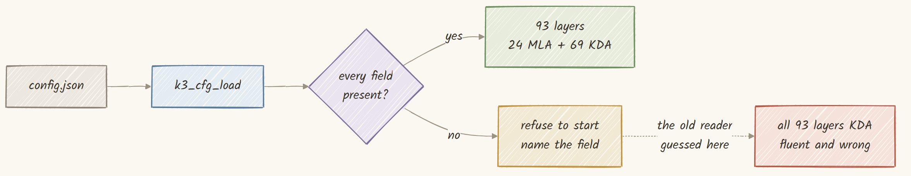

Consider what a permissive reader would do. The released config nests its fields one level
deeper than a fixture does, so a reader that only knows the flat shape finds nothing it
recognises. If it then fills in defaults, two things happen: the SiTU betas get 4.0 and
25.0, which are the **correct** values, so nothing looks wrong, and `full_attn_layers`
comes back empty, so all 93 layers run as KDA and the 24 global-attention layers vanish.
The model loads, streams, decodes, and produces grammatical English from an architecture
that is not Kimi K3.

```c
/* An absent field is an ERROR, never a default. Missing names are accumulated so
 * the message lists all of them at once. */
static int cfg_req_int(jval root, const char *key, int *out,
                       const char **missing, int *nmissing)
{
    jval v = json_get(root, key);
    if (v.type != JSON_NUM) {                 /* absent OR the wrong type */
        if (*nmissing < K3_CFG_MAXMISS) missing[(*nmissing)++] = key;
        return 0;
    }
    *out = (int)v.num;
    return 1;
}
```

```text
  [no_layermap]
    k3_cfg: no_layermap.json is missing 1 required field(s):
        full_attn_layers
      refusing to substitute defaults: a config this reader cannot
      fully understand would silently produce a DIFFERENT model.
      ok    correctly rejected no_layermap.json

  [bad_layer_index]
    k3_cfg: bad_layer_index.json full_attn_layers[2] = 999 is outside 1..93
        (the list is ONE-based)
      ok    correctly rejected bad_layer_index.json
```

A config reader is about a hundred and fifty lines of the most boring code in the project,
and it is one of exactly two places that can hand you a different model without telling
you.

## 3. The tokenizer, byte for byte

The other one is the tokenizer. Kimi K3 uses a byte-level BPE with 163,584 ranks plus 256
special tokens, shipped as a `tiktoken.model` file.


The loader reads that file straight into the vendored BPE structures. It rests on three
assumptions, each of which produces a tokenizer working perfectly on ASCII and diverging
on everything else:

- **The merge keys are bytes, not code points.** A key that happens to decode as valid
  UTF-8 must still be treated as its raw bytes.
- **Ranks come from the file.** They are not derived from frequency at load time.
- **The added-token block is appended after the ranks**, so an added token's id is 163,584
  plus its index, not its position in a merged table.

The test compares the C tokenizer against the Python `tiktoken` library case by case,
through files rather than command-line arguments:

```text
oracle   : tiktoken 0.13.0
method   : token-for-token comparison; every case passed through a FILE, never argv
           (argv is re-encoded to the active code page on Windows and would compare
            different bytes on every non-ASCII case)

  PASS  han only                 2 ids
  PASS  japanese                 6 ids
  PASS  korean                   5 ids
  PASS  cyrillic                 4 ids
  PASS  arabic                   7 ids
  PASS  emoji zwj                5 ids
  PASS  code python             11 ids
  PASS  json                    19 ids

tokenizer parity: 45/45 cases match
```

Then whole files are pushed through and decoded back:

```text
roundtrip: 48353 bytes -> 14797 ids -> 48353 bytes : PASS   <- k3_ops.c
roundtrip: 24499 bytes -> 6862 ids -> 24499 bytes : PASS   <- k3.h
roundtrip: 201775 bytes -> 52671 ids -> 201775 bytes : PASS   <- REPORT.md
roundtrip: 53444 bytes -> 12145 ids -> 53444 bytes : PASS   <- modeling_kimi_k3.py
```


Two hundred kilobytes of markdown becomes 52,671 token ids and comes back as exactly the
same two hundred kilobytes. Every later claim about identical output rests on the
tokenizer being deterministic.

```c
/* Greedily merge the lowest-rank adjacent pair. Everything here is BYTES. */
static int tok_encode_piece(const Tok *t, const unsigned char *p, int n, int *out)
{
    int parts[K3_TOK_MAXPIECE + 1], np = n + 1;
    for (int i = 0; i <= n; i++) parts[i] = i;          /* byte boundaries */

    for (;;) {
        int best = -1, bestrank = INT_MAX;
        for (int i = 0; i + 2 < np; i++) {
            const int r = tok_rank(t, p + parts[i], parts[i + 2] - parts[i]);
            if (r >= 0 && r < bestrank) { bestrank = r; best = i; }
        }
        if (best < 0) break;                            /* no mergeable pair left */
        memmove(&parts[best + 1], &parts[best + 2],
                (size_t)(np - best - 2) * sizeof(int));
        np--;
    }

    for (int i = 0; i + 1 < np; i++)
        out[i] = tok_rank(t, p + parts[i], parts[i + 1] - parts[i]);
    return np - 1;
}
```

The loop keeps a list of slice boundaries and repeatedly joins whichever adjacent pair has
the lowest rank, which is what makes the result independent of any tie-breaking order.

## 4. Reduction one: the experts already ship at half a byte

The first of the four reductions, and the largest single one.

The routed experts do not ship at bfloat16. They ship in **MXFP4**, a microscaling 4-bit
float format. Each weight is a 4-bit nibble indexing a 16-entry table, and every group of
32 consecutive weights shares one 8-bit exponent.


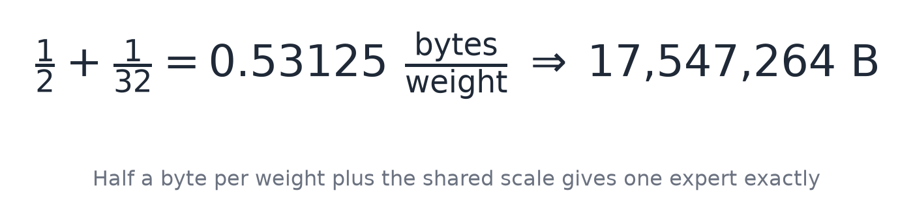

Half a byte plus one thirty-second of a byte is 0.53125 bytes per weight, and one expert
has 33,030,144 parameters, so one expert is exactly 17,547,264 bytes. That matches the
census to the byte.

The format is checked against the released checkpoint rather than against documentation:

```json
{
  "note": "Kimi K3 MXFP4 bytes from the released checkpoint. w = E2M1[nibble] * 2^(scale - 127), one scale per 32 elements.",
  "source": "language_model.model.layers.1.block_sparse_moe.experts.0.w1",
  "rows": 64, "packed_cols": 1792, "scale_cols": 112,
  "logical_width": 3584, "group_size": 32,
  "e2m1_lut": [0.0, 0.5, 1.0, 1.5, 2.0, 3.0, 4.0, 6.0,
              -0.0, -0.5, -1.0, -1.5, -2.0, -3.0, -4.0, -6.0]
}
```

Both halves of the decode are lookup tables, and building them is the only setup the
format needs.

```c
/* E2M1: sign, two exponent bits, one mantissa bit. Sixteen values in total. */
static const float K3_E2M1[16] = {
    0.0f,  0.5f,  1.0f,  1.5f,  2.0f,  3.0f,  4.0f,  6.0f,
   -0.0f, -0.5f, -1.0f, -1.5f, -2.0f, -3.0f, -4.0f, -6.0f
};

/* Byte -> its two weights, so the inner loop does one lookup, not two shifts. */
static void k3_pair_init(void)
{
    for (int b = 0; b < 256; b++) {
        K3_E2M1_PAIR[b][0] = K3_E2M1[b & 0x0F];   /* low nibble  = EVEN element */
        K3_E2M1_PAIR[b][1] = K3_E2M1[b >> 4];     /* high nibble = ODD  element */
    }
}

/* Scale byte -> power of two. 255 is NaN by spec, mapped to 0 to contain damage. */
static void k3_e8m0_init(void)
{
    for (int b = 0; b < 256; b++)
        K3_E8M0[b] = (b == 255) ? 0.0f : ldexpf(1.0f, b - 127);
}
```

Now the nibble order, which is a convention no statistic can check.


```text
"expected_swapped_nibbles": {
  "note": "what you get if the low nibble is treated as the ODD element.
           Statistics are identical; positions are wrong."
}
```

Every mean, every standard deviation, every histogram of the swapped version is identical
to the correct one, because it is the same multiset of numbers. Only the positions differ.
A verification that checks distributions would pass a matrix with every adjacent pair of
weights transposed.

The obvious way to use these weights is to decode them into floats and then do a normal
matrix multiply. Pricing that:

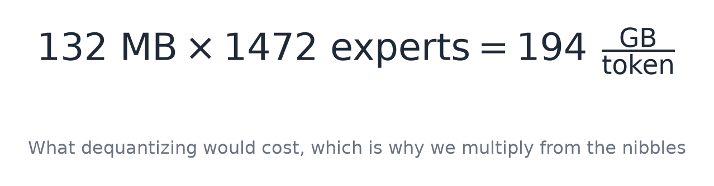

One expert at 17.55 MB becomes 132 MB once expanded to float32. Each token touches 16
experts across 92 layers (1,472 experts), so decoding them all would mean writing out
**194 gigabytes per token** of pure format conversion, before a single multiply-accumulate.


So nothing is ever dequantised. The matrix multiply reads packed nibbles directly.

```c
/* y[rows] = x[in] . W[rows][in], W stored as MXFP4. Nothing is dequantized. */
void k3_matmul_mxfp4(float *y, const float *x, const unsigned char *packed,
                     const unsigned char *scales, int in, int rows, int group)
{
    const int ngroup = (in + group - 1) / group;
    const int rowbytes = (in + 1) / 2;              /* two nibbles per byte */

#pragma omp parallel for schedule(static)
    for (int o = 0; o < rows; o++) {
        const unsigned char *pb = packed + (size_t)o * rowbytes;
        const unsigned char *sb = scales + (size_t)o * ngroup;
        double acc = 0.0;                            /* double, always */

        for (int g = 0; g < ngroup; g++) {
            const float s = K3_E8M0[sb[g]];
            if (s == 0.0f) continue;                 /* a NaN scale zeroes the group */

            const int i0 = g * group;
            const int n = (i0 + group <= in) ? group : (in - i0);
            float wf[64];

            /* low nibble is the EVEN weight, high nibble the ODD one */
            const int half = n / 2;
            for (int k = 0; k < half; k++) {
                const unsigned char b = pb[(i0 / 2) + k];
                wf[2 * k]     = K3_E2M1_PAIR[b][0];  /* low  nibble -> even index */
                wf[2 * k + 1] = K3_E2M1_PAIR[b][1];  /* high nibble -> odd index  */
            }
            if (n & 1) wf[n - 1] = K3_E2M1_PAIR[pb[(i0 / 2) + half]][0];

            double part = 0.0;
            for (int k = 0; k < n; k++) part += (double)x[i0 + k] * (double)wf[k];
            acc += part * (double)s;
        }
        y[o] = (float)acc;
    }
}
```

Two details are worth pausing on. `if (s == 0.0f) continue` handles a scale byte of 255,
which the MXFP4 specification defines as NaN; mapping it to zero means one corrupt byte
kills one group of 32 weights instead of turning an entire row into NaN and poisoning
every downstream layer. And `if (n & 1)` handles a group with an odd number of elements.
with a group size of 32 that can never happen on this checkpoint, and it is written
anyway. That is the difference between code that works and code that is correct, and it
costs one line.

```text
  PASS  mxfp4          64 rows x 3584 elems, EXACT on released checkpoint bytes
```

Not "within tolerance", but **exact**. Both sides read identical bytes off identical weights,
so there is nothing that could legitimately differ, and the test is written with zero
tolerance to say so.

That is reduction one. The experts arrive at 0.53125 bytes per weight instead of 2, which
takes 5.45 TB of expert weights down to 1.447 TB, and never expanding them saves another
194 GB of memory traffic per token.

## 5. Kernels with a floating point contract

Every code path must produce the same bits. RMSNorm is the most used kernel in the model.


```c
void k3_rmsnorm(float *out, const float *x, const float *w, int n, float eps)
{
    double ss = 0.0;                                   /* double, not float */
    for (int i = 0; i < n; i++) ss += (double)x[i] * (double)x[i];
    const float inv = (float)(1.0 / sqrt(ss / (double)n + (double)eps));
    for (int i = 0; i < n; i++) out[i] = x[i] * inv * (w ? w[i] : 1.0f);
}
```

Two details are load-bearing: the accumulator is a **double** even though every input and
output is a float, and epsilon goes **inside** the square root rather than outside.

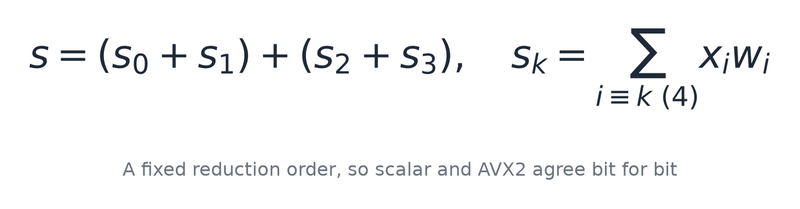

```c
/* Four accumulators partitioned by i % 4. This pins the summation order, so a
 * 4-wide vector loop adds the same numbers in the same sequence. */
static float k3_dot4(const float *x, const float *w, int n)
{
    double a0 = 0.0, a1 = 0.0, a2 = 0.0, a3 = 0.0;
    int i = 0;
    for (; i + 3 < n; i += 4) {
        a0 += (double)x[i]     * (double)w[i];
        a1 += (double)x[i + 1] * (double)w[i + 1];
        a2 += (double)x[i + 2] * (double)w[i + 2];
        a3 += (double)x[i + 3] * (double)w[i + 3];
    }
    for (; i < n; i++) a0 += (double)x[i] * (double)w[i];
    return (float)((a0 + a1) + (a2 + a3));       /* the parentheses are the contract */
}
```

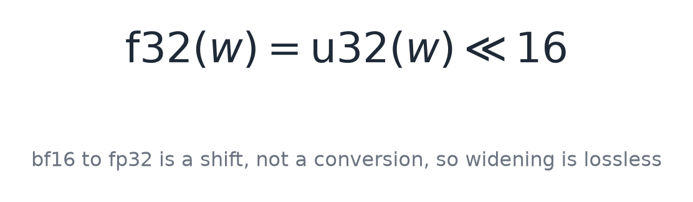

A bfloat16 value is the top 16 bits of a float32 with the bottom 16 dropped, so widening
is a shift left by 16 and it is exact. That is why the trunk can be streamed in its
shipped precision with no accuracy question at all, a point that becomes important much
later.

```c
void k3_matmul_bf16(float *y, const float *x, const uint16_t *W, int in, int out)
{
#pragma omp parallel for schedule(static) if (out > 64)
    for (int o = 0; o < out; o++) {
        const uint16_t *row = W + (size_t)o * in;
        int i = 0;
        double acc;
#if defined(__AVX2__)
        {
            __m256d v = _mm256_setzero_pd();
            for (; i + 3 < in; i += 4) {
                /* bf16 -> f32 is a 16-bit shift: no table, no rounding */
                const __m128i h   = _mm_loadl_epi64((const __m128i *)(row + i));
                const __m128i b32 = _mm_slli_epi32(_mm_cvtepu16_epi32(h), 16);
                const __m256d wd  = _mm256_cvtps_pd(_mm_castsi128_ps(b32));
                const __m256d xd  = _mm256_cvtps_pd(_mm_loadu_ps(x + i));
                v = _mm256_add_pd(v, _mm256_mul_pd(wd, xd));   /* NOT fmadd */
            }
            double a[4];
            _mm256_storeu_pd(a, v);
            acc = (a[0] + a[1]) + (a[2] + a[3]);
        }
#else
        {
            double a0 = 0.0, a1 = 0.0, a2 = 0.0, a3 = 0.0;
            for (; i + 3 < in; i += 4) {
                a0 += (double)k3_bf16f(row[i    ]) * (double)x[i    ];
                a1 += (double)k3_bf16f(row[i + 1]) * (double)x[i + 1];
                a2 += (double)k3_bf16f(row[i + 2]) * (double)x[i + 2];
                a3 += (double)k3_bf16f(row[i + 3]) * (double)x[i + 3];
            }
            acc = (a0 + a1) + (a2 + a3);
        }
#endif
        for (; i < in; i++) acc += (double)k3_bf16f(row[i]) * (double)x[i];
        y[o] = (float)acc;
    }
}
```

Both branches accumulate into four doubles, both partition by `i % 4`, and both reduce as
`(a0 + a1) + (a2 + a3)`. The vector path is the scalar path with the same additions
performed in the same order, four at a time.

Note the multiply-add. `_mm256_add_pd` of an `_mm256_mul_pd` is deliberately not
`_mm256_fmadd_pd`. A fused multiply-add rounds once instead of twice and is therefore
**more** accurate, which is exactly the problem: it would give a different answer from
the scalar loop, and a hardware capability must never change the output.


Proving the AVX2 and scalar paths agree cannot be done with a tolerance check, because a
tolerance check happily passes a kernel that quietly reassociated its sum. So the
benchmark hashes the output instead: FNV-1a over the exact bit pattern of every float in
the result, built twice, once with AVX2 and once without, then diff the digests.

```text
tolerance: atol=1.0e-05 rtol=1.0e-04  (from MANIFEST.json)
  PASS  rmsnorm        n=384    worst=0.01x tol
  PASS  situ_glu       n=48     worst=0.00x tol
        bound check |out|=100.000 must be <= b1*b2=100.0 : ok
  PASS  kda_decay      H=4 D=16 tok=4  max|dg|=4.768e-07 max|dalpha|=1.788e-07
  PASS  mla            n=768    worst=0.08x tol
        H=4 qh=32 (nope 24 + rope 8) v=16 kv_lora=32 scale=0.176777
  PASS  mxfp4          64 rows x 3584 elems, EXACT on released checkpoint bytes
  PASS  matmul_bf16   n=129    bit-identical to k3_matmul
22 passed, 0 failed, 0 skipped
```

The worst case across all 22 kernels is 8 percent of the allowed tolerance, and two are
exact rather than merely close.


Benchmarked at the model's own dimensions on the smallest configuration, the split is
about 36 seconds of trunk reading, 11 seconds of expert reading and 10 seconds of
arithmetic. **Eighty percent of a token is waiting for a disk**, which is why the second
half of this document is about I/O and not about kernels.

## 6. Reduction two: KDA, attention with a memory that never grows

Sixty-nine of the 93 layers use Kimi Delta Attention, and its property that matters here
is easy to state: its memory does not grow with context length.

A standard attention layer stores a key and a value for every token it has seen, so its
cache grows linearly forever. KDA instead keeps one fixed-size matrix per head and updates
it in place as tokens arrive.


Ninety-six heads times a 128×128 matrix per head is the entire memory of a KDA layer, at
any sequence length. Across all 93 layers that is **626.25 megabytes**, whether you feed
it ten tokens or a million.


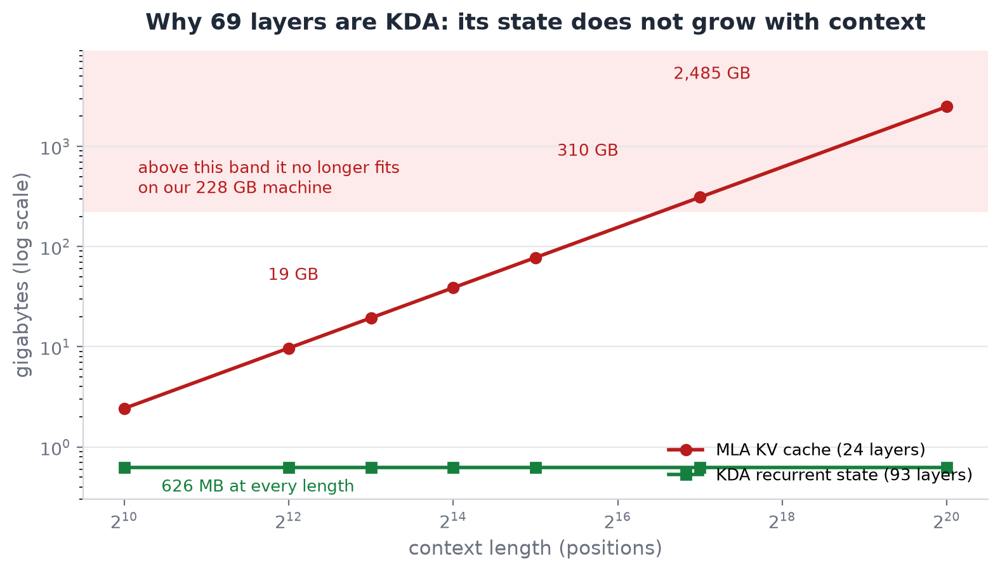

That plot is the argument for the whole design. The flat line is KDA. The rising line is
what the other 24 layers cost, and it crosses this machine's memory somewhere around
100,000 tokens. If all 93 layers behaved like it, the model would not fit at any context
length worth having.


First, the projections go through a short depthwise causal convolution of width four with
SiLU fused in.


```c
/* Causal depthwise conv with SiLU fused. State is carried across calls. */
void k3_shortconv(float *y, const float *x, const float *w, float *state,
                  int channels, int k, int T)
{
    const int hist = k - 1;                  /* guard on hist, not on buf */
    float *buf = hist ? (float *)malloc((size_t)hist * sizeof(float)) : NULL;
    if (hist && !buf) k3_fatal_oom("ShortConv history", (size_t)hist * sizeof(float));

    for (int c = 0; c < channels; c++) {
        if (hist) {
            if (state) memcpy(buf, state + (size_t)c * hist, (size_t)hist * sizeof(float));
            else       memset(buf, 0, (size_t)hist * sizeof(float));
        }

        for (int t = 0; t < T; t++) {
            const float cur = x[(size_t)t * channels + c];
            float acc = w[(size_t)c * k + hist] * cur;   /* taps run oldest to newest */
            for (int j = 0; j < hist; j++)
                acc += w[(size_t)c * k + j] * buf[j];

            for (int j = 0; j + 1 < hist; j++) buf[j] = buf[j + 1];
            if (hist > 0) buf[hist - 1] = cur;

            y[(size_t)t * channels + c] = acc * sigmoidf_(acc);   /* SiLU, fused */
        }
        if (state && hist) memcpy(state + (size_t)c * hist, buf, (size_t)hist * sizeof(float));
    }
    free(buf);
}
```

Note the guard on `hist` rather than on `buf`: with a kernel width of one there is no
history at all, `malloc(0)` is allowed to return NULL, and a check on the pointer would
silently skip the entire convolution and leave the output untouched.

Then the queries and keys are L2-normalised, a sum of squares, not a mean of squares,
which is a different function that looks nearly identical in code.


Then the decay gate, which is **invariant one**.

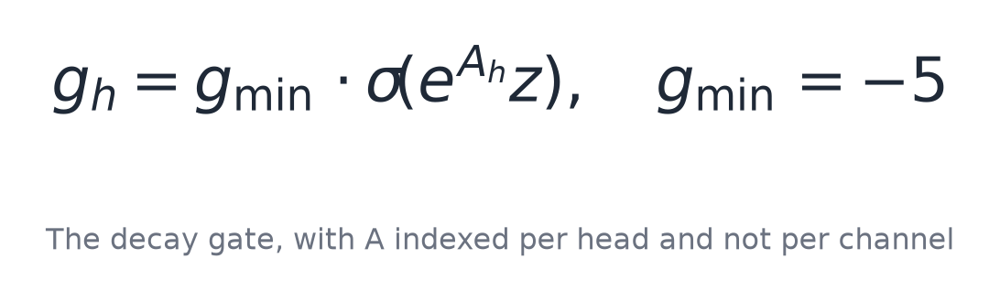

```c
void k3_kda_decay(float *g, float *alpha, const float *z, const float *A_log,
                  const float *dt_bias, int H, int D, float lb)
{
    for (int h = 0; h < H; h++) {
        const float a = expf(A_log[h]);      /* PER HEAD, not per channel */
        for (int d = 0; d < D; d++) {
            const int i = h * D + d;
            const float u  = a * (z[i] + dt_bias[i]);
            const float gi = lb * sigmoidf_(u);   /* in (lb, 0] */
            g[i] = gi;
            alpha[i] = expf(gi);                  /* in (e^lb, 1] */
        }
    }
}
```

The gate lower bound is −5, so `alpha` lands between `e^-5` and 1. Near one means this key
channel keeps almost all of its history; near `e^-5` means it forgets almost everything,
per channel and per token.


```c
void k3_kda_step(float *S, float *o, const float *q, const float *k,
                 const float *v, const float *alpha, float beta, int dk, int dv)
{
    /* 1. decay: scale ROW i of S by alpha[i], per key channel */
    for (int i = 0; i < dk; i++) {
        float *row = S + (size_t)i * dv;
        const float a = alpha[i];
        for (int j = 0; j < dv; j++) row[j] *= a;
    }

    /* 2. read the state along k: u = S^T k */
    float *u = (float *)calloc((size_t)dv, sizeof(float));
    if (!u) k3_fatal_oom("KDA recurrence temporary", (size_t)dv * sizeof(float));
    for (int i = 0; i < dk; i++) {
        const float ki = k[i];
        if (ki == 0.0f) continue;
        const float *row = S + (size_t)i * dv;
        for (int j = 0; j < dv; j++) u[j] += ki * row[j];
    }

    /* 3. rank-one delta write: (v - u) is the prediction error */
    for (int i = 0; i < dk; i++) {
        const float ki = k[i];
        if (ki == 0.0f) continue;
        float *row = S + (size_t)i * dv;
        for (int j = 0; j < dv; j++) row[j] += ki * beta * (v[j] - u[j]);
    }

    /* 4. output from the ALREADY UPDATED state: o = S^T q */
    for (int j = 0; j < dv; j++) o[j] = 0.0f;
    for (int i = 0; i < dk; i++) {
        const float qi = q[i];
        if (qi == 0.0f) continue;
        const float *row = S + (size_t)i * dv;
        for (int j = 0; j < dv; j++) o[j] += qi * row[j];
    }
    free(u);
}
```

That `calloc` happens **after** step one has already scaled the state, so an early return
on allocation failure would leave the recurrent matrix permanently decayed but never
updated. Every subsequent token would then be computed from a state that is quietly wrong,
with nothing to indicate it. That is why the failure path aborts instead of returning.


```c
void k3_kda_layer(float *out, const float *x, const K3KdaW *w, const K3Cfg *c,
                  int T, float *state, float *scratch)
{
    const int E = c->hidden, H = c->kda_heads, D = c->kda_head_dim;
    const int P = H * D, K = c->conv_k, hist = K - 1;

    float *q  = scratch;                 float *k  = q + (size_t)T * P;
    float *v  = k + (size_t)T * P;       float *z  = v + (size_t)T * P;
    float *al = z + (size_t)T * P;       float *bt = al + (size_t)T * P;
    float *o  = bt + (size_t)T * H;      float *gb = o + (size_t)T * P;
    float *wr = gb + P;                  float *fa = wr + P;

    /* 1. projections */
    for (int t = 0; t < T; t++) {
        const float *xt = x + (size_t)t * E;
        k3_mmw(q + (size_t)t * P, xt, w->q, w->wdt, E, P);
        k3_mmw(k + (size_t)t * P, xt, w->k, w->wdt, E, P);
        k3_mmw(v + (size_t)t * P, xt, w->v, w->wdt, E, P);
        k3_mmw(bt + (size_t)t * H, xt, w->b, w->wdt, E, H);
        k3_mmw(fa, xt, w->f_a, w->wdt, E, D);        /* one low-rank pair, all heads */
        k3_mmw(z + (size_t)t * P, fa, w->f_b, w->wdt, D, P);
    }

    /* 2. ShortConv with fused SiLU, carrying state across calls */
    float *cs = state ? state + (size_t)H * D * D : NULL;
    k3_shortconv(q, q, w->q_conv, cs ? cs : NULL, P, K, T);
    k3_shortconv(k, k, w->k_conv, cs ? cs + (size_t)P * hist : NULL, P, K, T);
    k3_shortconv(v, v, w->v_conv, cs ? cs + (size_t)2 * P * hist : NULL, P, K, T);

    /* 3. L2Norm on q and k ONLY, per head. v is deliberately left alone. */
    for (int t = 0; t < T; t++)
        for (int h = 0; h < H; h++) {
            l2norm_(q + (size_t)t * P + (size_t)h * D, D, 1e-6f);
            l2norm_(k + (size_t)t * P + (size_t)h * D, D, 1e-6f);
        }

    /* 4/5. beta and the decay chain */
    for (int t = 0; t < T; t++) {
        for (int h = 0; h < H; h++) bt[(size_t)t * H + h] = sigmoidf_(bt[(size_t)t * H + h]);
        k3_kda_decay(z + (size_t)t * P, al + (size_t)t * P, z + (size_t)t * P,
                     w->A_log, w->dt_bias, H, D, c->gate_lb);
    }

    /* 6. recurrence, per head, with q pre-scaled by d_k^-0.5 */
    float *S = state;
    float *Sown = NULL;
    if (!S) {
        Sown = (float *)calloc((size_t)H * D * D, sizeof(float));
        if (!Sown) k3_fatal_oom("KDA recurrent state", (size_t)H * D * D * sizeof(float));
        S = Sown;
    }
    const float qscale = 1.0f / sqrtf((float)D);
    for (int t = 0; t < T; t++)
        for (int h = 0; h < H; h++) {
            const size_t off = (size_t)t * P + (size_t)h * D;
            for (int i = 0; i < D; i++) wr[i] = q[off + i] * qscale;
            k3_kda_step(S + (size_t)h * D * D, o + off, wr, k + off, v + off,
                        al + off, bt[(size_t)t * H + h], D, D);
        }

    /* 7/8/9. head-wise RMSNorm, THEN the gate, THEN the output projection */
    for (int t = 0; t < T; t++) {
        const float *xt = x + (size_t)t * E;
        float *ot = o + (size_t)t * P;
        for (int h = 0; h < H; h++)
            k3_rmsnorm(ot + (size_t)h * D, ot + (size_t)h * D, w->o_norm, D, c->rms_eps);
        k3_mmw(gb, xt, w->g, w->wdt, E, P);
        for (int i = 0; i < P; i++) ot[i] *= sigmoidf_(gb[i]);
        k3_mmw(out + (size_t)t * E, ot, w->o, w->wdt, P, E);
    }
    free(Sown);
}
```

Nine numbered steps, and the numbering is not decoration. Step 3 normalises `q` and `k`
and deliberately leaves `v` alone. Step 6 pre-scales the query by one over the square root
of the head dimension **before** the recurrence rather than after it.

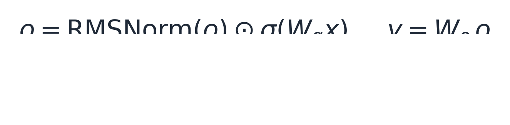

Steps 7, 8 and 9 carry an ordering constraint of their own. The released model ends the
layer with a fused kernel from the `fla` library called `FusedRMSNormGated`, which takes
the raw gate and applies the sigmoid internally. The reference implementation instead does
an explicit RMSNorm followed by a multiply by the sigmoid of the gate. Those are the same
function **only** if the fused kernel is norm-first and gate-second, so
`tools/verify_kda.py` proves it rather than assuming it:

> The plausible alternatives, gating before norming or norming the gate, both run cleanly
> and produce a different model.

No test catches that except comparing against the released code, which is exactly what
that script does.

```text
one KDA layer  : 443740384 params  (887.48 MB at bf16)
69 KDA layers  : 61.24 GB at bf16   (KDA attention ONLY, not the whole trunk)
full trunk     : 113.49 GB at bf16, 56,743,648,000 always-active params
one expert     : 33030144 params  (17.55 MB at MXFP4)
all 82432 experts: 1.45 TB at MXFP4  <- streamed from NVMe

per-sequence state, FIXED regardless of context:
  KDA recurrent : 217.06 MB at bf16
  ShortConv     : 15.26 MB at bf16
  MLA KV        : 2.37 MB per position (24 MLA layers, EXPANDED k and v, fp32)
                  19.38 GB at 8192 context
                  310.04 GB at 131072 context

allocating and running ONE full-width KDA layer (fp32)...
  weights: 1.77 GB
  ran 4 tokens in 0.17 s (44 ms/token)
  output all finite: YES, max |y| = 0.000003
  state non-zero   : yes
```

The two lines under "FIXED regardless of context" are the payoff. The KDA state is 217 MB
and the convolution history is 15 MB, and neither number moves no matter how long the
sequence gets, against 310 GB for the other attention mechanism at 131,072 positions.

That is reduction two: 69 of 93 layers have a memory cost completely independent of how
much text you feed them.

## 7. Reduction three: MLA, one latent instead of ninety-six heads

The other 24 layers do global attention, because a purely recurrent stack cannot look back
at an arbitrary earlier token with full precision. They use Gated Multi-head Latent
Attention, and they are the ones that cost memory per position.

A normal attention layer with 96 heads would store, for every position, a key and a value
for each head. MLA instead projects the token down into one small shared latent, caches
only that, and rebuilds the per-head keys and values from it when they are needed.


The latent is 512 dimensions for the key and value content plus 64 more, and those 64 are
where **invariant four** lives.

```c
/* NoPE: the 64 rope dimensions are projected and cached, but never rotated. */
static void k3_mla_project(float *q, float *kv, const float *x, const K3MlaW *w,
                           const K3Cfg *c)
{
    float qa[K3_MAX_QLORA];                  /* down to 1536, norm, back up */
    k3_mmw(qa, x, &w->q_a_proj, c->q_lora, c->hidden);
    k3_rmsnorm(qa, qa, w->q_a_norm, c->q_lora, c->rms_eps);
    k3_mmw(q, qa, &w->q_b_proj, c->n_heads * (c->qk_nope + c->qk_rope), c->q_lora);

    /* one 576-wide projection: the entire per-position cache for this layer */
    k3_mmw(kv, x, &w->kv_a_proj, c->kv_lora + c->qk_rope, c->hidden);
    k3_rmsnorm(kv, kv, w->kv_a_norm, c->kv_lora, c->rms_eps);
    /* the trailing qk_rope floats are left unnormalised and unrotated */
}
```

The head width is 192 (128 content dimensions plus those 64 carried-but-unrotated
ones), so the softmax scale is the inverse square root of 192 rather than of 128. Getting that
wrong is a change of about 22 percent in every attention score, and it produces perfectly
readable output.

```c
    for (int t = 0; t < T; t++) {
        const int p = cached + t;
        for (int h = 0; h < H; h++) {
            const float *qt = q + ((size_t)t * H + h) * qh;
            float m = -INFINITY;
            for (int s = 0; s <= p; s++) {                 /* causal: s <= p */
                const float *ks = K3_KV_AT(s) + (size_t)h * kvd;
                const float *kr = K3_ROPE_AT(s);           /* shared slot */
                double d = 0.0;
                for (int i = 0; i < qn; i++) d += (double)qt[i] * (double)ks[i];
                /* the rope slot is UNROTATED but still scored, and the SAME 64
                 * values serve every head */
                for (int i = 0; i < qr; i++) d += (double)qt[qn + i] * (double)kr[i];
                sc[s] = (float)d * scale;
                if (sc[s] > m) m = sc[s];
            }
            double z = 0.0;
            for (int s = 0; s <= p; s++) { sc[s] = expf(sc[s] - m); z += sc[s]; }
```

The score is two dot products added together. The first runs over the 128 content
dimensions, which are per head. The second runs over the 64 rope dimensions, which are
**shared**: `K3_ROPE_AT(s)` takes no head index, so all 96 heads score against the same 64
numbers. That is what makes the cache 576 wide instead of 96 × 320, and skipping the
second term is the quiet way to get a model that still speaks.


Ninety-six heads times 320 floats is 30,720 floats per position per layer. The latent is
576. That is **53 times smaller for mathematically identical output**, and it is the difference
between a context length you can use and one you cannot.

Because the KV cache is the one thing that grows, the engine refuses to start rather than
discovering the problem an hour in:

```c
/* The context limit is the MLA KV cache, not any array size. */
if (incremental) {
    const double kv_need = (double)(np + gen + 1) * K3_KV_BYTES_PER_POS;
    const double avail   = mem_available_bytes();
    if (avail > 0.0 && kv_need > avail * 0.9) {
        fprintf(stderr,
            "\nREFUSING: the KV cache for %d positions needs %s but only %s is\n"
            "available. This is a MEMORY limit, not an engine ceiling: MLA caches\n"
            "expanded k and v in fp32 across 24 layers, so context costs ~2.37 MB per\n"
            "position regardless of budget. Shorten the request, or use full\n"
            "recompute (drop --incremental), which carries no KV cache at all.\n",
            np + gen + 1, kb, ab);
        return 2;
    }
}
```

"This is a MEMORY limit, not an engine ceiling" saves somebody an afternoon of looking for
a hardcoded constant that does not exist.

That is reduction three. Context costs 2.37 MB per position instead of 125.

## 8. Attention residuals: layers that look back

One more structural piece, unusual enough to be worth a section even though it costs no
memory.

In a normal transformer each layer adds its output to a running residual stream. Kimi K3
does something different: each layer attends over the outputs of every preceding **block**,
where a block is twelve layers, and learns how much of each to mix in.

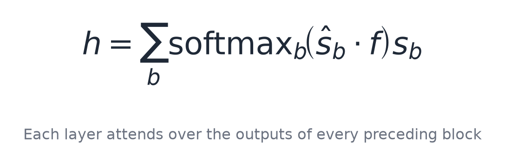

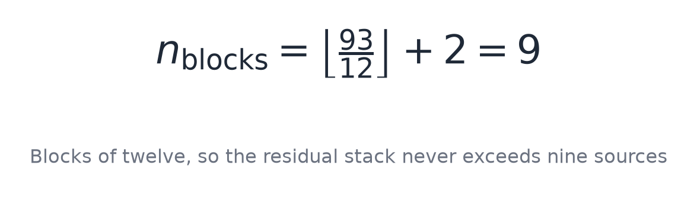

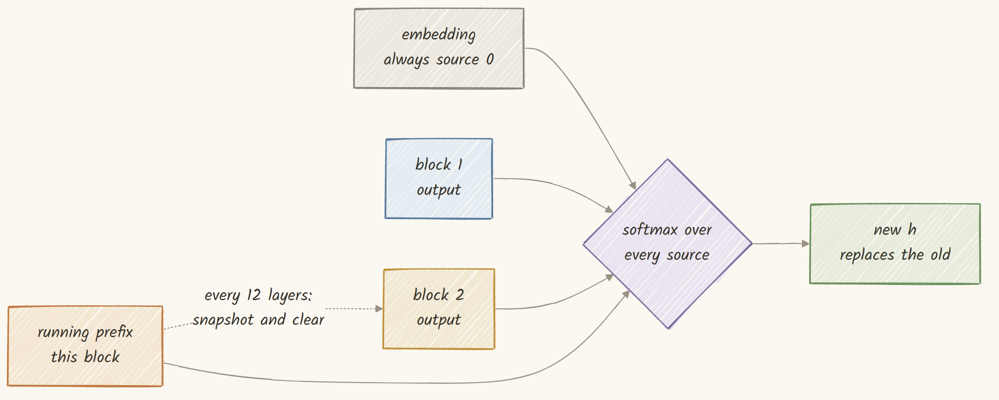

```c
void k3_attn_res(float *out, const float *src, const float *fold,
                 int nsrc, int n, float eps)
{
    float *score = (float *)malloc((size_t)nsrc * sizeof(float));
    if (!score) k3_fatal_oom("AttnRes scores", (size_t)nsrc * sizeof(float));

    for (int s = 0; s < nsrc; s++) {
        const float *v = src + (size_t)s * n;
        double ss = 0.0;
        for (int i = 0; i < n; i++) ss += (double)v[i] * (double)v[i];
        const float inv = (float)(1.0 / sqrt(ss / (double)n + (double)eps));
        double acc = 0.0;                            /* key: the NORMALISED source */
        for (int i = 0; i < n; i++) acc += (double)(v[i] * inv) * (double)fold[i];
        score[s] = (float)acc;
    }

    float m = score[0];
    for (int s = 1; s < nsrc; s++) if (score[s] > m) m = score[s];
    double z = 0.0;
    for (int s = 0; s < nsrc; s++) { score[s] = expf(score[s] - m); z += score[s]; }

    for (int i = 0; i < n; i++) out[i] = 0.0f;
    for (int s = 0; s < nsrc; s++) {
        const float p = (float)(score[s] / z);
        const float *v = src + (size_t)s * n;   /* the RAW source, not the key */
        for (int i = 0; i < n; i++) out[i] += p * v[i];
    }
    free(score);
}
```

The keys are normalised before scoring and the values are the **raw** sources. Norming the
values as well is the obvious-looking mistake, and it quietly rescales the residual stream.

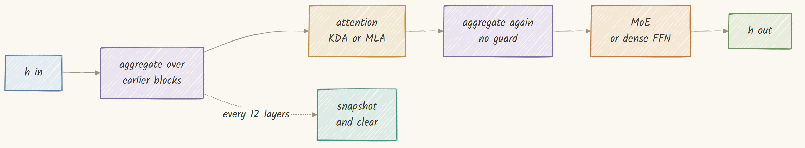

```c
void k3_decoder_layer_inc(float *h, float *block_residual, int *n_blocks,
                          const K3LayerW *w, const K3Cfg *c, int layer_idx,
                          int T, float *state, float *scratch,
                          float *kvc, float *ropec, int cached, int cap)
{
    const int E = c->hidden;
    const int maxb = c->n_layers / c->attn_res_block + 2;

    float *pref   = scratch;                    /* [T][E] the running residual   */
    float *tmp    = pref + (size_t)T * E;       /* [T][E] module output          */
    float *hin    = tmp  + (size_t)T * E;       /* [T][E] normalised layer input */
    float *foldA  = hin  + (size_t)T * E;       /* [E] attention aggregator      */
    float *foldM  = foldA + E;                  /* [E] mlp aggregator            */
    float *src    = foldM + E;                  /* [maxb+1][E] source stack      */
    float *dgu    = src + (size_t)(maxb) * E;   /* [2*dense_inter]               */
    float *sub    = dgu + (size_t)2 * c->dense_inter;   /* scratch for the module */

    /* norm gain and scoring projection collapse into one vector */
    for (int i = 0; i < E; i++) {
        foldA[i] = w->attn_res_norm[i] * w->attn_res_proj[i];
        foldM[i] = w->mlp_res_norm[i]  * w->mlp_res_proj[i];
    }

    memcpy(pref, h, (size_t)T * E * sizeof(float));
    int have_prefix = 1;                        /* mirrors "prefix_sum is not None" */

    /* aggregation before attention, only when snapshots already exist */
    if (*n_blocks > 0) {
        for (int t = 0; t < T; t++) {
            for (int b = 0; b < *n_blocks; b++)
                memcpy(src + (size_t)b * E,
                       block_residual + ((size_t)t * maxb + b) * E,
                       (size_t)E * sizeof(float));
            memcpy(src + (size_t)(*n_blocks) * E, pref + (size_t)t * E,
                   (size_t)E * sizeof(float));
            k3_attn_res(h + (size_t)t * E, src, foldA, *n_blocks + 1, E, c->rms_eps);
        }
    }

    /* block boundary: snapshot the running residual, then CLEAR it */
    if (layer_idx % c->attn_res_block == 0) {
        for (int t = 0; t < T; t++)
            memcpy(block_residual + ((size_t)t * maxb + *n_blocks) * E,
                   pref + (size_t)t * E, (size_t)E * sizeof(float));
        (*n_blocks)++;
        have_prefix = 0;
    }

    /* whichever attention was bound for this layer */
    for (int t = 0; t < T; t++)
        k3_rmsnorm(hin + (size_t)t * E, h + (size_t)t * E, w->in_norm, E, c->rms_eps);
    if (w->kda) k3_kda_layer(tmp, hin, w->kda, c, T, state, sub);
    else        k3_mla_cached(tmp, hin, w->mla, c, T, sub, kvc, ropec, cached, cap);

    if (have_prefix) for (size_t i = 0; i < (size_t)T * E; i++) pref[i] += tmp[i];
    else             { memcpy(pref, tmp, (size_t)T * E * sizeof(float)); have_prefix = 1; }

    /* aggregation before the MLP, with no emptiness guard */
    for (int t = 0; t < T; t++) {
        for (int b = 0; b < *n_blocks; b++)
            memcpy(src + (size_t)b * E,
                   block_residual + ((size_t)t * maxb + b) * E,
                   (size_t)E * sizeof(float));
        memcpy(src + (size_t)(*n_blocks) * E, pref + (size_t)t * E,
               (size_t)E * sizeof(float));
        k3_attn_res(h + (size_t)t * E, src, foldM, *n_blocks + 1, E, c->rms_eps);
    }

    for (int t = 0; t < T; t++)
        k3_rmsnorm(hin + (size_t)t * E, h + (size_t)t * E, w->post_norm, E, c->rms_eps);

    if (w->moe) {
        int   idx[K3_MAX_TOPK]; float wt[K3_MAX_TOPK];
        k3_moe(tmp, hin, w->moe, c, T, idx, wt, sub);
    }
}
```

The layer never asks which kind it is; it checks whether `w->kda` was bound, so the layer
map from `config.json` is the only thing that decides. The two aggregations are not
symmetric: the one before attention is skipped when no snapshots exist yet, and the one
before the MLP has no such guard, because the reference has none either.

Does that do anything observable? The reference forward pass draws it. Printing the
maximum absolute activation after every layer:

```text
  L45  KDA MoE      41.2 s   |h| max 47.714829
  L46  KDA MoE      38.9 s   |h| max 62.183392
  L47  MLA MoE      44.3 s   |h| max 76.281532
  L48  KDA MoE      36.1 s   |h| max 2.902113
  L49  KDA MoE      39.5 s   |h| max 4.353188
```

Layer 47 to layer 48: the activation magnitude goes from **76.28 to 2.90**, a factor of
26, in one layer. That is a block boundary: the running prefix was snapshotted and
cleared, so the next layer starts from a fresh small residual.

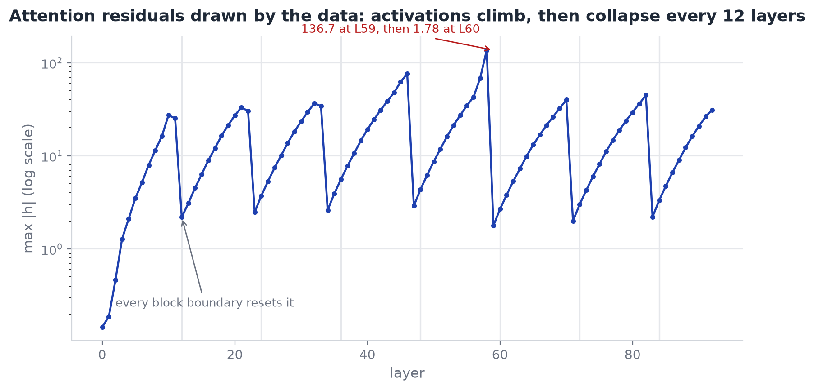

Seven sawteeth, one per block, each climbing for twelve layers and then collapsing. Nobody
drew that shape; the model did. The biggest peak is 136.7 at layer 59, dropping to 1.78 at
layer 60. When a measured curve has exactly the period the code says it should, that is a
decent sign the code matches the model.

## 9. Picking 16 experts of 896

The router scores every one of the 896 experts and picks sixteen. This is **invariant
five**, the subtlest of the lot.


```c
/* Score all n_experts, pick the top-k, weight them. The bias steers SELECTION only. */
void k3_router(int *idx, float *w, const float *x, const float *W, const float *bias,
               int hidden, int n_experts, int topk, int renorm, float routed_scale)
{
    float sc[K3_MAX_EXPERTS], ch[K3_MAX_EXPERTS];

#pragma omp parallel for schedule(static)
    for (int e = 0; e < n_experts; e++) {
        double acc = 0.0;
        for (int i = 0; i < hidden; i++)
            acc += (double)x[i] * (double)W[(size_t)e * hidden + i];
        sc[e] = 1.0f / (1.0f + expf(-(float)acc));      /* the UNBIASED score */
        ch[e] = sc[e] + (bias ? bias[e] : 0.0f);        /* the SELECTION score */
    }

    char taken[K3_MAX_EXPERTS] = {0};        /* top-k by repeated max */
    for (int j = 0; j < topk; j++) {
        int best = -1;
        for (int e = 0; e < n_experts; e++)
            if (!taken[e] && (best < 0 || ch[e] > ch[best])) best = e;
        taken[best] = 1;
        idx[j] = best;
        w[j] = sc[best];                                 /* the UNBIASED score again */
    }

    if (renorm) {
        float s = 0.0f;
        for (int j = 0; j < topk; j++) s += w[j];
        if (s > 0.0f) for (int j = 0; j < topk; j++) w[j] /= s;
    }
    for (int j = 0; j < topk; j++) w[j] *= routed_scale;
}
```

`sc[e]` and `ch[e]` are both computed and used for different things. The biased score picks
the winners; the unbiased score weights them. Collapsing those two into one variable is a
two-character edit that changes the model.


```c
/* Stable LatentMoE for one token.
 *
 * Six steps, and step 4 is the one people get wrong: the RMSNorm is applied to the
 * AGGREGATE of the weighted expert outputs, not to each expert individually. Norming
 * per expert and then summing is a different function.
 *
 * The two shared experts run on the ORIGINAL full-width input, not the latent, and
 * their output is added UNWEIGHTED. They are not part of the top-k sum. */
void k3_moe(float *out, const float *x, const K3MoeW *w, const K3Cfg *c,
            int T, int *idx, float *wt, float *scratch)
{
    const int E = c->hidden, L = c->latent, I = c->moe_inter;
    float *z = scratch, *accL = z + L, *gu = accL + L, *act = gu + 2 * I;
    float *edn = act + I;

    for (int t = 0; t < T; t++) {
        const float *xt = x + (size_t)t * E;

        /* 1. route on the FULL width, not the latent */
        k3_router(idx, wt, xt, w->gate, w->gate_bias, E,
                  c->n_experts, c->topk, c->moe_renorm, c->routed_scale);

        /* 2. down-project into the expert latent */
        k3_mmw(z, xt, w->down, w->wdt, E, L);

        /* 3. run the chosen experts, accumulating in the latent */
        for (int i = 0; i < L; i++) accL[i] = 0.0f;
        if (w->src && w->src->getmany) w->src->getmany(w->src, w->layer, idx, c->topk);

        for (int j = 0; j < c->topk; j++) {
            K3ExpertQ q;
            if (w->src->get(w->src, w->layer, idx[j], &q) != 0) {
                k3_expert_drops++;          /* counted, never silent */
                continue;
            }
            k3_matmul_mxfp4(gu,     z, q.p1, q.s1, L, I, K3_MXFP4_GROUP);
            k3_matmul_mxfp4(gu + I, z, q.p3, q.s3, L, I, K3_MXFP4_GROUP);
            k3_situ_glu(act, gu, I, c->situ_b1, c->situ_b2);
            k3_matmul_mxfp4(edn, act, q.p2, q.s2, I, L, K3_MXFP4_GROUP);
            for (int i = 0; i < L; i++) accL[i] += wt[j] * edn[i];
        }

        /* 4. norm the AGGREGATE, not each expert */
        if (c->latent_norm) k3_rmsnorm(accL, accL, w->latent_norm, L, c->rms_eps);

        /* 5. back up to full width */
        float *ot = out + (size_t)t * E;
        k3_mmw(ot, accL, w->up, w->wdt, L, E);

        /* 6. shared experts, on the ORIGINAL input, added UNWEIGHTED */
        const int SI = I * c->n_shared;
        k3_mmw(gu,      xt, w->sh1, w->wdt, E, SI);
        k3_mmw(gu + SI, xt, w->sh3, w->wdt, E, SI);
        k3_situ_glu(act, gu, SI, c->situ_b1, c->situ_b2);
        k3_mmw(edn, act, w->sh2, w->wdt, SI, E);
        for (int i = 0; i < E; i++) ot[i] += edn[i];
    }
}
```

The activation inside each expert is SiTU-GLU, a gated unit with both halves passed
through bounded tanh functions.


```c
void k3_situ_glu(float *y, const float *x, int n, float b1, float b2)
{
    const float *gate = x;
    const float *up   = x + n;
    for (int i = 0; i < n; i++) {
        const float g = gate[i];
        /* the sigmoid takes the UNCAPPED gate */
        const float a = b1 * tanhf(g / b1) * sigmoidf_(g);
        const float u = b2 * tanhf(up[i] / b2);
        y[i] = a * u;
    }
}
```

The sigmoid reads the **uncapped** gate `g`, not the capped `b1 * tanh(g / b1)`. Feeding it
the capped value gives a function that is still smooth, still bounded, still produces
fluent output, and is a different activation.

Because both factors are bounded, the product can never exceed 4 × 25 = 100, and the
fixture drives it deliberately to that exact analytic cap:

```text
  PASS  situ_glu       n=48     worst=0.00x tol
        bound check |out|=100.000 must be <= b1*b2=100.0 : ok
```

A fixture that only tested the near-linear region would pass an implementation with the
caps left out entirely, because for small inputs the tanh is almost the identity.

Now the thing to remember for later. The Kimi K3 technical report describes a training
technique called **Quantile Balancing** whose entire purpose is to flatten expert usage
across the pool, so that no small set of experts dominates.


That is good for the model, and it is going to be very bad for the cache. Hold that
thought.

One last thing about the `continue` in the expert loop. A dropped expert means one token
was computed with fifteen-sixteenths of its routed sum, and the run still finishes and
still prints a plausible token. So the engine counts them globally and refuses to exit
successfully:

```c
/* Silent numerical corruption that exits 0 is indistinguishable from a good run. */
if (k3_expert_drops) {
    fprintf(stderr,
            "\nRUN INVALID: %ld routed expert load(s) failed and were dropped from\n"
            "the MoE sum. The token ids above are CORRUPT. Re-run; if this repeats,\n"
            "the shard set or the storage is at fault.\n", k3_expert_drops);
    return 4;
}
return 0;
```

Note where that sits: after all the reporting and all the frees. A corrupt run still
prints its full diagnostics and still cleans up. It simply does not exit zero.

## 10. Packing the trunk: 93 layers, one read each

The resident set is down to 113.49 GB. That is still far more than a consumer machine has,
and it is the last big number in the ledger.

The trunk is spread across 96 shard files, interleaved with the experts. Reading one
layer's worth means finding a few dozen tensors scattered through a 17 GB file. So before
running anything, it is rewritten once into a layout that suits how it is actually read.


The key fact that makes this cheap is that each layer's trunk tensors already sit in one
contiguous run inside its shard. So packing is 93 range copies, not a scatter-gather.

```python
# 93 sequential range copies, one per layer, each verified contiguous first.
for L in range(n_layers):
    names = [n for n in index if n.startswith(f"model.layers.{L}.") and not is_expert(n)]
    shards = {index[n] for n in names}
    if len(shards) != 1:
        die(f"layer {L} spans {len(shards)} shards; refusing")

    runs = sorted((offsets[n][0], offsets[n][1]) for n in names)
    lo, hi = runs[0][0], runs[-1][1]
    covered = sum(b - a for a, b in runs)
    if covered != hi - lo:
        # a gap would drag expert bytes along with it
        die(f"layer {L} is not contiguous: {hi - lo - covered} bytes of gap")

    out_off = align_up(out_off, ALIGN)      # head aligned for O_DIRECT
    copy_range(shard_path(shards.pop()), lo, hi, out_fh, CHUNK)
    out_off += align_up(hi - lo, ALIGN)     # and the tail, so reads never overrun
```

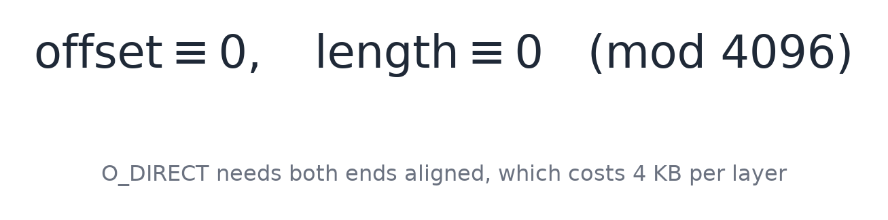

If a layer's tensors were not contiguous, copying the whole span would drag expert bytes
along with it and bloat the trunk file. Rather than silently produce a 400 GB trunk, the
packer stops.

```text
  packed 10/93 layers, 12.90 GB, 25 s (521 MB/s)
  packed 20/93 layers, 24.31 GB, 47 s (520 MB/s)
  packed 30/93 layers, 36.14 GB, 74 s (488 MB/s)
  packed 40/93 layers, 47.55 GB, 99 s (480 MB/s)
  packed 50/93 layers, 59.38 GB, 127 s (466 MB/s)
  packed 60/93 layers, 70.79 GB, 153 s (462 MB/s)
  packed 70/93 layers, 82.62 GB, 181 s (457 MB/s)
  packed 80/93 layers, 94.02 GB, 208 s (451 MB/s)
  packed 90/93 layers, 105.86 GB, 236 s (448 MB/s)
  packed 93/93 layers, 108.81 GB, 244 s (447 MB/s)

wrote trunk.bin: 108.81 GB across 93 layers
largest layer run: 2.341 GB  <- the streaming slot size
```


Four minutes, once, and layer L lives at a known offset and can be read in a single call.
The last line sizes everything downstream: **the largest layer run is 2.341 GB**, so any
buffer that has to hold one arbitrary layer must be at least that big.

## 11. Reduction four: streaming the trunk turns a floor into a dial

The trunk is 108.81 GB and every layer of it is used on every token. There is no sparsity
to exploit and nothing to skip. So the question is not how to avoid reading it, it is
where to keep it.

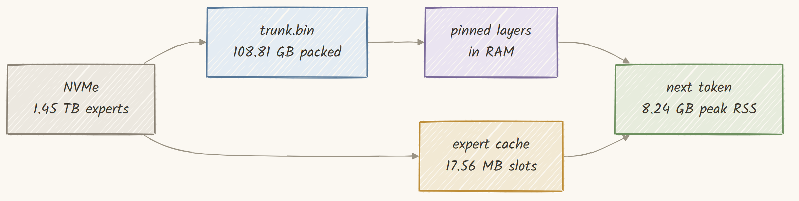


The design is a pinned prefix plus one rotating slot. Whatever fits in the budget gets
pinned permanently, and the rest cycles through a single ring buffer. Critically, it is a
**prefix** and not a cache.

The engine walks layers 0 through 92 in the same order on every token. That is a cyclic
scan, and a cyclic scan is the pathological case for least-recently-used eviction: by the
time layer 0 comes round again it is the least recently used thing in the cache, so it has
always just been evicted.

An LRU of 90 slots over a 93-layer cycle achieves a hit rate of **exactly zero**. Pinning
the first N layers instead gives a deterministic hit rate of N/93, which for N = 90 is 96.8
percent. The obvious data structure is not merely suboptimal here; it is wrong in the worst
possible direction, returning zero where the trivial approach returns almost one.

```c
/* Pinned count and slot size are mutually dependent, so iterate to a fixed point. */
size_t slot = tr->max_run;                 /* start assuming nothing is pinned */
int npin = 0;
for (int pass = 0; pass < 4; pass++) {
    size_t avail = budget > slot * (size_t)nring ? budget - slot * (size_t)nring : 0;
    int n = 0;
    size_t used = 0;
    while (n < tr->n_layers && used + tr->lay[n].nbytes <= avail) {
        used += tr->lay[n].nbytes;
        n++;
    }
    size_t need = 0;                       /* largest run still not pinned */
    for (int L = n; L < tr->n_layers; L++)
        if (tr->lay[L].nbytes > need) need = tr->lay[L].nbytes;
    if (need == 0) need = 4096;            /* everything pinned: degenerate but valid */
    if (n == npin && need == slot) break;  /* converged */
    npin = n;
    slot = k3_align_up(need, K3_TRUNK_ALIGN);
}
```

There is a memory detail that matters a lot. `O_DIRECT` reads pin their destination pages,
and a 2.37 GB slot on 4 KB pages is about 578,000 pages, pinned and unpinned 93 times per
token, nearly 54 million page operations per token purely in bookkeeping. So the arenas
are allocated on 2 MB hugepages instead.


```c
/* Add up EVERYTHING before allocating anything. */
const double need_b = w_trunk + w_model + w_cache + w_state + w_buf + w_kv;
const double have = mem_available_bytes();      /* MemAvailable, not MemFree */

if (need_b > have * 0.95) {
    fprintf(stderr,
            "\nREFUSING TO START: this needs %s and the machine has %s "
            "available, a shortfall of %s.\n"
            "Options: a larger box, a smaller --cache-gb, or fewer --layers.\n",
            b6, b1, b2);
    return 1;
}
```

That plan is explicitly a forecast and not a result. It omits the safetensors index, about
78 MB at full scale, reports requested budgets rather than actual reservations, and cannot
see fragmentation. So the engine also measures the peak resident set afterwards and labels
it, in the output, as the number to quote.


```c
/* One full forward over T tokens, writing logits for the LAST position only. */
static int forward(Weights *w, const K3Cfg *c, K3Cache *cache, const int *ids, int T,
                   float *logits_last, float *scratch, float *h, float *br, float *kstate)
{
    const int E = c->hidden;
    const int maxb = c->n_layers / c->attn_res_block + 2;
    const int P = c->kda_heads * c->kda_head_dim;
    const size_t kper = (size_t)P * c->kda_head_dim + (size_t)3 * P * (c->conv_k - 1);

    for (int t = 0; t < T; t++)
        k3_embed_row(h + (size_t)t * E, w->mb.embed, w->mb.wdt, ids[t], E);

    memset(br, 0, (size_t)T * maxb * E * sizeof(float));
    /* incremental decode carries the KDA state forward; full recompute rebuilds it */
    if (!w->kvc) memset(kstate, 0, kper * (size_t)w->n_bound * sizeof(float));

    int nb = 0;
    for (int L = 0; L < w->n_bound; L++) {
        /* bring this layer in, and hint the next one so its read overlaps */
        if (w->trunk) {
            if (k3_trunk_bind(w->trunk, c, L, &w->lay[L]) != 0) {
                fprintf(stderr, "trunk bind failed at layer %d\n", L);
                return -1;
            }
            k3_trunk_prefetch(w->trunk, L + 1);
        }
        if (w->lay[L].lay.moe) {
            w->lay[L].moe.src = &cache->src;
            w->lay[L].moe.layer = L;
        }
        if (w->kvc && w->mla_slot[L] >= 0) {
            const size_t kvper = (size_t)w->kv_cap * c->n_heads * (c->qk_nope + c->v_head);
            const size_t rpper = (size_t)w->kv_cap * c->qk_rope;
            const int mi = w->mla_slot[L];
            k3_decoder_layer_inc(h, br, &nb, &w->lay[L].lay, c, L, T,
                                 kstate + kper * (size_t)L, scratch,
                                 w->kvc + kvper * (size_t)mi,
                                 w->ropec + rpper * (size_t)mi,
                                 w->cached, w->kv_cap);
        } else {
            k3_decoder_layer_inc(h, br, &nb, &w->lay[L].lay, c, L, T,
                                 kstate + kper * (size_t)L, scratch,
                                 NULL, NULL, 0, 0);
        }
    }

    /* one model-level aggregator, beyond the two in every layer */
    if (w->mb.out_res_norm && w->mb.out_res_proj) {
        float *fold = scratch;
        float *src  = fold + E;
        for (int i = 0; i < E; i++) fold[i] = w->mb.out_res_norm[i] * w->mb.out_res_proj[i];
        for (int t = 0; t < T; t++) {
            for (int b = 0; b < nb; b++)
                memcpy(src + (size_t)b * E, br + ((size_t)t * maxb + b) * E,
                       (size_t)E * sizeof(float));
            memcpy(src + (size_t)nb * E, h + (size_t)t * E, (size_t)E * sizeof(float));
            k3_attn_res(h + (size_t)t * E, src, fold, nb + 1, E, c->rms_eps);
        }
    }

    float *nrm = scratch;
    k3_rmsnorm(nrm, h + (size_t)(T - 1) * E, w->mb.norm, E, c->rms_eps);
    k3_mmw(logits_last, nrm, w->mb.lm_head, w->mb.wdt, E, c->vocab);
    return 0;
}
```

That is the entire model in seventy lines. Embed the tokens, walk 93 layers binding each
one as it arrives, apply one final aggregator across all the block snapshots, normalise the
last position and project it to 163,840 logits.

The `if (!w->kvc)` line is the whole distinction between incremental decode and full
recompute in a single condition.


The first time the engine touched all 2.78 trillion parameters:

```text
Kimi K3, pure C, released checkpoint
  model    : /home/k3/k3model
  prompt   : 5 tokens, generating 2

indexed 497220 tensors from 96 shards in 0.70 s

memory plan
  trunk (STREAMED) 16.00 GB
  embed + lm_head  4.70 GB
  expert cache     6.00 GB
  recurrent state  626.25 MB
  buffers          6.68 MB
  KV cache         0.00 B
  TOTAL            27.33 GB
  available        65.91 GB

trunk stream: 108.81 GB packed, 10/93 layers PINNED (13.16 GB), ring 1 x 2.37 GB
              reads use O_DIRECT (page cache bypassed)
              deterministic hit rate 10.8% (a cyclic scan defeats LRU, so a pinned
              prefix is used instead)

peak RSS after loading weights: 4.78 GB  (the plan above is a forecast, this is measured)
expert cache: 341 slots x 17.56 MB = 5.99 GB (0.41% of the 1.45 TB expert pool)

STEP   TOKEN      SECONDS      CACHE HIT  READ GB    TOK/S
--------------------------------------------------------------------
0      2494       167.84       35.0       83.91      0.006
1      9          171.65       39.3       94.05      0.006
--------------------------------------------------------------------
2 tokens in 339.5 s, 169.75 s/token average
PEAK RSS for the whole run: 25.83 GB   <- quote this, not the plan
```

It works, and it is **169.75 seconds per token**, which is unusable. Almost everything in
[Part IV](#part-iv-measurements) is about walking that number down to 10.66, and the
thing that fixes it is not the obvious one.

Pushing the other way, with nothing pinned at all and an expert cache under two gigabytes:

```text
trunk stream: 108.81 GB packed, 0/93 layers PINNED (0.00 GB), ring 2 x 2.37 GB
              deterministic hit rate 0.0%
expert cache: 113 slots x 17.56 MB = 1.98 GB (0.14% of the 1.45 TB expert pool)

STEP   TOKEN      SECONDS      CACHE HIT  READ GB    TOK/S
--------------------------------------------------------------------
0      17374      57.08        22.8       99.70      0.018
1      20829      27.72        0.0        25.83      0.036
2      10         26.95        0.0        25.83      0.037
3      427        27.25        0.0        25.83      0.037
--------------------------------------------------------------------

cache [final step]
  requests     : 1472  hits 0 (0.00%)  misses 1472  evictions 1472
```

Zero layers pinned. An expert cache holding **0.14 percent** of the pool. A cache hit rate
of exactly **zero**, with all 1,472 requests missing and all 1,472 evicting. And it still
emits `17374, 20829, 10, 427`, the same correct answer every other configuration gives.


Holding the trunk resident instead spends **150 seconds just loading weights** before the
first token, asks for 315 GB, and needs a machine with 755 GB free to be allowed to start.

```c
/* Offset and length are both 4096-aligned, so this is a plain pread with no fixup. */
static int load_run(K3Trunk *tr, int L, unsigned char *dst)
{
    const K3Run *r = &tr->lay[L];
    size_t got = 0;
    while (got < r->nbytes) {
        const ssize_t n = pread(tr->fd, dst + got, r->nbytes - got,
                                (off_t)(r->off + got));
        if (n <= 0) return -1;      /* a short read is a corrupt layer */
        got += (size_t)n;
    }
    tr->bytes_read += got;
    return 0;
}
```

## 12. An LRU cache for the experts

Now the other side of the read path: 1,472 expert fetches per token, each 17.56 MB, drawn
from a 1.45 TB pool.

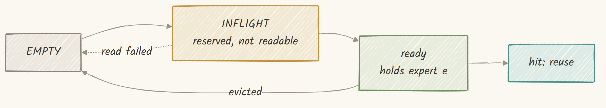


```c
/* Three slot states, not two: a key, EMPTY, or INFLIGHT. */
static int pick_victim(K3Cache *c)
{
    int best = -1;
    uint64_t oldest = (uint64_t)-1;
    for (int i = 0; i < c->nslot; i++) {
        if (c->key_of[i] == K3_SLOT_INFLIGHT) continue;   /* being read into RIGHT NOW */
        if (c->key_of[i] == K3_SLOT_EMPTY) return i;      /* free, take it */
        if (c->pinned[i]) continue;
        if (c->used_at[i] < oldest) { oldest = c->used_at[i]; best = i; }
    }
    return best;
}
```

Three details in twelve lines. `INFLIGHT` slots are skipped entirely rather than treated as
candidates, so a slot cannot be claimed twice. `EMPTY` returns immediately, because a free
slot is always better than evicting a live one. And pinned slots are skipped *after* the
empty test, so pinning never blocks the cheap path.

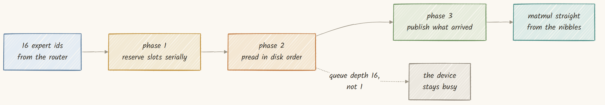


```c
static int cache_getmany(K3ExpertSrc *self, int layer, const int *experts, int n)
{
    K3Cache *c = (K3Cache *)self->ctx;
    int slots[K3_MAX_TOPK];

    /* phase 1: reserve serially, so no two experts take the same slot */
    int nres = 0;
    for (int j = 0; j < n; j++) {
        int s = cache_lookup(c, layer, experts[j]);
        if (s >= 0) { slots[j] = -1; continue; }        /* already resident */
        s = cache_pick_victim(c);
        if (s < 0) { slots[j] = -1; continue; }
        c->slot_id[s] = K3_SLOT_INFLIGHT;
        slots[j] = s;
        nres++;
    }

    /* phase 2: read in parallel, in disk-offset order */
    int order[K3_MAX_TOPK];
    cache_sort_by_offset(c, layer, experts, slots, n, order);
#pragma omp parallel for schedule(dynamic)
    for (int k = 0; k < n; k++) {
        const int j = order[k];
        if (slots[j] < 0) continue;
        if (!k3_expert_load_direct(c->st, layer, experts[j], c->arena + slot_off(c, slots[j])))
            slots[j] = -2;
    }

    /* phase 3: publish only what arrived */
    for (int j = 0; j < n; j++) {
        if (slots[j] >= 0) c->slot_id[j] = expert_key(layer, experts[j]);
        else if (slots[j] == -2) c->slot_id[j] = K3_SLOT_EMPTY;
    }
    return nres;
}
```

The slot sizing carries a similar guard. An expert is 17,547,264 bytes, which happens to be
exactly 4,284 × 4,096, so the alignment the reads need holds on the released checkpoint **by
coincidence**. Code that assumed the alignment rather than enforcing it would work on every
shipped weight, which is why the cache fixture deliberately uses a non-conforming expert
size. The released weights cannot exercise that path, so the test data was built to.

```c
int64_t k3_expert_load(const K3St *s, const K3ExpertRef *r, unsigned char *buf)
{
    if (r->contiguous) {                     /* one coalesced 17.55 MB read */
        K3Tensor t;
        memset(&t, 0, sizeof t);
        t.name = (char *)"expert";
        t.shard = r->shard;
        t.off = r->off;
        t.nbytes = r->nbytes;
        t.dtype = K3_DT_U8;
        t.ndim = 1;
        t.shape[0] = r->nbytes;
        return k3_st_read(s, &t, buf);
    }

    /* fallback: six separate reads, one per tensor */
    static const char *W[3] = { "w1", "w2", "w3" };
    char name[256];
    int64_t got = 0;
    for (int i = 0; i < 3; i++) {
        snprintf(name, sizeof name, EXPERT_FMT, r->layer, r->expert, W[i], "weight_packed");
        const K3Tensor *p = k3_st_find(s, name);
        snprintf(name, sizeof name, EXPERT_FMT, r->layer, r->expert, W[i], "weight_scale");
        const K3Tensor *c = k3_st_find(s, name);
        if (!p || !c) return got;
        got += k3_st_read(s, p, buf + (p->off - r->off));
        got += k3_st_read(s, c, buf + (c->off - r->off));
    }
    return got;
}
```

That synthetic `K3Tensor` named `"expert"` does not correspond to anything in the
checkpoint. It exists purely so the six-tensor run can be handed to the same short-read
loop that reads any other tensor.

```text
4. streaming expert cache
  PASS  prefetch_reads <= hits             requests 24, hits 24, prefetch 24
  PASS  mixed batch and serial             0 of 24 wrong
CACHE TESTS PASSED
```


Random cold is the pattern that matters, because the router picks experts by relevance and
the file lays them out by index, and those two orders have nothing to do with each other.

## 13. How big should that cache be? Ask the trace

Measuring cache size directly would mean running the model once per cache size on a machine
large enough to hold the whole expert pool. There is a shortcut, and it is a good one:
**routing does not depend on the cache.** The same prompt picks the same experts in the same
order no matter what the cache does, so one run can record every `(layer, expert)` request
and that single trace can be replayed at any capacity under any policy.


```python
def belady(trace, cap):
    """Evict whatever is needed furthest in the future. A ceiling, not a policy."""
    nxt = defaultdict(deque)
    for i, k in enumerate(trace):
        nxt[k].append(i)
    resident, hits = set(), 0
    for k in trace:
        nxt[k].popleft()
        if k in resident:
            hits += 1
            continue
        if len(resident) >= cap:
            victim = max(resident, key=lambda r: nxt[r][0] if nxt[r] else 1 << 60)
            resident.discard(victim)
        resident.add(k)
    return hits / len(trace)
```

```text
trace: 100096 requests, 10010 distinct experts, about 68 token(s)
distinct experts touched: 10010 of 82432 (12.14% of the pool)
if nothing were cached: 25.83 GB per token
total reuse: 90086 of 100096 requests are repeats (90.0%)

CACHE        SLOTS       LRU    BELADY   PIN+LRU  GB READ/TOK     SEC/TOK
----------------------------------------------------------------------------
8 GB           455    36.24%    39.42%    37.82%        16.47       13.35
16 GB          911    36.24%    42.61%    39.42%        16.47       13.35
32 GB         1823    36.24%    48.99%    42.57%        16.47       13.35
64 GB         3647    36.24%    61.74%    48.66%        16.47       13.35
128 GB        7294    49.19%    84.59%    62.86%        13.12       10.64
192 GB       10941    90.00%    90.00%    90.00%         2.58        2.09
1450 GB      82633    90.00%    90.00%    90.00%         2.58        2.09

compulsory misses: 10010 (every expert must be read at least once), a ceiling of
90.00% hit rate for ANY policy at ANY size on this trace.
```


Sixty-eight tokens touched 10,010 distinct experts, only 12.14 percent of the pool.
Holding every expert this trace touched would need 175.65 GB, against 1,446 GB for the
whole pool. Even a perfect cache for this workload is a fraction of the model.

Two things jump out. First, LRU is completely flat from 8 GB to 64 GB: an eightfold
increase in capacity buys **nothing at all**. Second, Belady over that same range climbs
from 39 percent to 62 percent, which means the flatness belongs to the policy and not to
the workload.

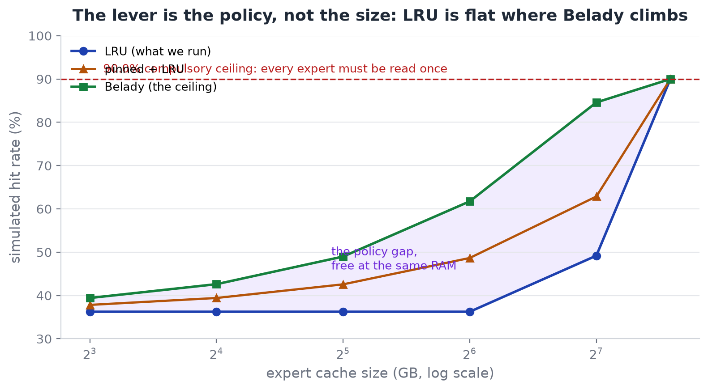

At 64 GB there is a **25.5 point gap** between what LRU achieves and what an optimal policy
would achieve at exactly the same memory, which says the promising direction is a better
replacement policy rather than more RAM.

```text
CAVEAT, and it matters
This trace was recorded during a run that re-prefills the whole prefix every step, so
the same experts are legitimately touched ~68 times. Steady-state incremental decode
has far less reuse, and its hit rates will be LOWER than this curve suggests. Treat
these numbers as an upper bound on what caching can do, not a forecast.
```

Keep that table in mind. [Part IV](#part-iv-measurements) measures it directly, and the
two do not agree.

---

# Part III: Validation

## The gate ladder


## A tiny oracle first

The middle level is a tiny model with the same tensor graph: thirteen layers, hidden size
128, vocabulary 256.

Why thirteen and not five? Because attention residuals operate in blocks of twelve, and
their failure modes cannot appear until two blocks are complete and a third is in progress.
A five-layer model would never exercise the boundary logic at all.

```text
3. full-model oracle gates on the 13-layer reference
checkpoint: 628 tensors loaded
layer map (0-based): KKKMKKKMKKKMM   (M=MLA, K=KDA; dense layer = 0)
attn_res boundaries at: 0 3 6 9 12
prompt_ids 12, full_ids 32, tf_pred 32
all layer weights bound

GATE 1  teacher forcing : 32/32 positions match tf_pred
        generated span  : 20/20  <- must be exact
GATE 2  greedy decode   : 20/20 generated tokens match full_ids
GATE 3  incremental    : 20/20 generated tokens match full_ids  <- KV cache + carried KDA state

VERDICT: ENGINE MATCHES THE REFERENCE EXACTLY
```

Three different execution paths giving identical token ids. All three are exact, because on
a discrete argmax there is no such thing as a small error.

And the caveat that goes directly underneath it:

```text
The strongest-sounding line in gates.txt is about a toy model. "VERDICT: ENGINE
MATCHES THE REFERENCE EXACTLY" refers to the 13-layer, hidden-128, vocab-256 oracle
- NOT the 2.8T checkpoint.
```

Every fixture was designed to fail a specific plausible wrong implementation. The router
fixture reorders its top two experts on five of six rows, so an implementation that ignores
the routing bias fails it. The SiTU-GLU fixture spans inputs from 0.1 to 1000, because in
the near-linear region the bounded tanh is indistinguishable from the identity. A test that
a plausible bug would survive is not a test.

## Proving it on the full checkpoint

Two questions remain: is each of the 93 layers wired correctly, and does the whole stack
produce the right numbers.

```python
# A wrong binding does not miss by 1e-6, it misses by ~1.
tol = 1.2e-7 * math.sqrt(width) * 50
```

```text
L87  KDA  PASS   3 stages  worst 0.00x budget   44s
L88  KDA  PASS   3 stages  worst 0.00x budget   46s
L89  KDA  PASS   3 stages  worst 0.00x budget   43s
L90  KDA  PASS   3 stages  worst 0.00x budget   45s
L91  MLA  PASS   3 stages  worst 0.00x budget   46s
L92  MLA  PASS   3 stages  worst 0.00x budget   49s

==============================================================================
LAYERS 0..92   93 passed, 0 failed   (69 KDA, 24 MLA)   5639 s total
worst stage across all passing layers: 0.00x of its rounding budget
==============================================================================
VERDICT: ALL LAYERS CONFORM
```


Note the last two rows: **L91 and L92 are both MLA**, the architectural quirk the config
announced at the very beginning, now visible in the verification output.

For the second question, a full forward pass from an independent implementation:

```text
reference forward: 93 layers, 5 prompt ids, hidden 7168, vocab 163840
embedded 5 ids (BF16)
  L0   KDA dense    20.7 s   |h| max 0.145457
  L1   KDA MoE      44.7 s   |h| max 0.187096
  L2   KDA MoE      41.8 s   |h| max 0.463652
  L3   MLA MoE      39.2 s   |h| max 1.284419
  ...
  L92  MLA MoE      36.7 s   |h| max 31.064180

final position: argmax token 2494, logit 15.021948, mean -0.462536, max 15.021948
total 3608.5 s
```

**Three thousand six hundred seconds.** One hour for a single forward pass over five tokens
in PyTorch, loading and freeing one layer at a time because the fp32 expansion would be
about 227 GB. The C engine did the same forward in 169.73 seconds.


```text
===== ELEMENTWISE LOGIT COMPARISON =====
prompt cross-check     : both sides ran [3, 4, 5, 6, 7]
vocab                 : 163840
C argmax              : 2494  (logit 15.021946)
reference argmax      : 2494  (logit 15.021948)
top-10 overlap        : 10/10
max |diff|            : 7.867813e-06
relative to max|ref|  : 5.237545e-07   (budget 5.1e-04)
mean |diff|           : 1.231738e-06
correlation           : 1.000000000

VERIFIED: the C engine's logits match the torch reference over the FULL 93-layer
stack on the released checkpoint, elementwise, and the argmax token agrees.
```

The largest disagreement anywhere in 163,840 values is **7.87 × 10⁻⁶**, about a thousandth
of the allowed budget, and the correlation prints as 1.000000000.

And the caveat, which the corpus states about itself:

```text
The logit parity run used prompt ids 3,4,5,6,7, which decode to: $%&'(
That is synthetic junk, not text.

That same run reports `KV cache 0.00 B`, so the KV path is not exercised by the
parity check at all.
```

It is agreement on one position of a meaningless prompt: strong evidence about the
arithmetic and no evidence at all about output quality.

## The first tokens


```text
  prompt    ids : 1008,10484,318,15383,387
  prompt    txt : The capital of France is
  generated ids : 17374,20829,10,427,414,1008,606,142957
  generated txt :  Paris.",~+            "The Eiffel~
                  (~ marks a newline)

  The first two tokens are 17374 = ' Paris' and 20829 = '.",' - the model answers
  the question CORRECTLY.
```

**Paris.** The first token out of a 2.78 trillion parameter model running on a CPU in a few
gigabytes of RAM is the right answer. The trailing quote and the "The Eiffel" continuation
are not a defect: with no chat template and no instruction tuning in the loop, this is a
base model continuing text. It has decided it is inside a JSON list of sentences about
France, and it is continuing that list.

```text
  cap    trunk  cache  s/token    token ids          decoded
96G    48G    40G    72.3430    17374,20829,10  Paris.",~+~
64G    32G    24G    67.8921    17374,20829,10  Paris.",~+~
48G    24G    16G    63.1822    17374,20829,10  Paris.",~+~
32G    12G    12G    63.4072    17374,20829,10  Paris.",~+~
24G    10G    7G     60.8162    17374,20829,10  Paris.",~+~
16G    6G     4G     68.4805    17374,20829,10  Paris.",~+~
12G    4G     2G     61.0702    17374,20829,10  Paris.",~+~

Every row that ran must show the SAME tokens. A differing row is a bug.
```


From 96 GB down to 12, the same three tokens. Not merely the same ids at every budget, but
the same right answer.

## Sustained generation: text in, text out

Four full generations, plain text in and plain text out, with the C tokenizer on both ends
and no Python anywhere on the path.


All four run at `--trunk-gb 110 --cache-gb 13 --incremental`. That split gives almost
everything to the trunk and almost nothing to the expert cache;
[Allocation beats capacity](#allocation-beats-capacity) shows why it wins.

```c
for (int g = 0; g < gen; g++) {
    k3_cache_reset_stats(&cache);
    const double ts = now_s();
    int frc;
    if (incremental) {
        /* step 0 feeds the whole prompt; later steps feed only the new token */
        const int base = w.cached;
        const int nT   = (g == 0) ? np : 1;
        frc = forward(&w, &c, &cache, seq + base, nT, lg, sc, h, br, ks);
        w.cached = base + nT;
    } else {
        frc = forward(&w, &c, &cache, seq, T, lg, sc, h, br, ks);
    }
    /* Abort the run rather than argmax a buffer the forward never wrote. */
    if (frc != 0) {
        fprintf(stderr, "forward pass failed at generation step %d; aborting.\n", g);
        return 1;
    }
    const int nxt = argmax_(lg, c.vocab);
    ...
}
```

The sampler is one line, and it is the only one there is:

```c
static int argmax_(const float *v, int n)
{ int b = 0; for (int i = 1; i < n; i++) if (v[i] > v[b]) b = i; return b; }
```

Greedy, with no temperature and no top-p. That is deliberate rather than unfinished, because
greedy decoding is what makes the output identical at every memory budget, the property
most of the testing here depends on.

```text
trunk stream: 108.81 GB packed, 90/93 layers PINNED (108.19 GB), ring 1 x 1.29 GB
              deterministic hit rate 96.8%
expert cache: 740 slots x 17.56 MB = 12.99 GB (0.90% of the 1.45 TB expert pool)
incremental decode: KV cache 70.96 MB for 24 MLA layers at 30 positions

STEP   TOKEN      SECONDS      CACHE HIT  READ GB    TOK/S
--------------------------------------------------------------------
0      1040       53.04        100.0      89.21      0.019
1      149803     8.92         100.0      25.83      0.112
2      316        8.92         100.0      25.83      0.112
3      374        8.74         100.0      25.83      0.114
4      1491       8.85         100.0      25.83      0.113
5      261        8.91         100.0      25.83      0.112
--------------------------------------------------------------------
24 tokens in 255.8 s, 10.66 s/token average

--- generated text ---
 Kelsey and I am a certified teacher. I have experience tutoring after school at the
middle school level. I have taught
----------------------

PEAK RSS for the whole run: 127.89 GB   <- quote this, not the plan
```

The prompt was **"Hello! My name is"**. That is fluent, grammatical, and it holds a persona
across the whole span: it invented a name and stayed consistent with it for twenty-four
tokens.

Look at the timing column, because that shape repeats in every run. Step 0 takes **53.04
seconds** and reads 89.21 GB. Every step after it takes about **8.9 seconds** and reads
exactly **25.83 GB**.


Given `def fibonacci(n):`:

```text
--- generated text ---

    if n <= 1:
        return n
    else:
        return fibonacci(n-1) + fibonacci
----------------------

28 tokens in 299.3 s, 10.69 s/token average
```

A correct recursive Fibonacci. The base case `if n <= 1: return n` is right, the
indentation is right, and the recurrence is right, cut off only because the token budget
ran out mid-expression.

And given "Kimi K3 is a mixture-of-experts language model. It works by":

```text
--- generated text ---
 routing each token through a small subset of its total parameters, which keeps
inference fast and cheap relative to its size. The model is trained on a large corpus of
----------------------

32 tokens in 361.6 s, 11.30 s/token average
```

**"routing each token through a small subset of its total parameters"** is exactly what
[Part II](#part-ii-how-it-works) implements. That run also shows the prefill cost
scaling: its prompt is 17 tokens rather than 5, and step 0 took **97.98 seconds and read
200.67 GB**, roughly double the five-token prompts, while every subsequent step still
read exactly 25.83 GB.


Four prompts is a demonstration and not a benchmark. But the shape is consistent: about
10.7 to 11.8 seconds per token in sustained decode, at 127.9 GB of peak memory, producing
text that is grammatical, factual and in one case correct Python.

---

# Part IV: Measurements

## The memory ladder: 8 GB to 224 GB

The memory limit has to be **enforced**. Telling the engine to use 8 GB on a 228 GB machine
measures nothing, because nothing stops it from using more.


```bash
# MemorySwapMax=0 matters as much as MemoryMax: without it an over-budget rung
# swaps instead of dying, and its s/token measures swap bandwidth.
systemd-run --scope --user -q \
    -p MemoryMax=${TOT}G -p MemorySwapMax=0 \
    ./bin/k3 "$MODEL" --ids "$IDS" --gen "$GEN" \
    --trunk "$TRUNK" --trunk-gb "$TR" --cache-gb "$CA" --incremental \
    --out "$OUT/$tag.json" > "$OUT/$tag.log" 2>&1
```

```text
=== LADDER COMPLETE ===
total_gb  pin_layers  cache_gb  s_per_tok  trunk_hit  gb_read  peak_rss_gb
8         0           0.49      32.69      0.0        25.83    8.24
12        0           2.79      31.41      0.0        25.83    10.53
16        3           4.39      32.21      2.8        25.83    16.00
24        7           7.58      31.85      6.6        25.83    23.95
32        11          10.80     31.44      10.3       25.83    31.90
48        19          17.19     29.76      17.9       25.83    47.80
64        27          23.59     28.60      25.4       25.83    63.71
96        43          36.39     24.40      40.5       18.11    95.51
128       60          49.19     29.40      56.5       17.51    128.18
160       76          61.99     26.31      71.5       17.28    159.98
192       90          77.00     21.32      84.7       16.65    191.83
224       90          108.98    19.21      84.7       14.53    223.82

ids, every row: 17374,20829,10,427,414,1008,606,142957
```

Read that last line first. **Every rung produced byte-identical output.** Twelve budgets
spanning a factor of 28, and the token ids are the same in every one.

Raw data: [`docs/data/memory-ladder.tsv`](docs/data/memory-ladder.tsv).


Going from 8 GB to 224 GB takes 32.69 s/token down to 19.21. That is **28 times the memory for
1.70 times the speed.** If you are choosing hardware, the jump from 8 GB to 64 GB buys 14
percent. The memory is not where the speed is.


Ask for 8 GB and it uses 8.24. Ask for 224 and it uses 223.82. Every rung lands on its own
budget.


At the top rungs 90 of 93 layers are pinned, so the steady-state trunk hit rate is 96.8
percent. The table says 84.7 percent because these are eight-token runs and token zero pays
the full pinning cost: seven tokens each hit 90 layers out of 744 total binds, which is
exactly 84.7 percent.

## The cache that was not participating

Look at the `gb_read` column again:

```text
8    GB budget  ->  25.83 GB read per token
12   GB budget  ->  25.83 GB read per token
16   GB budget  ->  25.83 GB read per token
24   GB budget  ->  25.83 GB read per token
32   GB budget  ->  25.83 GB read per token
48   GB budget  ->  25.83 GB read per token
64   GB budget  ->  25.83 GB read per token
```

Seven consecutive budgets read **exactly** the same number of bytes. Over that range the
expert cache grows from 28 slots to 1,344, a factor of 48, and the bytes moved do not change
by a single decimal.


A cache that grows 48 times and changes the bytes moved by zero is not working
inefficiently. It is **not participating at all**.


The simulation predicted flat 36.24 percent with a knee at 128 GB; the reality is flat 0.0
percent with a knee at about 36 GB of arena. Its own caveat had warned us: the trace came
from full-recompute decode, which touches each expert about 68 times and manufactures reuse
that steady-state decode does not have.

Why is the cache so useless? The answer is in the model, not the engine. **Quantile
Balancing** flattens expert usage across the pool by design, and flat usage is precisely
what defeats a least-recently-used cache. With no hot subset, a few gigabytes of arena
retain nothing worth keeping. The weak caching is a property of Kimi K3, not a defect in
this implementation.

That leaves a measurement problem:

```text
cache [final step]
  slots        : 740 of 17.56 MB = 12.99 GB arena (740 resident, 0 pinned)
  requests     : 1472  hits 1472 (100.00%)  misses 0  evictions 1032
  of those hits : 38940 came from the batch prefetch, i.e. read from disk
                  this token; TRUE resident hit rate 0.00%
  read from disk: 25.83 GB in 5.06 s (5104 MB/s while loading)
```

A hit rate of 100.00 percent sitting two lines above a resident hit rate of 0.00 percent,
for the same 1,472 requests.


The first counts a request satisfied from the arena, but the batch prefetch put the expert
there microseconds earlier by reading it off disk, so it reads about 100 percent at every
cache size and tells you nothing about avoided I/O. The second counts only experts already
resident before the step began, which is the quantity we care about, but it is measured
against a window that resets every step.


An expert that had to be evicted is one that was not retained. At the 36.39 GB rung that
gives `1 - 1032/1472 = 29.89%` retained, against `18.11/25.83 = 70.1%` of the bytes still
being read. Those two agree to the decimal, computed from completely different counters.

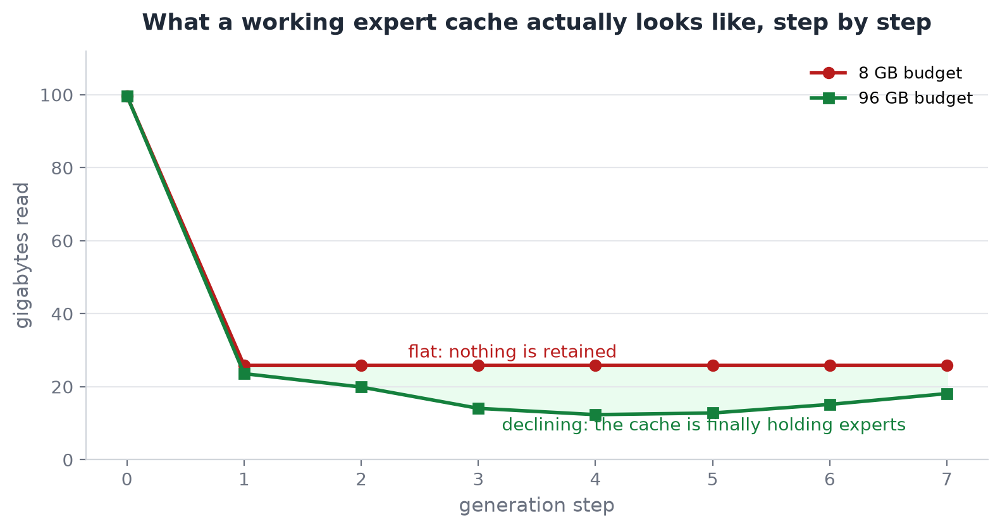

At the 8 GB budget every step reads 25.83 GB, flat forever. At 96 GB the reads fall from
99.70 to 23.58 to 19.90 to 14.07 across the first four steps as the arena fills with
experts that get used again. That declining curve is what a working cache looks like, and
it does not appear anywhere below about 36 GB of arena.

## Allocation beats capacity

If the expert cache does nothing below 36 GB, where should the memory go instead?

The arithmetic is not close. The trunk is 108.81 GB re-read in full on every token. The
experts are 25.83 GB per token. That is **4.2 times the bytes and 2.9 times the time**.


A gigabyte given to the trunk pins roughly one more layer and removes about 1.17 GB per
token of traffic that would otherwise happen with certainty. A gigabyte given to the expert
cache removes, below the knee, nothing measurable.


So it was tested directly. Fix the total memory, vary only the split:

```bash
# Fractions of the budget given to the trunk, cache-heavy first so the sweep runs
# AGAINST the hypothesis rather than with it.
FRACS="0.10 0.25 0.60 0.86"
```

```text
total_gb  trunk_gb  cache_gb  s_per_tok  hit_pct  gb_read  peak_rss
128       12.3      110.7     28.38      44.02    14.46    127.89
128       30.8      92.2      25.20      42.93    14.74    127.53
128       49.2      73.8      25.69      33.97    17.06    128.14
128       73.8      49.2      18.37      32.20    17.51    128.19
128       98.4      24.6      19.46      0.0      25.83    127.36
128       110.0     13.0      16.80      0.0      25.83    127.85
```


From 28.38 s/token down to 16.80, at **identical total memory**: 1.69 times faster from
allocation alone.

Now look again, because that table contains a result that runs the wrong way. The
**fastest** configuration reads 25.83 GB per token with a 0.0 percent cache hit rate. The
**slowest** reads only 14.46 GB with a 44.02 percent hit rate.

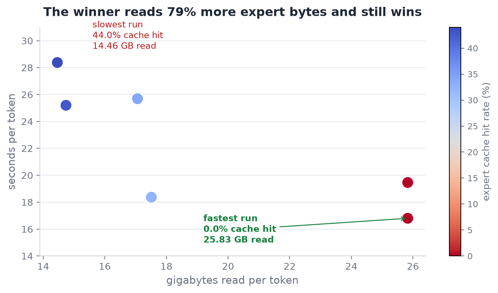

The winner moves 79 percent more expert bytes than the loser and beats it by 69 percent
anyway. Optimising the number everyone would naturally optimise, the cache hit rate,
actively takes you to the slower configuration.

So the rule is simple: **give the trunk everything until it is fully pinned, and only then
feed the expert cache.**

On how strong this is: the trend is not perfectly monotonic. There are two inversions inside
the 128 GB series and one at 32 GB, all well inside the noise. The claim rests on the rank
correlation across twelve points at two different totals, Spearman ρ of −0.886 and −0.714
plus a mechanism that predicts it. The direction is solid; the figure of 1.69 has not been
replicated three times, so treat the magnitude as approximate.

Raw data: [`docs/data/trunk-cache-split.tsv`](docs/data/trunk-cache-split.tsv).

## Measuring the measurement

Before quoting any timing, how repeatable is a timing on this machine? Three runs of one
identical configuration, back to back:

```text
[09:36:39] --- replicate 1/3 (trunk 110 / cache 13, gen 8, identical every time) ---
  8 tokens in 118.2 s, 14.78 s/token average
[09:39:14] --- replicate 2/3 ---
  8 tokens in 117.3 s, 14.67 s/token average
[09:41:22] --- replicate 3/3 ---
  8 tokens in 161.1 s, 20.14 s/token average
```


Mean 16.53 s/token, standard deviation 3.13, spread **33.1 percent**. A third of the
measurement is noise.

That is the bar every timing claim has to clear, and it rules a line through several of the
smaller ladder steps. The 12 GB rung sitting four percent under the 8 GB rung is not an
effect. The 11 percent trunk-first improvement at a 32 GB total is not an effect. The dip at
128 GB is not an outlier, it is dispersion.


Two results clear the bar comfortably: the ladder spans **70 percent** end to end, and
trunk-first at 128 GB is **69 percent**. Both are more than twice the floor.

Every non-timing result is untouched, because counts and byte totals are not stopwatch
readings. The byte-identical output across twelve budgets, the flat 25.83 GB across seven
rungs, the 0.0 percent retention from 28 slots to 1,344, the trunk hit rate tracking the
pinned fraction. No amount of scheduling jitter moves any of those.

So where does a third of a measurement go? Two runs of the same configuration, taken from
two different sweeps:

```text
run A  (from the ladder)        run B  (from the split sweep)
  trunk (STREAMED) 73.80 GB       trunk (STREAMED) 73.80 GB
  expert cache     49.20 GB       expert cache     49.20 GB
  60/93 layers PINNED (72.34 GB)  60/93 layers PINNED (72.34 GB)
  2802 slots                      2802 slots
  requests 1472  evictions 998    requests 1472  evictions 998
  binds 744, hits 420 (56.5%)     binds 744, hits 420 (56.5%)
  read 374.99 GB in 138.40 s      read 374.99 GB in 63.84 s
       (2709 MB/s)                     (5874 MB/s)
  29.40 s/token                   18.37 s/token
```

They pinned the same layers, allocated the same slots, made the same number of requests,
evicted the same number of experts and read **exactly the same 374.99 GB**. Every count
matches. The only difference is that one got 2,709 MB/s out of the disk and the other got
5,874, a factor of 2.17 on identical work.

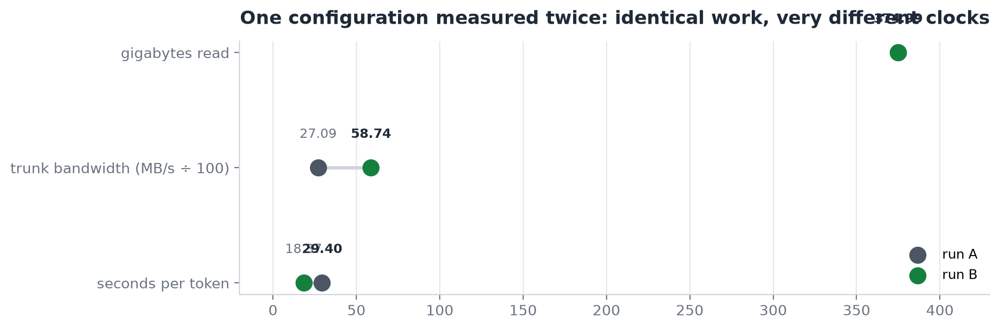

The variance is not scheduling jitter or NUMA placement. It is the device.

Raw data: [`docs/data/replication.tsv`](docs/data/replication.tsv).

## Storage is the whole game


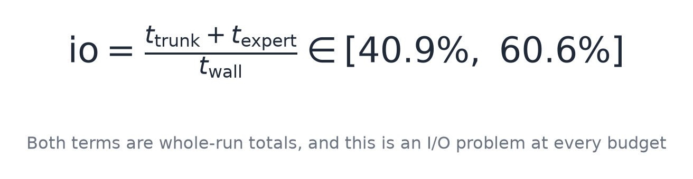

Between 40.9 and 60.6 percent of wall clock is spent waiting on the disk, at every rung. So
the same binary on two different devices is two different engines.


A run at 31.71 s/token on local NVMe and a run at 70.62 on a network volume differ by 2.2
times, and none of that is attributable to anything in the source. Any comparison between
two configurations has to hold the device fixed, or it is measuring the device.

It also means the tool that measures storage cannot use `dd`:

```python
# dd is one sequential stream at queue depth 1. The expert path is random
# 17.55 MB O_DIRECT reads, up to 16 outstanding. On network storage they diverge.
SZ = 17547264   # one Kimi K3 routed expert, to the byte
N  = 40         # reads per measurement
for qd in (1, 4, 16):
    measure(path, qd)
```

One optimisation result. Switching the arenas from 4 KB pages to 2 MB hugepages,
measured as a clean A/B on one binary using an environment variable rather than two builds:

```text
########## A: 4 KB pages (previous behaviour)
4 tokens in 45.5 s, 11.37 s/token average
  read 153.02 GB in 24.36 s (6282 MB/s)

########## B: 2 MB hugepages (new)
4 tokens in 43.0 s, 10.76 s/token average
  read 153.02 GB in 22.64 s (6758 MB/s)

=== output equality (a speedup that changes tokens is worthless) ===
A: [161427, 11294, 58776, 123595]
B: [161427, 11294, 58776, 123595]
IDENTICAL
```

The tokens are identical, which is the first thing to check about any optimisation. The
timing improved by 5.4 percent, which is comfortably **inside the 33 percent noise floor**,
so it is not claimed as a win. The mechanism is sound and the measurement does not establish
the size.

```c
/* An A/B between two builds compares two binaries. An A/B on one binary
 * compares one decision. */
```

## Why the trunk is not quantised

The trunk is 108.81 GB of bfloat16. Quantising it to int8 would halve that, and to int4
would quarter it. Every other engine of this shape offers a bit-width knob. This one has
exactly two weight types and no knob at all:

```c
enum { K3_WF32 = 0, K3_WBF16 = 1 };
```

The reason is that the cost was measured. The study sampled 31 attention tensors from the
released checkpoint over HTTP range reads, 384 rows each, quantised with symmetric per-row
scaling.

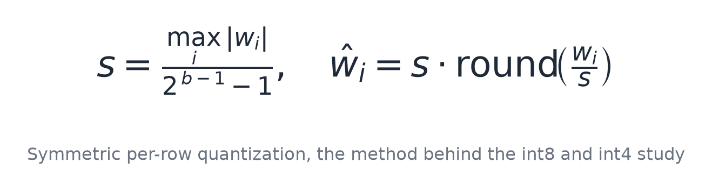

```text
  type   tensor                      int8 mean  int4 mean    ratio
  ------------------------------------------------------------------
  KDA    L13.o_proj                    0.01188    0.21122    17.8x
  MLA    L3.kv_b_proj                  0.00736    0.13355    18.2x
  MLA    L11.o_proj                    0.01399    0.24612    17.6x
  ------------------------------------------------------------------
  MEAN over KDA-layer tensors          0.01046    0.18746    17.9x  (n=2)
  MEAN over MLA-layer tensors          0.00948    0.17154    18.1x  (n=18)
  MEAN over ALL sampled tensors        0.00961    0.17383    18.1x  (n=31)
```


Int8 costs about one percent and int4 about seventeen, a ratio of 18 that holds across every
tensor sampled. And the mean understates the damage, because the tail is much worse.


The worst individual rows at int4 reach 45 percent, 56 percent and **65 percent** relative
error. Those are not rounding artefacts.

There is also a strong hint from the model authors. The technical report says the experts
are MXFP4 with quantisation-aware training, "while all non-expert components remain in
higher precision". That list of non-expert components is exactly this trunk. It was
deliberately not quantised, and it was never trained to tolerate four bits.


A lossless stream costs seconds per token, and those seconds are recoverable by giving the
engine more RAM, which is exactly what the memory ladder demonstrated. Accuracy lost to
four-bit rounding is not recoverable at any budget.

Four caveats, all of which the study states about itself: this is weight reconstruction
error and not output quality; it sampled 384 rows per tensor rather than whole tensors; it
covered attention projections only, with no MoE, no embeddings and no output head; and no
downstream logit or token comparison was run at int4, so the quality cost is bounded rather
than measured.

Raw data: [`docs/data/trunk-quantisation.txt`](docs/data/trunk-quantisation.txt).

---

# Part V: Reference

## Scope

- **No chat template.** Base model continuations, not replies.
- **Greedy decoding only.** No temperature, no top-p, no top-k. Greedy is what keeps the
  output identical across budgets.
- **No chunked prefill.** The ceiling is 32,768 tokens, but a 21,000 token prompt is one
  quadratic pass.
- **Context is bounded by memory, not by the engine.**


- **No vision.** MoonViT-V2 is fully specified in `config.json` at 27 layers, and has zero
  code here. That absent encoder is 0.057 percent of the checkpoint and downloadable on its
  own, which makes implementing it a 0.9 GB job rather than a 1.56 TB one.
- **No SIMD in the KDA recurrence.** The matmuls have AVX2 paths; the recurrence is still
  scalar C.
- **No quality benchmark.** No perplexity, no task eval. At 11 seconds per token that is
  days of compute, and it would measure Kimi K3 rather than this engine.


What comes next, in priority order: [`ROADMAP.md`](docs/ROADMAP.md).

## Closing the ledger


Every parameter at bfloat16 is 5.56 TB. The experts already ship at 0.53125 bytes per
weight, which takes it to 1.56 TB on disk. Routing means only 16 of 896 experts fire per
layer, so 1.45 TB of that never needs to be in memory at all, leaving 113.49 GB. Streaming
the trunk a layer at a time turns that last floor into a dial, and the dial goes down to a
measured **8.24 GB**.

The point was never the speed. At 8 GB it takes about half a minute per token, and
pretending otherwise would be silly. The point is that the model fits, that it produces the
same tokens at 8 GB as it does at 224, and that the gap between "you need a datacentre" and
"you need a desktop" was four decisions about where bytes live rather than any change to the
model itself.

## Documentation

| | |
|---|---|
| [`QUICKSTART.md`](docs/QUICKSTART.md) | the setup above, condensed to commands |
| [`ARCHITECTURE.md`](docs/ARCHITECTURE.md) | how the model maps onto the code |
| [`PERFORMANCE.md`](docs/PERFORMANCE.md) | the memory ladder, measured, with its noise floor |
| [`TUNING.md`](docs/TUNING.md) | picking a budget and a split |
| [`BENCHMARKING.md`](docs/BENCHMARKING.md) | measuring without fooling yourself |
| [`TESTING.md`](docs/TESTING.md) | what each gate establishes |
| [`API.md`](docs/API.md) | the C interface, for embedding the engine |
| [`ROADMAP.md`](docs/ROADMAP.md) | scope, and what comes next |
| [`docs/data/`](docs/data/) | measurement output; every figure above is transcribed from it |
| [`docs/images/`](docs/images/) | every diagram and equation, with the mermaid and Python sources that generate them |
| [`kimi-k3-tech-report.pdf`](docs/kimi-k3-tech-report.pdf) | the model's technical report |

## Development

```bash
make test        # the gate that stays green, no weights, no network, no Python
make help        # the documented targets
make asan        # AddressSanitizer and UBSan
make portable    # generic AVX2, without -march=native
```

CI runs the same gates: a GCC and Clang matrix under `-Werror`, sanitizers over the parsers
and the cache, the full weightless suite, and ruff and shellcheck as blocking checks.
Fixtures are generated from the PyTorch reference and committed;
[`tests/fixtures/README.md`](tests/fixtures/README.md) records what makes each one
adversarial and how to regenerate it. [`CONTRIBUTING.md`](CONTRIBUTING.md) is the place to
start.

## License

Apache 2.0, see [`LICENSE`](LICENSE). Vendored third-party components, and the
modifications made to them, are declared in [`NOTICE`](NOTICE).

Kimi K3 is created and released by Moonshot AI under its own license. This repository
contains **no model weights** and grants no rights to them; the technical report is included
for reference and remains the property of its authors.

<div align="center">
<br>
<sub>Built for the proposition that a trillion-parameter model should not require a trillion-dollar rack.</sub>
</div>
