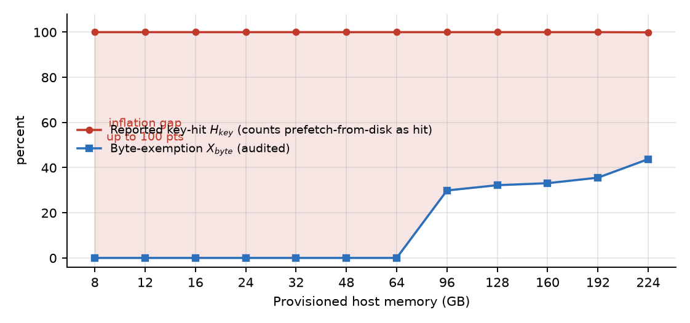
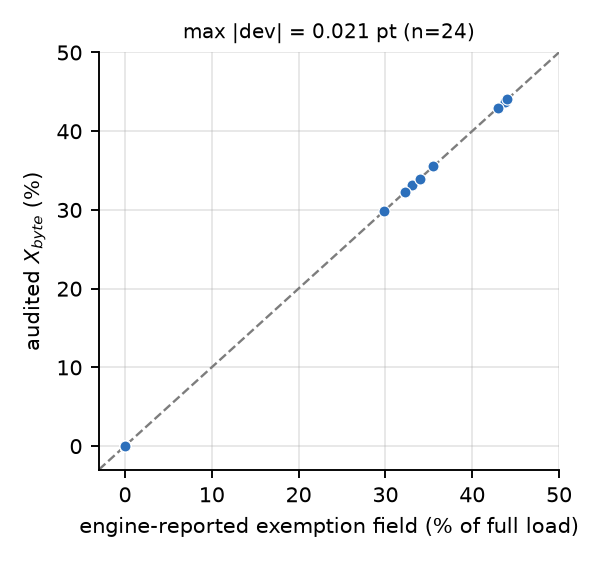
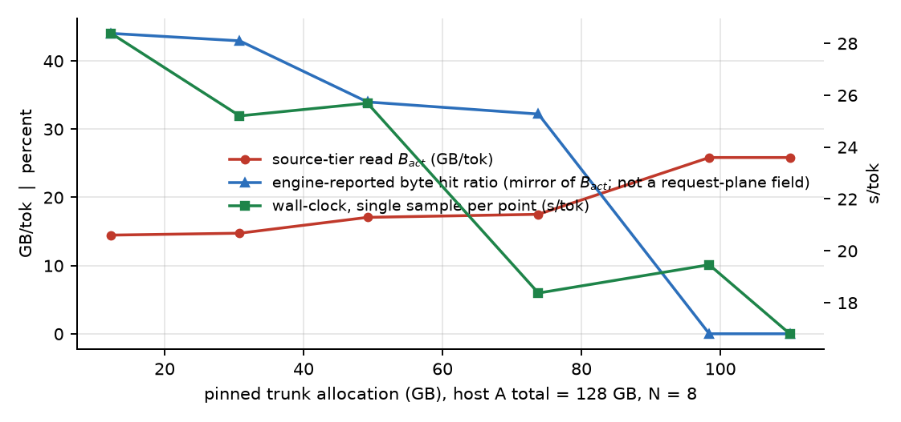
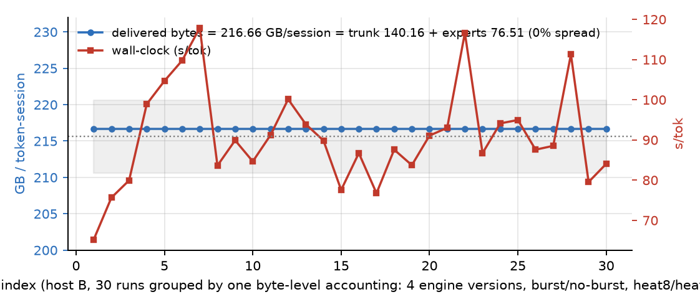
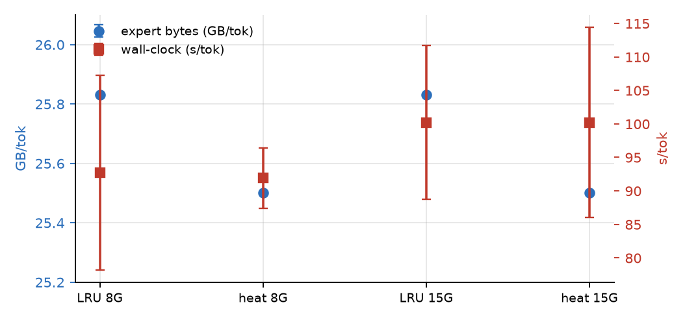
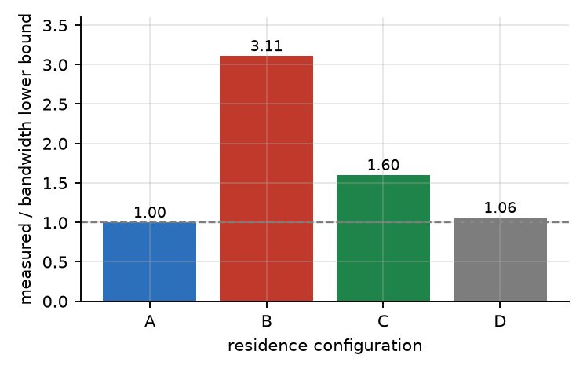
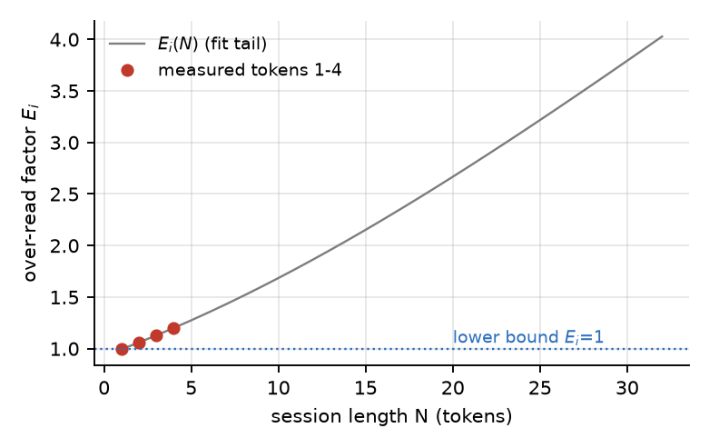

# 命中率通胀：缓存复用度量在键—字节—时间三平面的分离与验收判据

唐海勇；中国核工业华兴建设有限公司，福建　宁德　355110（研究方向：大模型推理性能优化与存储层次设计）

收稿日期：2026-××-××
第一作者：唐海勇，主要研究方向为大模型推理性能优化、分层存储与带宽受限计算；邮箱：[2338953@qq.com](mailto:2338953@qq.com)（通讯作者）

## 摘要

缓存命中率被广泛用作复用是否奏效的验收指标，但其口径是"交付时键是否在某级索引中在场"，与"字节是否免于自源层重读"并非同一件事。本稿把缓存复用的度量显式拆为三个平面——键平面（引擎自报命中率 H_key）、字节平面（字节命中率 X_byte 与读放大倍数 E）、时间平面（每词元墙钟），给出命中率通胀 HRI = H_key − X_byte 的定义与分解：通胀恰等于"命中但仍付字节"的访问占比，因而自报命中率恒为字节命中率的上界，且该上界可以完全松弛。本案引擎的自报命中率把批量预取自盘读入的专家也计入命中（引擎在该行后自注"this is not a measure of avoided I/O"，同一行给出真正的常驻命中率 3.80%），故其满格是预取形态的产物，HRI 度量的正是这一产物与字节免除之间的差。台账取自两台主机：主机 A（EPYC 7763，228 GiB，3.2 GB/s NVMe 源层，N = 8 冷启动）承载内存阶梯与配额扫描；主机 B（Hygon 8 核 / 56 GB，机械慢盘 + NVMe，WSL2，每次运行 1 提示 + 3 生成词元）承载重复运行、策略四臂与带宽下界诊断。两台主机的源层物理层与"每词元字节"口径不同，本文按主机分列台账而不合并叙述。四个观测实例为：主机 A 内存自 8 GB 增至 224 GB（28 倍）时自报命中率恒为 100%（末点 99.93%）而字节命中率在 8—64 GB 区间恒为 0，通胀达 100 个百分点（字节为确定性计数，不受重复性影响）；主机 A 固定 128 GB 内存把驻留配额自 12.3 GB 移至 110.0 GB，源层读数恶化 78.6%（可确证）而端点墙钟差 −40.8%——后者是单样本端点比较，对 33% 的单配置噪声底未达确证门槛，本文只保留其方向（十二点秩相关 Spearman ρ = −0.886 与 −0.714）而不把 40.8% 当作效应量；主机 B 按同一字节口径归并的 30 次运行（跨 4 个引擎版本、突发/非突发两臂与两个 heat 策略臂）交付字节恒为 216.66 GB（标准差 0）而墙钟跨度 80.8%。据此给出可验收性判据：以 Welch 检验与功效分析计，一次改动在字节平面以 3 次运行即可确证的 1.278% 效应，在时间平面需约 1.33 万次运行（约 1 000 机时）方能达到同等功效，样本量比约 4 400 倍。另给出一条跨来源恒等式 X_byte ≡ (B_full − B_act)/B_full，在 24 个配置点上与引擎自报的自报字节命中率字段一致，最大偏差 0.021 个百分点；该恒等式同时用作字段归属判据——本文据此判定配额扫描台账的唯一命中字段为字节命中率口径而非键平面，并撤回上一稿基于该列得出的"键平面坍塌"结论。本稿不提出新的存储系统，交付物是三平面的口径定义、四条一致性检验与一张验收阶梯表；结论限于两台主机、两种会话时序。

**关键词：** 缓存命中率；字节命中率；度量分离；命中率通胀；最小可检测效应；混合专家模型；带宽受限推理

**中图分类号：** TP314　　**文献标志码：** A

## 1 引言

### 1.1 一个满格命中率与零免除并存的观测

在主机 A（§4.1）上冷启动推理 Kimi K3[1]（混合专家，MoE）时，作者观察到一组难以用命中率语言解释的台账：把主机可用内存自 8 GB 逐档提升到 64 GB（缓存槽位自 28 增至 1 344），引擎自报的专家命中率始终为 100.0%，而每词元自源层读入的专家字节始终为 25.83 GB——与"完全无复用"时的理论全量载入逐字节相同。换言之，在这七档配置上，自报命中率达到量程上限，而复用带来的字节免除恰为零。内存继续增加到 96 GB 以上，字节命中率才开始离开零（29.89%），到 224 GB 时为 43.75%，而自报命中率仍报 99.93%。

这一现象的成因可以在引擎台账里逐字核对，不需推测。最新一轮引擎输出在 `hits 1472 (100.00%)` 之后附有三行注记：

```
of those hits : 1416 came from the batch prefetch, i.e. read from disk this token;
                TRUE resident hit rate 3.80%
...
(retention = requests - evictions; the raw `hits` counter includes
 experts the prefetcher had just read from disk, so it is not a
 measure of avoided I/O)
```

即：批量预取先把专家自盘读入缓存再交付，于是**每一次访问都记为命中**；该行同时给出真正的常驻命中率 3.80%。所以自报命中率量的是"交付时键是否在缓存索引中在场"，而预取形态保证该条件恒真——它在满格处不携带任何关于字节免除的信息。仓库内的仪表文档亦把这一字段列为缺陷（"counts disk reads as hits"），并给出与字节台账一致的正解 `1 − evictions/requests`；本文不复述该文档的工程处置，只在度量层面把差量 HRI 定义出来并变成一条可验收的自检（§3.2、§3.4）。

一旦承认这一点，用命中率做验收就失去意义：它可以在被优化量毫无变化时打满，也可以在字节台账显著改善时纹丝不动。第 4 章给出四个真机实例，其中一个方向与直觉相反——源层读数恶化 78.6% 的同一次改动，端点墙钟差为 −40.8%（单样本、未重复，见 §6.1(7)）；交付字节完全冻结（标准差 0）的 30 次运行，墙钟跨度达 80.8%。

### 1.2 本文工作

本稿定位为**度量方法学**短文，不提出新的存储系统、缓存结构或替换算法。交付物是四件可直接套用的产物：

1. **三平面口径与命中率通胀的定义与分解（第 3 章）**。把缓存复用度量显式拆为键平面（引擎自报命中率 H_key）、字节平面（字节命中率 X_byte、读放大倍数 E）、时间平面（每词元墙钟），定义通胀 HRI = H_key − X_byte，并证明其分解式 HRI = h_paid，即通胀恰为"命中但仍付字节"的访问占比（定理 1）。推论：H_key 是 X_byte 的上界，且上界可以完全松弛至 H_key = 1、X_byte = 0。

2. **字节命中率上界与读放大倍数（定理 2、推论 1）**。在原子槽位粒度与冷启动前提下给出 X_byte ≤ 1 − B_distinct(N)/B_full(N)，即字节命中率的可达上界由会话 distinct 集决定，与命中率无关；配套给出 E = B_act/B_distinct(N) 与其下界 E ≥ 1。

3. **四条一致性检验 C1—C4（§3.4）**，用于判定台账本身是否可用于验收。其中 C3（E ≥ 1）具有自否证性：把不匹配会话的预算代入会得到 E < 1，从而自动宣告判据失效（第 4.4 节给出一次真实的 C3 触发，涉及跨主机误用）。C2 则兼作字段归属判据：凡满足 X_byte ≡ (B_full − B_act)/B_full 的字段必为字节命中率口径，不得标为键平面（§4.3、§4.4 据此判定表 4 的一列字段）。

4. **可验收性分析与验收阶梯（第 5 章）**。以功效分析给出三个平面各自的最小可检测效应（MDE），并用一组真实的策略对照量化"用错平面的代价"：字节平面 3 次运行确证 1.278% 的效应，时间平面需约 1.33 万次运行（约 1 000 机时），样本量比约 4 400 倍（表 5）。

5. **台账来源的分列（第 4.1 节、附录 A）**。内存阶梯与配额扫描取自主机 A（N = 8、cgroup 上限、源层为 3.2 GB/s NVMe），重复运行、策略四臂与带宽下界诊断取自主机 B（1 提示 + 3 生成词元、机械慢盘 + NVMe、WSL2）；两者的会话长度、源层物理层与"每词元字节"口径都不同，故本文不把两套台账并入单一主机叙述，并把每个结论绑定到其台账归属。

全文结构：第 2 章述相关工作；第 3 章给出三平面框架、定理与一致性检验；第 4 章报告四个解耦实例与恒等式核验；第 5 章给出可验收性分析与验收阶梯；第 6 章讨论威胁到效度与适用边界；第 7 章收束。

## 2 相关工作

### 2.1 命中率作为性能指标

命中率与命中计数是缓存系统最常用的汇报量。Denning 的工作集模型[13]刻画活跃引用集大小，compulsory miss 刻画首次访问的不可免读部分，二者共同给出"命中率能到多高"的语境，但均以引用（reference）为计数单位，而非以字节为口径。Roofline[5]指出带宽受限时复用是主要杠杆，Eyeriss[6]在体系结构层实证了"慢速存储读一次、片上复用多次"的收益，二者回答复用值不值得做，未回答命中率在何种条件下失去证明力。排队论与操作分析[10,11,12]表明吞吐由服务需求最大的瓶颈设备决定，Amdahl 界[14]是单串行段的退化情形；这些工作给出时间平面的下界，本文 §5.2 用其解释"字节已定而时间仍弥散"。

### 2.2 指标失配与观测面分离

系统测量文献中，"工具层指标"与"底层事实"的分离多以经验描述出现。就本文所及，尚少见把该分离落成一个可计算的差量（HRI）、给出其分解式、并为每个候选验收量标定最小可检测效应的处理。LLM 推理侧的权重与 KV offload 工作（如 CXL-SpecKV[7]、FastKV[8]）侧重近存、压缩与预填—解码加速；MoE 的稀疏门控[2]、单专家路由[3]与细粒度切分[4]使"哪些专家进入工作集"随词元变化，落位层与分层字节读数因而更易与白板命中脱钩。上述方向与本文观测面相关，但均不以命中率口径的失效为研究对象。

### 2.3 可复现性与效应量

同配置重复运行的墙钟弥散在基准测试社区广为人知，通行做法是报告分位数或配对差。本文的差别在于把弥散量转化为**平面之间的分辨率比**：不是"时间指标不准"，而是"用时间平面确证某一效应所需的样本量，是用字节平面确证同一效应所需样本量的数千倍"，并给出该倍数的一次真机实例（§5.1）。

## 3 三平面度量框架

### 3.1 记号与三个平面

考虑一次生成会话，长度为 N 个词元，存储层次按单次字节访问代价单调排序为 M_1（最慢，源层）→ … → M_N（最快）。设引擎在每个词元上发出一组键访问，全_session 访问总数为 A，每次访问 j 需搬入 b_j 字节（MoE 专家槽位近似等长，b_j ≈ b）。记：

- **B_full(N) = Σ_j b_j**：无任何复用时须自源层 M_1 读入的字节总量，即理论全量载入。
- **B_act(N)**：实测自 M_1 读入的字节总量。
- **D(N)**：会话实际触及的 distinct 项集合；**B_distinct(N) = Σ_{d∈D(N)} slot(d)**，即每项自 M_1 恰好装入一次的字节量。

三个平面及其口径如表 1。本文引入的三个英文术语与既有文献的对应关系需先说明，以免读者误以为是新造概念：

| 本文中文 | 本文英文 | 该英文术语在既有文献中的含义 |
| --- | --- | --- |
| 请求命中率 H_key | request hit rate | 标准术语：命中请求数 ÷ 请求总数 |
| 字节命中率 X_byte | byte hit ratio | 标准术语：**以字节而非请求为单位**的命中率 |
| 读放大倍数 E | read amplification factor | 标准术语：实际读取字节 ÷ 理想读取字节 |
| 源层 M_1 | source tier（亦即最慢层，slow tier） | 层次结构中最慢的一级 |
| 稠密层 | dense layers | MoE 中与专家层并列的稠密权重层 |
| 台账 | byte byte-level accounting | 以字节为单位的原始计量记录 |

**关键一点**：请求命中率与字节命中率都是既有术语，二者本就不等——短请求易命中则请求命中率高而字节命中率低。本文不发明这对概念，只指出在带宽受限的 MoE 推理中这一差距可以大到使命中率失去验收资格，并给出可验收的判据。下文沿用这套既有术语，仅"命中率通胀"（hit-rate inflation，即两者的差）一词为本文所造。

表 1　缓存复用的三个度量平面
Table 1　Three measurement planes for cache reuse

| 平面 | 量 | 口径（英文术语） | 单位 | 同配置重复性（本案实测） |
| --- | --- | --- | --- | --- |
| 请求平面（键平面） | H_key | request hit rate（引擎自报）：交付时键在缓存索引中在场（含预取命中，见 §1.1） | % | 满格后不随资源变化（主机 A，8→224 GB 恒 100%） |
| 字节平面 | X_byte = 1 − B_act/B_full | byte hit ratio：免于自源层重读的字节占比 | % | 标准差 0（主机 B，30 次同字节口径运行交付字节恒 216.66 GB） |
| 字节平面 | E = B_act/B_distinct(N) | read amplification factor，下界 1 | 倍 | 同上 |
| 时间平面 | s/tok | wall-clock time per token | s | 跨度 80.8%，CV 13.43%（主机 B，含配置效应）；单配置重复性以主机 A 的 33.1% 为准 |

三个平面共用同一批台账，但计数单位、分母与噪声结构互不相同，这是后文一切分离现象的来源。

### 3.2 命中率通胀：定义与分解

把全_session 的 A 次访问按"服务该次访问时字节最终来自何处"分为三类：

- **h_free**：命中，且服务过程自源层 M_1 读入 0 字节（真免除字节）；
- **h_paid**：命中，但服务过程仍须自 M_1（或经 M_1 回填的更慢路径）读入载荷字节（命中但仍付字节）；
- **m**：未命中。

显然 h_free + h_paid + m = 1。引擎自报的命中率把前两类合并：

```
H_key = h_free + h_paid
```

字节命中率在等长槽位假设下即真免除访问的占比：

```
X_byte = 1 − B_act/B_full = h_free        （b_j ≡ b 时严格成立）
```

**定义 1（命中率通胀）**　HRI = H_key − X_byte，单位为百分点。

**定理 1（通胀分解与上界）**　在上述记号下：
（i）HRI = h_paid ≥ 0；
（ii）X_byte ≤ H_key，即自报命中率是字节命中率的上界；
（iii）上界可以完全松弛：存在配置使 H_key = 1 且 X_byte = 0，当且仅当全部命中均为付费命中（h_paid = 1）。

**证明**　(i) 由定义直接相减。(ii) 由 (i) 与 h_paid ≥ 0。(iii) 取缓存索引可容纳全部键但载荷驻留在 M_1 之下的配置，则每次访问均记为命中且每次均须自 M_1 读入 b 字节，B_act = B_full，X_byte = 0，H_key = 1。第 4.2 节给出该情形的真机实例（主机 A，内存 8—64 GB 七档）。∎

定理 1(iii) 的含义是：**自报命中率达到量程上限不携带任何关于字节免除的信息**。§1.1 已给出本案该条件恒真的机制（批量预取把自盘读入的专家计入命中）：在该配置下该字段的信息量恰为零，而不是"精确度不足"。这也划清了本文与工程修复的界线——把该计数器改为 `1 − evictions/requests` 是仪表修复，会使 HRI 消失；本文要论证的是，即使字段被如此修复，只要验收体系仍以"命中率是否够高"为题，HRI 类的口径错位就会在下一个计数器上重演，故须在定义层面把它显式化。

**字节加权推广**　槽位不等长时，以字节为权：

```
X_byte = Σ_j b_j·1[j ∈ free] / Σ_j b_j ，  H_key = |{j : 命中}| / A
```

此时 HRI 不再严格等于 h_paid，而是"按访问计数的付费命中占比"与"按字节计数的付费载荷占比"之差；X_byte ≤ H_key 仍成立当且仅当付费命中的平均字节不大于全体访问的平均字节。工程上应同时报告两式，其差本身即为一条自检量（§3.4 C4）。

### 3.3 字节命中率上界与读放大倍数

**定理 2（源层读数下界与字节命中率上界）**　设会话为冷启动（会话开始时 D(N) 中任一项均不驻留于任何快层），且槽位为原子粒度（一项要么整项在场、要么不在场）。则：

（i）B_act(N) ≥ B_distinct(N)，即 E = B_act/B_distinct(N) ≥ 1；
（ii）X_byte(N) ≤ 1 − B_distinct(N)/B_full(N) ≜ X_max(N)。

**证明**　(i) D(N) 中每一项在会话内首次被触及时必自 M_1 读入至少一次，原子粒度下该次读入不少于 slot(d)；各项之和即 B_distinct(N)。(ii) 由 X_byte = 1 − B_act/B_full 与 (i)。∎

**推论 1（上界随会话长度收紧）**　当每词元全量载入 b_tok 恒定、distinct 集随 N 次线性饱和时，B_full = b_tok·N 线性增长而 B_distinct(N) 次线性增长，故 X_max(N) 随 N 单调上升并趋于 1。本案阶段 A 的拟合给出 X_max(8) ≈ 33.9%、X_max(32) ≈ 75.2%。

推论 1 给出一条**不依赖任何字节测量的先验否证**：若某配置报出的字节命中率或"等效免除"的命中率超过 X_max(N)，则该报告不可能来自该会话。它把命中率的可信度问题转化为一次算术比较。

**注（粒度）**　定理 2 的原子粒度假设是实质性的。若缓存以子槽位（页、块）粒度驻留，或边界访问由预取的部分读服务，B_act 可低于 B_distinct(N)，此时 E < 1 不再意味着台账错误，而意味着粒度假设不成立。因此 E ≥ 1 应作为**检验**（C3）而非公理使用；其失败有两种解释，须由台账中记录的驻留粒度区分（§3.4）。这也说明 C1 与 C3 必须区别对待：C1 只在 N = 1 的边界点上以 ε = 1% 放行该偏差（属边界效应，可记录），C3 则对整段会话要求 E ≥ 1（不容许系统性低于 1）。

### 3.4 四条一致性检验

判据依赖台账，而台账会骗人。承载本稿数据的开源仓库[9]在其测量定稿中记录了六个曾产生错误结论的计数器字段，其共同点是探针误差与真实故障同量级、因而不会自我报警。本稿给出针对三平面的四条检验（表 2），每条都标明"读什么、比什么、失败意味着什么"。

表 2　一致性检验 C1—C4
Table 2　Consistency checks C1—C4

| 编号 | 检验式 | 数据来源 | 失败的解释 |
| --- | --- | --- | --- |
| C1 | abs(E − 1) ≤ ε 于 N = 1，ε = 1% | 首词元 B_act 与 B_distinct(1) | 边界访问被预取的部分读服务，或 distinct 预算拟合残差；本案 E(1) = 0.9927，偏差 0.73%，容差内 |
| C2 | X_byte ≡ (B_full − B_act)/B_full 与引擎自报字节命中率字段逐点相等 | 两个独立来源同屏打印 | 其中一个字段的分母不是全量载入，或混入了非源层字节；通过则同时判定该字段为字节命中率口径 |
| C3 | E ≥ 1（整段会话） | 会话累计 B_act 与同主机同会话的 B_distinct(N) | 预算与实测取自不同主机或不同会话；或驻留粒度为子槽位 |
| C4 | 访问计数口径与字节计数口径的付费命中占比之差在噪声内 | H_key、h_paid 与逐访问字节 | 槽位长度不齐，等长假设失效 |

C2 是本稿在本案中新核验出的一条恒等式：由 gb_read 独立算得的 X_byte 与引擎自报的免读字段在 24 个配置点上一致，最大偏差 0.021 个百分点（§4.3）。这既证明该字段确为字节口径而非键口径，也说明 X_byte 可由台账中任一量独立复算——**同屏打印是发现机制，不是修辞**。C2 还兼作字段归属判据：凡满足该恒等式的字段必为字节命中率口径。本文据此判定表 4 台账的唯一命中字段为字节命中率口径而非键平面，并撤回上一稿基于该列标为键平面所得的结论（§4.4）；若不做此步归属判定，一次字段误标就会凭空造出一个"第三平面"。

C3 具有自否证性。第 4.4 节将给出一实例：把阶段 A 会话拟合的 B_distinct(8) = 136.63 GB 代入内存阶梯台账（同 N = 8）得到 E = 0.851 < 1，检验失败，从而自动宣告"该预算不可迁移到此台账"。一条能检测自身误用的判据，比一条总是通过的判据有用。

## 4 真机测量：四个解耦实例

### 4.1 平台、负载与台账来源

实验对象为 Kimi K3[1]（2.8T 参数，MoE），以冷启动推理方式在**两台主机**上运行（引擎实现见开源仓库[9]）。两台的存储层次不同，故本文按主机分列台账，不合并为"单一主机"叙述。完整的机器规格、环境存档与原始日志见仓库[9]，本文只列与口径判断直接相关的三项差异：

| | 主机 A | 主机 B |
| --- | --- | --- |
| 承载实验 | §4.2 内存阶梯、§4.4 配额扫描 | §4.5 重复运行、§4.6 策略四臂、§5.2 带宽下界 |
| 会话形状 | N = 8（冷启动，8 个词元 id） | 1 个提示词元 + 3 个生成词元 |
| 源层物理层 | 3.2 GB/s NVMe，**无机械慢盘** | 机械慢盘（约 60—85 MB/s）+ 1.9 GB/s NVMe |

由这张表派生出两条必须写明的口径要点，否则跨表引用会出错：

1. **源层物理层不同**。表 3、表 4 的"源层读数"取自主机 A 的 NVMe；表 7 中 85 MB/s 的慢盘属主机 B。两表的字节数不得互相代入，本文亦不据此比较两台主机的快慢。
2. **每词元字节不是同一口径**。§4.5、§4.6 的会话每次交付 216.66 GB = 主干 140.16 GB + 专家 76.51 GB（三词元合计），专家侧 25.50 GB/词元。该值含主干且按会话计，**不可与 B_full(8) = 206.64 GB 或 25.83 GB/词元同框比较**——若同框相除会得到 −4.85% 的"负字节命中率"，那是口径混用而非物理现象。

引擎内建字节级 READ 计数：本文"引擎 READ"口径为 `pread` 请求字节，不以操作系统页缓存命中冒充免读；介质冷读带宽在 `drop_caches` 后单独取得，与请求字节分列。**本文所有台账文件的逐项对应关系见附录 A；读者若对任一数字有疑问，可直接回到仓库[9]的对应台账文件核对原始值。** 选择 MoE 因其权重流在带宽受限主机上占端到端的主导份额（本案专家流占 79.6%，表 7），是度量分离最容易显形的负载，不代表框架仅适用于 MoE。每词元专家理论全量载入 B_full(1) = 92 层 × 16 专家 × 17.55 MB = 25.83 GB。

### 4.2 D1：键平面满格而字节平面为零

内存阶梯扫描见**表 3**（主机 A）：主机总内存自 8 GB 增至 224 GB（28 倍），每档记录引擎自报的专家命中率（naive 口径）、字节命中率口径、源层读数与每词元墙钟。

表 3　内存阶梯台账（主机 A，N = 8，B_full = 25.83 GB/词元）
Table 3　Memory-sweep ledger (host A, N = 8, B_full = 25.83 GB/token)

| 主机内存/GB | 缓存/GB | 缓存槽位 | H_key/% | X_byte/% | HRI/百分点 | 源层读数/(GB·词元⁻¹) | s/词元 |
| --- | --- | --- | --- | --- | --- | --- | --- |
| 8 | 0.49 | 28 | 100.00 | 0.00 | 100.00 | 25.83 | 32.69 |
| 12 | 2.79 | 159 | 100.00 | 0.00 | 100.00 | 25.83 | 31.41 |
| 16 | 4.39 | 250 | 100.00 | 0.00 | 100.00 | 25.83 | 32.21 |
| 24 | 7.58 | 432 | 100.00 | 0.00 | 100.00 | 25.83 | 31.85 |
| 32 | 10.80 | 615 | 100.00 | 0.00 | 100.00 | 25.83 | 31.44 |
| 48 | 17.19 | 979 | 100.00 | 0.00 | 100.00 | 25.83 | 29.76 |
| 64 | 23.59 | 1 344 | 100.00 | 0.00 | 100.00 | 25.83 | 28.60 |
| 96 | 36.39 | 2 073 | 100.00 | 29.89 | 70.11 | 18.11 | 24.40 |
| 128 | 49.19 | 2 802 | 100.00 | 32.21 | 67.79 | 17.51 | 29.40 |
| 160 | 61.99 | 3 531 | 100.00 | 33.10 | 66.90 | 17.28 | 26.31 |
| 192 | 77.00 | 4 386 | 100.00 | 35.54 | 64.46 | 16.65 | 21.32 |
| 224 | 108.98 | 6 208 | 99.93 | 43.75 | 56.18 | 14.53 | 19.21 |

三条观测：

**（1）H_key 在 28 倍资源跨度上不变，X_byte 自 0 变到 43.75%。** 键平面在 8—192 GB 的十一档上恒为 100.00%，末档 99.93%；同一区间 X_byte 自 0 变到 43.75%。以 H_key 为验收量，这十一档完全无法区分；以 X_byte 为验收量，八档为零、四档非零，一目了然。这是定理 1(iii) 的真机实例。

**（2）通胀在整段扫描上不低于 56 个百分点。** 即使在最优档（224 GB，缓存 108.98 GB、6 208 槽位），HRI 仍为 56.18 百分点。通胀不因资源充裕而自动收敛，因为 H_key 的分母是访问计数、X_byte 的分母是字节总量，二者只在 h_paid = 0 时重合。

**（3）非主导流的命中可与主导流的零免除并存。** 台账另记 dense 流命中率自 16 GB 档起即为 2.8%，64 GB 档 25.4%，224 GB 档 84.7%；而 8—64 GB 七档的专家源层读数恒为 25.83 GB。若验收只看聚合命中率或非主导流命中率，会得出"复用已生效"的结论，而占端到端 79.6% 的专家流字节毫无变化。**命中率必须按流分列，聚合值掩盖主导流。**

**（4）本表各行的证据强度不同。** H_key、X_byte、HRI、源层读数四列是确定性计数，不受重复性影响；s/词元 每档只有一次运行，主机 A 的同配置噪声底为 33.1%（同二进制同提示连做三次），故该列的单点差异不可单独解读，本文的墙钟结论只在跨越噪声底或由多次运行支撑处给出。

图 1　键平面与字节平面在内存阶梯上的分离（数据同表 3）
Fig.1　Separation of the request plane and the byte plane along the memory sweep (same data as Table 3)



图 1 上曲线为 H_key，下曲线为 X_byte，阴影为通胀 HRI。8—64 GB 区间两曲线相距 100 百分点；96 GB 之后差距收窄但不消失。

**附带观测（字节平面冻结而时间平面移动）** 见表 3 末两列：8—64 GB 七档 X_byte 恒为 0、源层读数恒为 25.83 GB，而 s/词元 自 32.69 变到 28.60（改善 12.5%，小于 33.1% 噪声底，按弥散处理）；128 GB 档 s/词元 29.40 反而劣于 96 GB 档的 24.40——该点在主机 A 的台账中已被判定为**弥散而非异常**（同配置噪声底 33.1%），无需解释，更不得据此反推复用变差。时间平面在字节平面完全冻结时仍在移动，说明其变化来自三平面之外的因素（并发调度、层间串行暴露），不能反推为复用改善。

### 4.3 D2：跨来源恒等式核验（检验 C2）

X_byte 由 B_act 与 B_full 算得，引擎另有一个自报字节命中率字段。二者来源不同：前者来自字节计数器的差值，后者来自引擎内部的驻留判定。若二者逐点相等，则台账中至少有一条量可被独立复算，检验 C2 通过。

对表 3 的 12 档与表 4 的 12 档（表 4 见 §4.4）共 24 个配置点（均在主机 A，含 1 个在两次扫描中重复的点）计算差值：

```
max |引擎字节命中率口径 − (B_full − B_act)/B_full| = 0.021 百分点
```

阶梯扫描 12 点的最大偏差 0.0210，配额扫描 12 点的最大偏差 0.0172（后者即表 4 的 `hit_pct` 列）；偏差量级与两位有效数字的台账分辨率一致，无系统性偏移。图 2 把这两个字段画在同一张图上：24 个点全部落在对角线上。

图 2　恒等式核验：引擎字节命中率口径 vs 由字节台账独立算得的 X_byte（24 点）
Fig.2　Verification of the identity: engine reported byte hit ratio vs X_byte recomputed from the byte accounting (24 points)



这条恒等式有三处用途。其一，它把自报字节命中率字段从不可验证的自报量变成可复算量，任何后续台账只要 gb_read 与 B_full 在，就能重算并比对。其二，它给出一个反例判据：**若某实现报出的命中率与由字节台账算得的 X_byte 不满足该恒等式，则该命中率不是字节口径**，不得与字节命中率混列。本案 H_key 与该恒等式在 8—64 GB 七档上偏离 100 百分点，即为该判据的一次触发。其三，也是本文修订时实际用到的一条：**凡通过该恒等式的字段必为字节命中率口径**，故表 4 的 `hit_pct` 不能被标为键平面（§4.4）。

### 4.4 D3：字节平面恶化而时间平面端点变快

固定主机 A 的内存 128 GB，改变"驻留固定层（dense）"与"专家缓存（cache）"之间的配额划分，得表 4 下半部；同一总内存 32 GB 的对照扫描列于表 4 上半部。

表 4　驻留配额扫描台账（主机 A，N = 8）
Table 4　Residence-quota scan ledger (host A, N = 8)

| 主机内存/GB | dense/GB | cache/GB | 字节命中率口径/% | X_byte/% | 源层读数/(GB·词元⁻¹) | s/词元 |
| --- | --- | --- | --- | --- | --- | --- |
| 32 | 2.7 | 24.3 | 0.00 | 0.00 | 25.83 | 31.23 |
| 32 | 6.8 | 20.2 | 0.00 | 0.00 | 25.83 | 30.58 |
| 32 | 10.8 | 16.2 | 0.00 | 0.00 | 25.83 | 31.25 |
| 32 | 16.2 | 10.8 | 0.00 | 0.00 | 25.83 | 30.88 |
| 32 | 21.6 | 5.4 | 0.00 | 0.00 | 25.83 | 29.13 |
| 32 | 25.6 | 1.4 | 0.00 | 0.00 | 25.83 | 28.06 |
| 128 | 12.3 | 110.7 | 44.02 | 44.02 | 14.46 | 28.38 |
| 128 | 30.8 | 92.2 | 42.93 | 42.93 | 14.74 | 25.20 |
| 128 | 49.2 | 73.8 | 33.97 | 33.95 | 17.06 | 25.69 |
| 128 | 73.8 | 49.2 | 32.20 | 32.21 | 17.51 | 18.37 |
| 128 | 98.4 | 24.6 | 0.00 | 0.00 | 25.83 | 19.46 |
| 128 | 110.0 | 13.0 | 0.00 | 0.00 | 25.83 | 16.80 |

**本表没有键平面一列，这是台账字段决定的，不是取舍。** 配额扫描的原始台账只记录一个命中字段 `hit_pct`（附录 A），它在 128 GB 六档上与由源层读数算得的 X_byte 逐档吻合到 0.02 个百分点以内，即满足 §3.4 的 C2 恒等式；按同一次扫描的专家缓存阶梯台账，真正的自报命中字段（naive）在全部十二档上恒为 100.0。故本表的 `hit_pct` 属**字节命中率口径**，本文据此列名，不把它记作 H_key。上一稿曾将该列标为"键命中率"，据此得出"键平面自 44.02% 坍塌至 0"的结论；该结论作废——被记为键平面的量其实是字节平面量的第二次出现。

128 GB 段首末两行构成方向相反的对照：dense 配额自 12.3 GB 增至 110.0 GB，

- 源层读数 14.46 → 25.83 GB/词元，**恶化 78.6%**（字节平面，确定性计数，可确证）；
- 字节命中率口径 44.02% → 0.00%，**下降 44.02 百分点**（与上行互为同一量的两面）；
- 每词元墙钟端点 28.38 → 16.80 s，**端点差 −40.8%**（单样本，见下）。

**时间平面的这 40.8% 不构成已确证的效应量。** 每一档只有一次运行，主机 A 的同配置噪声底为 33.1%（同二进制同提示连做三次，原始值见仓库[9]）。承载方向的是十二点秩相关而非端点差：dense 份额与 s/词元的 Spearman ρ = −0.886（128 GB 六点）、−0.714（32 GB 六点），两次独立扫描排序一致；读数与墙钟的 Pearson 相关系数 −0.791（n = 6，单样本，描述性）。台账中两处反向台阶（+1.9%、+5.9%）均落在噪声底内，既不构成对趋势的反证，也不构成对趋势的支持。

机制上并不神秘——把配额从专家缓存移到常驻固定层，消除了固定层的反复重读与其造成的层间串行暴露，代价是专家流完全失去驻留。字节台账只记专家流，于是记下"恶化"；墙钟记全链路，于是记下端点变快。二者回答不同问题，必须并列报告，且各自绑定各自的问题；但**只有字节一侧能作 pass/fail**，时间一侧在本案只能作方向性旁证。

32 GB 段提供另一侧的对照：六档的字节命中率口径恒为 0.00%、源层读数恒为 25.83 GB（字节平面完全冻结），而墙钟自 31.25 变到 28.06 s（跨度 11.4%）。**在字节平面分辨率为零的区间上，时间平面仍有 11.4% 的自由变动**，而该幅度只有噪声底（33.1%）的三分之一，据此作出的任何配置结论都是噪声。

**检验 C3 的一次真实触发。** 表 4 与表 3 的会话长度同为 N = 8，但主机不同、驻留形态不同。若把主机 B 阶段 A 会话累计台账（`session_cumulative_stageA.tsv`，N = 8 行）拟合得到的 B_distinct(8) = 136.63 GB 代入表 3 末行（主机 A，224 GB 档，X_byte = 43.75%，即 B_act = 0.5625 × 206.64 = 116.24 GB），得

```
E = 116.24 / 136.63 = 0.851 < 1
```

C3 失败。解释不是"下界被违反"，而是**两份台账取自不同主机、不同会话，distinct 集不可迁移**：阶段 A 在主机 B、未接 L2 缓存层、词元序列与驻留形态均与主机 A 的阶梯扫描不同。C3 在此处的作用是把一次潜在的误用挡在结论之外——若不设该检验，"字节命中率已超过理论上界"会被写成一条反常发现。这也说明 B_distinct(N) 必须与该次实测同主机同会话采集，事后拟合的预算线不具备跨台账效力。

图 3　字节平面与时间平面在 128 GB 配额扫描上的反向（数据同表 4 下半部）
Fig.3　Byte plane against time plane on the 128 GB quota scan (same data as the lower half of Table 4)



图 3 中源层读数（左轴，圆点）与墙钟（右轴，方块）呈反向走势，字节命中率口径（左轴，三角）与源层读数互为镜像（同一量的两种记法）。本图只含字节与时间两个平面：键平面在本组台账中未被采集（表 4 无该字段，见其上方说明），而同一批扫描的阶梯台账显示该字段恒为 100%，故本图无从画出键平面。

### 4.5 D4：字节平面冻结而时间平面弥散

主机 B 上按**同一字节口径**（4595 请求 / 216.66 GB）归并的 30 次运行构成一组（D4 一行见表 5，台账见图 4 与附录 A）。这 30 次取自该主机的多轮实验，涵盖多个引擎版本与策略设置（逐次运行号见仓库[9]台账的 `run_id` 列），但**每词元专家字节均为 25.50 GB/词元**。需要写清两点，否则"零方差"会被误读：

- **字节恒定的范围**是"同一字节口径的各次运行"。跨策略族则不然：§4.6 的 LRU 臂专家字节为 25.83 GB/词元，与本组的 25.50 不同，故"字节是确定性计数"不等于"任何两次运行的字节都相同"。
- **会话按次计**。30 次每次交付 216.66 GB = 主干 140.16 GB + 专家 76.51 GB（三词元合计），此值含主干且按会话计，不可与 §4.2 的 B_full(8) = 206.64 GB 或 25.83 GB/词元同框比较（§4.1）。

关键读数：

- 交付字节：30 次全部为 216.66 GB/会话，标准差 0；
- 每词元墙钟：65.21—117.87 s，均值 90.82 s，标准差 12.20 s，变异系数 CV = 13.43%，极差比 80.8%；
- 台账同窗记录的并发倍数均值 8.79、CV 6.81%，与墙钟的相关系数 **0.011**——已记录的并发量不解释墙钟弥散。

因此这里的结论应限定为：**在同一字节口径下，字节侧 30 次逐位一致，而墙钟跨度 80.8%**。它不能被读作"某一配置的重复性"——组内混有真实的配置差异（引擎版本、策略设置），故 CV 13.43% 是"同字节口径各次运行"的离散度，其中含配置效应，不等于同配置重复性；同配置重复性的单独测量见 §4.2 引用的 33.1%（三次连做）。

图 4　同一字节口径的 30 次运行：字节平面为平线，时间平面散布
Fig.4　Thirty runs sharing one byte accounting: the byte count is constant, the wall-clock time is not



图 4 中字节序列是一条平线，时间序列散成一片。主机 B 为 WSL2 环境，无 PMU 与 `uncore_imc`，观测面限于 `/proc/diskstats`、`/proc/vmstat`、引擎台账与时间线。在该观测面下，墙钟弥散的 80.8% 中没有任何已记录变量可归因（并发量相关系数 0.011）。**这不是"再采一个指标就能解释"，而是当前观测面对时间平面的分辨率存在硬性上限**；字节平面不受此限。

### 4.6 一个真实的策略对照：字节效应可测而时间效应淹没

在可复现的四臂设计（{LRU, heat} × {8, 15} GB 缓存，每臂 3 轮，共 12 次运行，主机 B，每次运行 1 提示 + 3 生成词元）下比较两种替换策略：

- **字节平面**：LRU 六次运行专家字节全为 25.83 GB/词元，heat 六次全为 25.50 GB/词元，两组标准差均为 0。效应量 1.278%，**3 次运行即可确证，且无需统计检验**（组内零方差）。注意零方差的适用范围是同一策略族内部：跨策略族字节确有差异（25.83 对 25.50），故"字节是确定性计数"不等于"任何两次运行的字节都相同"。
- **时间平面**：heat 均值 96.07 s/词元，LRU 均值 96.46 s/词元，差 −0.41%；Welch t = −0.060，p = 0.954；Cohen's d = 0.034。四臂组内标准差 4.54—14.52 s，臂间均值差（92.72—100.23 s）大于策略间差（0.41%）。
- **吞吐口径不构成独立证据**：原始台账另记 `tok_per_hour`，但它是 `3600/s_per_tok` 的常数倍缩放（实测系数 20.05—20.16），不是独立测量。它在四臂上的"反向"（LRU-8G 均值 795 词元/小时、heat-8G 786）只是三样本高离散下算术均值与调和均值之差，与 s/词元 的均值（LRU 92.72、heat 91.91）并非矛盾；引用它作为第二个"反向口径"属重复计数同一份噪声，本文删除该论断。

图 5　四臂对照：字节效应（左轴，组内标准差为 0）与时间效应（右轴，误差棒覆盖策略差两个数量级）
Fig.5　Four-arm comparison: the byte effect (left axis, zero within-arm SD) against the time effect (right axis, error bars two orders of magnitude larger than the effect)



图 5 把两条曲线画在同一张图上：字节一侧四臂的点各自贴在均值上（误差棒为零），时间一侧的误差棒比臂间差高两个数量级，把策略差整个吞掉。这是"用错平面的代价"的一次量化实例，§5.1 把它换算成样本量比。

### 4.7 解耦实例汇总

表 5　解耦实例与台账自检汇总
Table 5　Decoupling instances and ledger self-check

| 编号 | 固定平面 | 变动平面 | 幅度 | 台账 |
| --- | --- | --- | --- | --- |
| D1 | 键（H_key ≡ 100%，8—192 GB 十一档） | 字节（X_byte 0 → 43.75%） | 通胀最高 100 百分点 | 表 3（主机 A） |
| D2 | —（两来源对账） | 恒等式 X_byte ≡ (B_full − B_act)/B_full 成立 | 最大偏差 0.021 百分点 | 表 3 + 表 4，24 点（主机 A） |
| D3 | 键（表 4 未采集该字段；同批阶梯台账中它恒为 100%） | 字节 +78.6%；时间端点差 −40.8%（单样本，未确证） | 方向相反 | 表 4（主机 A） |
| D4 | 字节（216.66 GB/会话，SD = 0） | 时间（跨度 80.8%） | CV 13.43%（含配置效应） | 主机 B，30 次 |

配对覆盖的更正：三个实例实际只覆盖三平面两两之间的**两种**配对——键—字节（D1）与字节—时间（D3、D4）。键—时间配对在本案**没有**实例，因为唯一的键平面计数器在主机 B 的 30 次运行中未被采集，且在主机 A 上恒为 100%。上一稿据表 4 的误列字段宣称"覆盖全部三种配对"，该宣称作废。要补齐键—时间配对，须在同一主机、同一会话上同时记录自报命中与墙钟的多次运行；本稿只把它列为待测项（§6.1(8)）。D2 非解耦实例，而是台账自检（§3.4 C2）。

## 5 可验收性分析

### 5.1 最小可检测效应与样本量比

设某改动的真实效应为 δ，平面内的变异系数为 CV，双侧 α = 0.05、功效 1 − β = 0.80，每臂 n 次独立运行，则最小可检测效应约为（Cohen[15] 的两样本 t 近似口径）

```
MDE(n) ≈ (t_{0.975,2n−2} + t_{0.80,2n−2}) · CV · √(2/n)
```

以本案时间平面 CV = 13.43%（主机 B，§4.5 的 30 次同字节口径运行，其中含配置效应，见该节限定）代入，得两个平面的分辨率对照（表 6）：

表 6　两个平面的分辨率对照
Table 6　Resolution contrast between the two planes

| 平面 | 组内变异 | MDE(n=3/臂) | MDE(n=6/臂) | MDE(n=10/臂) |
| --- | --- | --- | --- | --- |
| 字节（专家 GB/词元） | SD = 0（12 次运行、4 臂全为零方差） | 0（任意非零差即可判） | 0 | 0 |
| 时间（s/词元） | CV = 13.43% | 40.8% | 24.1% | 17.8% |

（表中 40.8% 是 n = 3/臂 的 MDE，与 §4.4 中那个 40.8% 的单样本端点差数值相同纯属巧合：前者是功效门槛，后者是待判定的观测值，二者不可互证。）

把 §4.6 的真实改动（字节 −1.278%、时间 −0.41%）代入：字节平面用 3 次运行确证；时间平面按 Cohen's d = 0.034 反解，达到同等功效需每臂约 **1.33 万** 次运行。该组运行为每次 1 提示 + 3 生成词元，按均值 90.82 s/词元 计单次运行约 4.5 分钟，单臂约 **1 000 小时**（约 42 天连续运行）。样本量比

```
13 300 / 3 ≈ 4 400 倍
```

这不是"时间指标不太准"的程度差别，而是**在同一改动上，一个平面以个位数运行给出结论、另一个平面在工程上不可判定**的质的差别。据此得到本文的规范性主张：

> **验收判据应建立在组内方差为零（或可压至零）的平面上；时间平面用于解释与旁证，不用于 pass/fail。**

字节平面之所以能达到零方差，是因为它是确定性计数而非采样：同一输入序列、同一权重、同一驻留形态、同一策略族下，请求字节数由算法唯一决定（跨策略族则不然：§4.6 中 LRU 与 heat 的 25.83 对 25.50 GB/词元即为反例）。时间平面则叠加了调度、页回收、设备队列与主机邻域噪声，其方差不可通过增加计数器消除，只能通过配对与增加重复压制。

一处必须写明的口径限制：上表的 CV 取自主机 B 的 3 词元会话，而表 3、表 4 的墙钟列取自主机 A 的 8 词元会话，其单配置重复性为 33.1%。**两个 CV 不可互相代入**：若按 33.1% 代入，时间平面的 MDE(n=3/臂) 约为 100%，即 D3 那个 40.8% 的单样本端点差在任何口径下都达不到确证门槛。本文的规范化主张只依赖方向性比较（同一改动的字节差可确证、同一改动的时间差不可确证），不依赖具体 CV 取值。

### 5.2 时间平面为何必要而不充分

字节下界给出时间下界：每词元自设备搬 B 字节、设备带宽 W，则用时不低于 B/W；多设备时由瓶颈设备决定（Little 定律[10]、操作分析与平衡作业界[11,12]）。表 7 为主机 B 上四个配置的实测/下界比（该表的 85 MB/s 慢盘与 1.5 GB/s 内存档均属主机 B 的存储层次，不可与表 3、表 4 的主机 A 源层混列）。

表 7　带宽下界与实测之比（主机 B）
Table 7　Ratio of measured time to the bandwidth lower bound (host B)

| 配置 | 字节/(GB·词元⁻¹) | 带宽 | 下界/s | 实测/s | 比值 |
| --- | --- | --- | --- | --- | --- |
| A 低速盘 | 25.83 | 85 MB/s | 303.9 | 303.58 | 1.00 |
| B 高速盘驻留 | 25.83 | 419 MB/s | 61.6 | 191.6 | 3.11 |
| C 部分内存驻留 | 77.5 | 1.5 GB/s | 51.7 | 82.86 | 1.60 |
| D 混合形态 | 64.3 | 混合 | 70.4 | 74.57 | 1.06 |

A 档比值 1.00 说明该配置已贴住带宽下界，字节量的任何下降都会直接兑换为时间；B 档比值 3.11 说明换到更快介质后仍有 2.11 倍的串行暴露未被兑现——**字节没有变多，时间却远未到下界**。按相位拆分（表 8）可见暴露集中在专家流。

图 6　四个配置的实测/带宽下界比（数据同表 7）
Fig.6　Measured-to-bound ratio for four residence configurations (same data as Table 7)



图 6 中比值为 1 表示时间平面已完全兑现字节平面的下界；B 档 3.11 是四者中唯一远离 1 的配置，其字节量与 A 档相同，差异全部来自串行暴露。

表 8　相位字节与串行暴露（配置 D，主机 B）
Table 8　Per-phase bytes and serialization overhead (configuration D, host B)

| 流 | 字节/(GB·词元⁻¹) | 速率/(MB·s⁻¹) | 暴露/s | 占端到端 |
| --- | --- | --- | --- | --- |
| 专家流 | 22.5 | 379 | 59.39 | 79.6% |
| 纯计算 | — | — | 14.85 | 19.9% |
| 固定层流 | 41.8 | 890 | 0.38 | 0.5% |
| 端到端 | 64.3 | — | 74.57 | 100% |

另以设备真实访问形态做配对测量（主机 B），设备聚合带宽与引擎聚合带宽之比为 1.30—1.58（三对），说明差距不来自设备能力不足，而来自读—算—读的层间串行。引擎内计数显示 16 个 worker 有 40—49% 墙钟停在 `cond_wait`，队列积压约 3%，`schedstat` 采样支持非 CPU 受限。

结论：**字节回落是端到端提速的必要条件而非充分条件**。因此第 3 章的判据不承诺速度收益；速度须由表 7 的比值另行诊断。这一限制与 §5.1 的主张并不矛盾——前者说的是"字节好不代表时间好"，后者说的是"时间差不代表字节差"，两者共同否定了任一平面单独充当验收量的资格。

### 5.3 验收阶梯

综合第 3、4、5 章，给出四级验收阶梯（表 9）。逐级通过方可进入下一级；任一级失败即停，不得以更高一级的好看数字覆盖。

表 9　三平面验收阶梯
Table 9　Three-plane tiered acceptance criteria

| 级 | 问题 | 读什么 | 通过标准 | 平面 |
| --- | --- | --- | --- | --- |
| L1 | 台账可信吗 | C1—C4 四条检验 | 全部通过；C2 偏差 ≤ 台账分辨率 | 字节 |
| L2 | 算法能免读吗 | 每词元 B_act 对照 B_full | X_byte > 0 或已证明 compulsory（B_act = B_full 且 D(N) 覆盖全部） | 字节 |
| L3 | 复用落位了吗 | E = B_act/B_distinct(N) | E → 1；HRI → 0 | 字节 |
| L4 | 端到端兑现了吗 | 实测/带宽下界比 | 比值 → 1；否则转串行暴露诊断 | 时间 |

L1—L3 的判定量组内方差为零，可作 pass/fail；L4 的判定量在本案为高变异时间量，只作诊断。表 6 的 MDE 为**非配对**两样本口径：n = 5/臂时 MDE = 27.1%，n = 3/臂时 40.8%，而每臂只有一次运行时不存在可估的组内方差，**任何单次运行的墙钟差都不构成结论，无论幅度**——这与项目规程一致（≥5 轮交错配对且配对差 ≥10% 方可判定"有差异"，n = 1 或 2 的对比一律不作结论）。据此，本文把表 4 的 40.8% 端点差记为方向性观察而非已确证改善（§4.4），把表 3 中 12.5% 的阶梯内变动记为弥散（§4.2）。

工程上若须用时间平面判定，应改用同窗交错配对（同一时间窗内交替运行两个配置，取逐轮差值），配对消除了跨时段漂移，其有效 CV 低于非配对口径；引擎现行规程取配对差 ≥10% 为有差异、<10% 记无差异。本文未采集配对序列，故不给出配对口径的 MDE 数值，只声明其优于非配对口径，且慎引跨时段绝对速率。

**排查次序**（每步标明读哪个计数器）：
1. H_key 满格而 X_byte = 0 → 全部命中为付费命中（定理 1(iii)），查落位层，不查替换策略；
2. X_byte > 0 而 E ≫ 1 → 复用已部分落位但 distinct 集未一次装入，查驻留容量与逐出；
3. E → 1 而 L4 比值 ≫ 1 → 字节已达下界，转串行暴露诊断（表 7、表 8）；
4. 任一量的两个来源不一致 → 回到 L1，先修台账再谈结论。

## 6 讨论

### 6.1 威胁到效度

**（1）两台主机、两种会话时序。** 全部数字来自两个引擎版本序列与两台主机：主机 A（EPYC 7763，228 GiB，3.2 GB/s NVMe 源层，N = 8 冷启动）承载表 3、表 4 与恒等式核验；主机 B（Hygon 8 核 / 56 GB，机械慢盘 + NVMe，WSL2，1 提示 + 3 生成词元）承载 §4.5、§4.6 与表 7、表 8。两台的源层物理层、内存量级与并发上限都不同，因此**跨主机的数字不可合并、不可互相代入**（§4.1 已列出两处必须分开的口径）。HRI、恒等式偏差与 MDE 的**数值**不可外推；三平面的**口径定义**与四条检验不依赖平台。上一稿把两套台账叙述为"单台存储受限主机"，该表述作废。

**（2）等长槽位假设。** 定理 1 的严格形式要求 b_j 恒定。MoE 专家槽位在本案中近似等长（17.55 MB），故 X_byte 与 h_free 重合；对槽位长度不齐的负载（变长 KV、页缓存），须用 §3.2 的字节加权式并同时报告 C4。

**（3）N = 8 的短会话，且头条字节数无同会话上界可比。** 短会话下 B_distinct(N) 尚未饱和，阶段 A 会话拟合给出的 X_max(8) ≈ 33.9%，任何超过该值的字节命中率报告都须先核对会话一致性。本文未做长会话（N ≥ 32）的阶梯扫描，也未记录表 3 该次会话的 D(N)，因此表 3 末档的 X_byte = 43.75% **只能作为"字节平面已非零"的定性证据，其量级在本文判据下无法验证**——它与 X_max(8) 的比较会因跨主机、跨会话而失效（C3 触发即为此类失效的实例）。本文不使用 43.75% 参与任何定量推论。

**（4）E_i 曲线的拟合段。** 阶段 A 会话累计台账（主机 B）中，仅前 4 个词元的 distinct 新增键数为实测，其后按几何衰减率 0.875 拟合。据该台账，E 自 N = 1 的 0.9927 升至 N = 8 的 1.5124、N = 32 的 4.0271（图 7）。本文的定理 2 不依赖这些数字；凡引用 E 的具体取值处，均以"实测 4 点 + 拟合尾段"标注。E(1) = 0.9927 略低于 1，与 §3.3 的粒度注一致（边界访问可由预取的部分读服务），故 C1 以 ε = 1% 放行，而 C3 对整段会话仍要求 E ≥ 1。图 7 中前四点为实测，其后的抬升由拟合尾段给出，故曲线的后段不构成独立证据。

图 7　阶段 A 读放大倍数 E 随会话长度上升（前 4 点实测，其后为拟合尾段）
Fig.7　Read amplification factor E of stage A rising with session length (first four points measured, remainder fitted)



**（5）时间平面的不可归因弥散。** 80.8% 跨度中无已记录变量可归因（并发相关系数 0.011）。本文不猜测成因；只据此否定时间平面的验收资格。

**（6）DRAM 目标档未测。** 表 3 的最高档为 224 GB 主机内存、108.98 GB 缓存，X_byte = 43.75%，未达"专家 distinct 集全驻留"。字节命中率的上界行为在 X_byte → X_max 区段无实证。

**（7）单次运行的时间结论。** 表 3、表 4 的墙钟列每档各一次运行，主机 A 的同配置噪声底为 33.1%，§4.5 的 30 次运行则含配置与版本差异。因此：表 4 的 40.8% 端点差记为方向性观察，表 3 的 12.5% 阶梯内变动与 128 GB 档的反常点记为弥散。本文所有**可确证**的时间平面陈述都不依赖单次运行，唯一例外是表 8 的相位暴露占比，该表取自带 `schedstat` 与分相位计数的单轮运行，其内部占比（79.6% / 19.9% / 0.5%）以比值形式给出，对整体墙钟弥散不敏感。

**（8）键—时间配对缺测。** 本案的键平面计数器只在主机 A 的阶梯与配额扫描中被采集，且在主机 A 上恒为 100%；主机 B 的 30 次与四臂运行未采集该字段。因此三平面两两配对中缺"键—时间"一项（§4.7）。补齐它需要一次专门测量：在同一主机、同一会话形态上同时记录自报命中率与墙钟的多次运行，且该字段须先按 §1.1 的注记替换为 `1 − evictions/requests`，否则测得的仍是被预取支配的量。

### 6.2 与命中率语言的关系

本文不主张废弃命中率。H_key 是廉价的、在线的、无需字节台账的量，在 h_paid ≈ 0 的系统（片上 SRAM、真 DRAM 驻留、无回填路径的键值缓存）中与 X_byte 近似重合，此时二者可互换。本文主张的是：**在使用 H_key 之前先测一次 HRI**。若 HRI ≈ 0，命中率语言照旧可用；若 HRI 显著（本案 56—100 百分点），则命中率不得单独充当验收量。测 HRI 的成本是一次 B_full 与 B_act 的差值；本文表 3 即为一次完整示范：十二档中前七档的自报命中率全为 100.00%，而字节命中率全为 0，两列并排才暴露出复用从未落位——单看命中率列，十二档无从区分。

### 6.3 工程应用清单

1. **报表**：任何缓存/分层存储评测并行汇报 H_key、X_byte、HRI 三列，按流分列，不报聚合命中率（§4.2 观测 3）。
2. **门禁**：把 C1—C4 写入 CI；C3 失败即阻断结论生成，而非仅记录警告。
3. **验收**：以 L1—L3 作 pass/fail；L4 用同窗配对差，阈值 10%。
4. **预算**：驻留容量按该次会话的 D(N) 定，不用固定全量（本案长会话专家 distinct 约 176 GB）除短会话实测量。
5. **改动评审**：报告效应量时同时给出所在平面的 MDE；效应 < MDE 者记"无差异"，不记"改善"。

**另一类负载的迁移**：同平台 KV 缓存回放负载上，累计 distinct 落在驻留容量内、逐出重访为 0，按 L2—L3 判为已达下界，HRI ≈ 0；专家权重流判为未回落（E ≫ 1）。判据依据的是 distinct 与驻留容量的关系，不含专家特设逻辑。

## 7 结论

本稿把缓存复用度量显式拆为键、字节、时间三个平面，定义命中率通胀 HRI = H_key − X_byte 并证明其等于"命中但仍付字节"的访问占比，从而给出 X_byte ≤ H_key 及该上界可完全松弛的结论。本案引擎的自报命中率把预取自盘读入的专家计入命中，其满格是预取形态的产物而非复用成效，这一机制可由引擎在该计数行后的自注逐字核对。四组真机台账取自两台主机，按主机分列：主机 A（EPYC 7763，228 GiB，NVMe 源层，N = 8 冷启动）上，自报命中率在 28 倍内存跨度上恒为 100% 而字节命中率自 0 变至 43.75%（该量级因缺同会话 distinct 记录而仅作定性证据），通胀最高达 100 百分点；固定 128 GB 把驻留配额自 12.3 GB 移至 110.0 GB，源层读数恶化 78.6%（可确证）而端点墙钟差 −40.8%（单样本，未达 33% 噪声底，只保留方向：秩相关 −0.886 / −0.714）。主机 B（Hygon 8 核 / 56 GB，WSL2，1 提示 + 3 生成词元）上，按同一字节口径归并的 30 次运行交付字节标准差为 0 而墙钟跨度 80.8%，策略四臂上 1.278% 的字节效应可由 3 次运行确证而 0.41% 的时间效应不可分辨。一条跨来源恒等式 X_byte ≡ (B_full − B_act)/B_full 在 24 个配置点上与引擎自报字节命中率字段一致，最大偏差 0.021 个百分点；该恒等式同时充当字段归属判据，据此撤回上一稿把配额扫描命中列当作键平面所致的"键平面坍塌"结论。一致性检验 C3（E ≥ 1）在一次跨主机预算误用中触发，显示判据具备自否证能力。可验收性分析给出：同一改动在字节平面以 3 次运行确证的 1.278% 效应，在时间平面需约 1.33 万次运行（约 1 000 机时），样本量比约 4 400 倍。

据此的建议是：验收判据建立在组内方差可压至零的字节平面上（L1—L3），时间平面用于串行暴露诊断（L4）而不作 pass/fail，且任何单次运行的墙钟差都不作结论；命中率在使用前先测一次通胀，且按流分列报告；台账列名须先过 C2 恒等式的归属判定，再进入报表。

边界：全部数值来自两台主机、同一引擎家族与两种会话时序（主机 A 的 N = 8 短会话、主机 B 的 1 + 3 词元），跨主机数字不可互相代入；等长槽位假设对变长负载须改用字节加权式；表 3 末档 43.75% 的量级缺同会话上界可比；DRAM 全驻留目标档未测；键—时间配对缺测；时间平面 80.8% 的弥散在现有观测面下不可归因。三平面的口径定义、定理 1—2 与四条检验不依赖上述平台条件。

## 参考文献

[1] Moonshot AI. Kimi K3: Open Frontier Intelligence[J]. arXiv:2607.24653, 2026.
[2] Shazeer N, Mirhoseini A, Maziarz K, et al. Outrageously Large Neural Networks: The Sparsely-Gated Mixture-of-Experts Layer[C]// ICLR 2017.
[3] Fedus W, Zoph B, Shazeer N. Switch Transformers: Scaling to Trillion Parameter Models with Simple and Efficient Sparsity[J]. Journal of Machine Learning Research, 2022, 23(120): 1-39.
[4] Dai D, Deng C, Zhao C, et al. DeepSeekMoE: Towards Ultimate Expert Specialization in Mixture-of-Experts Language Models[C]// ACL 2024: 1280-1297.
[5] Williams S, Waterman A, Patterson D. Roofline: An Insightful Visual Performance Model for Multicore Architectures[J]. Communications of the ACM, 2009, 52(4): 65-76.
[6] Chen Y H, Emer J, Sze V. Eyeriss: A Spatial Architecture for Energy-Efficient Dataflow for Convolutional Neural Networks[C]// ISCA 2016: 367-379.
[7] Liu D, Yu Y. CXL-SpecKV: A Disaggregated FPGA Speculative KV-Cache for Datacenter LLM Serving[C]// FPGA 2026: 56-66.
[8] Jo D, Song J, Kim Y, et al. FastKV: Decoupling of Context Reduction and KV Cache Compression for Prefill-Decoding Acceleration[C]// Findings of ACL 2026.
[9] 作者. kimi-k3-in-c：Kimi K3 推理引擎实现与本文三平面台账分析代码[Kimi K3 inference engine implementation and the three-plane measurement analysis code used in this paper]. https://github.com/openchat-ai/kimi-k3-in-c, 2026.
[10] Little J D C. A Proof for the Queuing Formula: L = λW[J]. Operations Research, 1961, 9(3): 383-387.
[11] Denning P J, Buzen J P. The Operational Analysis of Queueing Network Models[J]. ACM Computing Surveys, 1978, 10(3): 225-261.
[12] Zahorjan J, Sevcik K C, Eager D L, et al. Balanced Job Bound Analysis of Queueing Networks[J]. Communications of the ACM, 1982, 25(2): 134-141.
[13] Denning P J. The Working Set Model for Program Behavior[J]. Communications of the ACM, 1968, 11(5): 323-333.
[14] Amdahl G M. Validity of the Single Processor Approach to Achieving Large-Scale Computing Capabilities[C]// AFIPS Conference Proceedings. 1967, 30: 483-485.
[15] Cohen J. A Power Primer[J]. Psychological Bulletin, 1992, 112(1): 155-159.

---

# 英文题名、摘要与关键词（供期刊模板排版）

## Hit-Rate Inflation: Separation and Acceptance Criteria of Cache-Reuse Metrics across the Request, Byte, and Time Planes

TANG Haiyong; China Nuclear Industry Huaxing Construction Co., Ltd., Ningde 355110, Fujian, China

**Abstract:** Cache hit rate is widely used as the acceptance metric for reuse, yet the unit in which it is counted is "a key is resident in an index at service time", which is not the same thing as "the bytes avoided a re-read from the source tier". This paper separates cache-reuse measurement into three explicit planes—the request plane (engine-reported hit rate H_key), the byte plane (byte hit ratio X_byte and read amplification factor E), and the time plane (wall-clock time per token)—and defines hit-rate inflation HRI = H_key − X_byte, proving the decomposition HRI = h_paid: inflation is exactly the share of accesses that hit while still paying bytes. Hence H_key is an upper bound on X_byte, and that bound can be fully slack. In the engine measured here the self-reported counter also counts experts that the batch prefetcher has just read from disk (the engine annotates that line with "this is not a measure of avoided I/O" and prints the true resident hit rate of 3.80% on the same line), so its saturation is an artefact of the prefetching policy and HRI measures the gap between that artefact and the byte hit ratio. The byte accounting comes from two hosts and is reported separately, never merged: host A (EPYC 7763, 228 GiB, 3.2 GB/s NVMe source tier, cold-start sessions of N = 8) carries the memory sweep and the quota scan; host B (Hygon, 8 physical cores / 56 GB, mechanical slow disk plus NVMe, WSL2, one prompt plus three generated tokens per run) carries the repeated runs, the four policy arms, and the bandwidth-bound diagnosis. The source-tier physics and the per-token byte calibre differ between the two, so cross-host figures are not substituted for one another. Four observations follow. On host A, raising memory from 8 GB to 224 GB (28×) leaves the reported request hit rate at 100% (99.93% at the top point) while X_byte stays at exactly 0 across 8—64 GB—an inflation of 100 percentage points, established on deterministic byte counts that no amount of run-to-run dispersion can move. On host A at a fixed 128 GB, shifting residence quota from 12.3 GB to 110.0 GB worsens source-tier reads by 78.6% (confirmable) while the wall-clock endpoint differs by −40.8%; that endpoint is a single-sample comparison that fails the 33% single-configuration noise floor, so only its direction is retained here (Spearman ρ = −0.886 and −0.714 over twelve points) and 40.8% is not claimed as an effect size. On host B, thirty runs grouped by one byte accounting (four engine versions, burst/no-burst arms, two heat policy arms) deliver exactly 216.66 GB every time (SD = 0) while wall-clock time spans 80.8%. A power analysis then prices the choice of plane: a real 1.278% effect confirmed with three runs on the byte plane needs about 13 300 runs per arm (roughly 1 000 machine-hours) to reach equal power on the time plane, a sample-size ratio of roughly 4 400. A cross-source identity X_byte ≡ (B_full − B_act)/B_full agrees with the engine's own reported byte hit ratio on 24 configuration points to within 0.021 percentage points; the same identity doubles as a field-attribution criterion, and by it the quota-scan record's only hit column is shown to be a byte-hit-ratio field rather than a request-plane one, retracting the "request plane collapses to zero" claim of the previous draft. Consistency test C3 (E ≥ 1) fires on one genuine cross-host budget misuse, showing the criterion can falsify its own application. No new storage system is proposed. The deliverables are the plane definitions, four consistency checks, and four-tier acceptance criteria. Findings are limited to two hosts, one engine family, and two session shapes.

**Keywords:** cache hit rate; byte hit ratio; metric separation; hit-rate inflation; minimum detectable effect; mixture-of-experts; bandwidth-bound inference

---

# 作者简介与稿件信息

**作者简介**

唐海勇，男，汉族，中国核工业华兴建设有限公司工程师，主要研究方向为大模型推理性能优化、分层存储与带宽受限计算。E-mail：[2338953@qq.com](mailto:2338953@qq.com)

**CCF 会员：** 是。第一作者为中国计算机学会专业会员（会员号：64053M）。

# 自校负责人

自校负责人：唐海勇　电话：19835363343　邮箱：[2338953@qq.com](mailto:2338953@qq.com)

---

# 附录 A　台账文件与数字对应表

本附录是本文全部数字的**唯一取数索引**：正文只写结论与判定，原始值一律在开源仓库[9]内。
下表逐项给出"正文哪个表/图 ← 仓库哪个台账文件 ← 该文件里用哪个字段"。读者对任一数字有疑问时，
按此表定位到对应 TSV 即可核对；本文不复述台账内容，只引用由它们算出的量。

| 正文位置 | 主机 | 台账文件（均在仓库[9]内） | 字段与口径 |
| --- | --- | --- | --- |
| 表 3、图 1 | A | `papers/data/memory_ladder.tsv` | 12 档内存阶梯；H_key = `expert_hit_naive`（含预取命中），X_byte 由 `gb_read` 算得，字节命中率口径 = `expert_hit_true`，C2 偏差 = `expert_hit_true − X_byte` |
| 表 4、图 3 | A | `papers/data/trunk_cache_split.tsv` | 32 GB 六档 + 128 GB 六档配额扫描；台账只含一个命中字段 `hit_pct`，经 C2 恒等式判定为**字节命中率口径**，故本表不设键平面列 |
| 图 2 | A | 上两者合并（24 点） | 恒等式 C2 核验；偏差由 `(B_full − gb_read)/B_full − hit` 逐点计算 |
| §4.2 噪声底 | A | `docs/data/replication.tsv` | 同配置三次重复，s/词元 跨度 33.1%；本文对表 3、表 4 单样本墙钟的全部限定均引此值 |
| 图 4、§4.5、表 6 | B | `papers/data/byte_vs_time_30runs.tsv` | 按同一字节口径归并的 30 次运行，`run_id` 列给出逐次出处；CV、MDE、相关系数由此计算；`tok_per_hour` 为 `3600/s_per_tok` 的常数倍缩放，本文未采用 |
| 图 5、§4.6 | B | `papers/data/v62_policy_bytes.tsv` | 四臂 × 3 轮；Welch 检验与 Cohen's d 由此计算 |
| 表 7、图 6 | B | `papers/data/bottleneck_bound.tsv` | 四个配置的带宽下界比 |
| 表 8 | B | `papers/data/phase_exposure.tsv` | 配置 D 的相位拆分 |
| §6.1(4)、图 7 | B | `papers/data/session_cumulative_stageA.tsv` | E(N) 序列；前 4 词元实测，其后几何衰减 0.875 拟合 |
| §4.1、§6.3 | B | `papers/data/tier_bytes_ab.tsv`、`hit_triplet.tsv`、`stageB_slow_anchors.tsv` | 层次级联与命中口径 |
| §5.2 | B | `papers/data/v58_device_engine_pairs.tsv` | 设备/引擎配对比 1.30—1.58 |
| 主机 A 环境 | A | `docs/data/environment.txt` | 完整机器规格与环境存档 |
| 主机 B 环境 | B | `papers/byteflow-matrix.md` §0.1 | 完整机器规格与存储层次 |
| 运行级原始日志 | B | `reports/gateab_ab/` 各轮 `ctrl.log` | 上游逐轮日志；台账由这些日志汇总 |
| 复现脚本 | — | `papers/build_hri_figures.py` | 生成本文全部统计量与图 1—7 |

**统计口径**：MDE 按 `MDE(n) ≈ (t_{0.975,2n−2} + t_{0.80,2n−2})·CV·√(2/n)` 计算，α = 0.05 双侧、功效 0.80，CV 取主机 B 那 30 次运行的 13.43%（该值含配置与版本差异，仅用于平面间分辨率的对比，不用于判定任何单次运行的墙钟差；主机 A 的单配置重复性为 33.1%）。样本量反解按 Cohen's d = 0.034、同样 α 与功效。所有计算在 SciPy 1.18.0 / NumPy 2.3.5 / Python 3.14.4 下完成。
